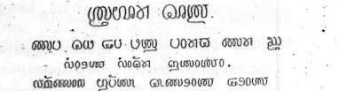

import ScriptDetails from '../../../../components/ScriptDetails.astro';
import WsList from '../../../../components/WsList.astro';
import ArticlesList from '../../../../components/ArticlesList.astro';
import SourceLinksList from '../../../../components/SourceLinksList.astro';
import BibList from '../../../../components/BibList.astro';

## Script details

<ScriptDetails />

## Script description

The Badugu (sometimes called Badaga) script is a relatively recent creation.

Read the full description...
It was developed over approximately 40 years by Yogesh Raj Kadasoley, and officially released in 2012. The script is designed for writing the Badaga language, a Dravidian language spoken in Tamil Nadu in South India. The Badaga people primarily worship the Hindu goddess Hethai.

Previously, the language was written in the Kannada script, and it is currently most often written in the Tamil script. 

This is not the first script designed exclusively for the Badaga language. In 2009, Anandhan Raju designed a Badaga script based on the shapes of Tamil characters.

_This script is not currently recognized by the [ISO 15924 standard](http://www.unicode.org/iso15924/), but is included in Writing Systems Technical Resources for research purposes. If you have any information on this script, please add the information to this site. Your contributions can be a great help in refining and expanding the ISO 15924 standard. The [Script Encoding Initiative](https://sei.berkeley.edu/) is working to support the inclusion of this script in the standard, and contributions here will support their efforts._

## Languages that use this script

<WsList script='x-badugu' wsMax='5' />

## Unicode status

The Badugu script is not yet in Unicode. It is not yet in the Roadmap for the Unicode Standard. 

- [Full Unicode status for Badugu](/scrlang/unicode/x-badugu-unicode)

## Resources

<ArticlesList tag='script-x-badugu' header='Related articles' />

<SourceLinksList tag='script-x-badugu' header='External links' entrytype='online' />

<BibList tag='script-x-badugu' header='Bibliography' entrytype='non-online' />

