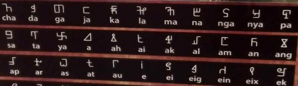

import ScriptDetails from '../../../../components/ScriptDetails.astro';
import WsList from '../../../../components/WsList.astro';
import ArticlesList from '../../../../components/ArticlesList.astro';
import SourceLinksList from '../../../../components/SourceLinksList.astro';
import BibList from '../../../../components/BibList.astro';
import Attribution from '/src/components/Attribution.astro';
import CaptionText from '/src/components/CaptionText.astro';

<CaptionText text="Iban Alphabet Chart."/>
<Attribution
    type="Image"
    license="CC0 1.0"
    author="Diviana Jackson"
    source="Wikimedia"
    sourceurl="https://commons.wikimedia.org/wiki/File:Huruf_Iban.jpg"
/>

## Script details

<ScriptDetails />

## Script description

The [Iban language](http://www.ethnologue.com/language/iba) is spoken by the Iban people.

Read the full description...
It is spoken in Sarawak, Indonesia, as well as in the Indonesian province of Kalimantan Barat, and in Brunei. The language is still currently taught to students in the region. 

Currently Iban uses a Latin alphabet for writing purposes, however an Iban syllabary was developed by Dunging anak Gunggu from 1947 to 1962. Dunging, is said to be a descendent of Renggi, who is credited with the creation of the initial ancient script that was made 400 to 600 years earlier.  The syllabary has been published and is recognized by the Iban community. There is an effort to revive the script.

The syllabary was revised in 1962, and the number of characters was reduced from 77 to 59. Each character is reported to have held a specific meaning, but the meaning has since been lost, since Dunging never recorded them. 

_This script is not currently recognized by the [ISO 15924 standard](http://www.unicode.org/iso15924/), but is included in Writing Systems Technical Resources for research purposes. If you have any information on this script, please add the information to this site. Your contributions can be a great help in refining and expanding the ISO 15924 standard. The [Script Encoding Initiative](https://sei.berkeley.edu/) is working to support the inclusion of this script in the standard, and contributions here will support their efforts._

## Languages that use this script

<WsList script='x-iban' wsMax='5' />

## Unicode status

The Iban script is not yet in Unicode. The script is not in the [Roadmap to the SMP](http://www.unicode.org/roadmaps/smp/) for the Unicode Standard.

- [Full Unicode status for Iban](/scrlang/unicode/x-iban-unicode)

## Resources

<ArticlesList tag='script-x-iban' header='Related articles' />

<SourceLinksList tag='script-x-iban' header='External links' entrytype='online' />

<BibList tag='script-x-iban' header='Bibliography' entrytype='non-online' />

