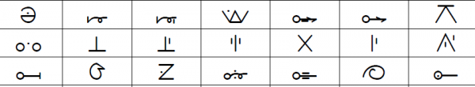

import ScriptDetails from '../../../../components/ScriptDetails.astro';
import WsList from '../../../../components/WsList.astro';
import ArticlesList from '../../../../components/ArticlesList.astro';
import SourceLinksList from '../../../../components/SourceLinksList.astro';
import BibList from '../../../../components/BibList.astro';
import Attribution from '/src/components/Attribution.astro';
import CaptionText from '/src/components/CaptionText.astro';

<CaptionText text="Masaba syllabary for the Bamanakan language."/>
<Attribution
    type="Image"
    copyholder=""
    copyurl=""
    copyyears=""
    license="Public Domain"
    licenseurl=""
    author=""
    source="Wikimedia"
    sourceurl="https://commons.wikimedia.org/wiki/File:Masaba_syllabary.png"
/>

## Script details

<ScriptDetails />

## Script description

The Masaba script (also called Bambara or Bamanakan) is one of five Mande syllabaries used in West Africa.

Read the full description...
(The other four are [Vai](/scrlang/scripts/vaii), [Loma](/scrlang/scripts/loma), [Mende](/scrlang/scripts/mend) and [Kpelle](/scrlang/scripts/kpel). The Bamanakan language, for which the script is used is spoken by almost 3 million people in Mali, Burkina Faso, Côte d’Ivoire, Gambia, Guinea, Mauritania, and Senegal. The script was created in 1930 by Woyo Couloubayi, a Malian. It has 123 letters and is read from left to right.

_This script is not currently recognized by the [ISO 15924 standard](http://www.unicode.org/iso15924/), but is included in Writing Systems Technical Resources for research purposes. If you have any information on this script, please add the information to this site. Your contributions can be a great help in refining and expanding the ISO 15924 standard. The [Script Encoding Initiative](https://sei.berkeley.edu/) is working to support the inclusion of this script in the standard, and contributions here will support their efforts._

## Languages that use this script

<WsList script='x-masaba' wsMax='5' />

## Unicode status

The Masaba script is not yet in Unicode. The script has not yet been added to the [Roadmap to the SMP](http://www.unicode.org/roadmaps/smp/) for the Unicode Standard.

- [Full Unicode status for Masaba](/scrlang/unicode/x-masaba-unicode)

## Resources

<ArticlesList tag='script-x-masaba' header='Related articles' />

<SourceLinksList tag='script-x-masaba' header='External links' entrytype='online' />

<BibList tag='script-x-masaba' header='Bibliography' entrytype='non-online' />

