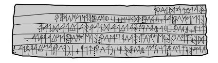

import ScriptDetails from '../../../../components/ScriptDetails.astro';
import WsList from '../../../../components/WsList.astro';
import ArticlesList from '../../../../components/ArticlesList.astro';
import SourceLinksList from '../../../../components/SourceLinksList.astro';
import BibList from '../../../../components/BibList.astro';

## Script details

<ScriptDetails />

## Script description

The Northern Palaeohispanic script was disunified from the Southern Palaeohispanic script. 

Read the full description...
It includes the north‐eastern Iberian and the Celtiberian script. The script is on the Script Encoding Initiative's list of scripts to encode.

## Languages that use this script

<WsList script='x-no-palaeohispanic' wsMax='5' />

## Unicode status

- [Unicode status for Northern Palaeohispanic](/scrlang/unicode/x-no-palaeohispanic-unicode)

## Resources

<ArticlesList tag='script-x-no-palaeohispanic' header='Related articles' />

<SourceLinksList tag='script-x-no-palaeohispanic' header='External links' entrytype='online' />

<BibList tag='script-x-no-palaeohispanic' header='Bibliography' entrytype='non-online' />

