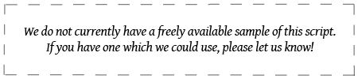

import ScriptDetails from '../../../../components/ScriptDetails.astro';
import WsList from '../../../../components/WsList.astro';
import ArticlesList from '../../../../components/ArticlesList.astro';
import SourceLinksList from '../../../../components/SourceLinksList.astro';
import BibList from '../../../../components/BibList.astro';

## Script details

<ScriptDetails />

## Script description

The Nwagu Aneke Igbo syllabary was created in the late 1950s for the Umuleri dialect of Igbo by Ogbuevi Nwagụ Aneke. 

_This script is not currently recognized by the [ISO 15924 standard](http://www.unicode.org/iso15924/), but is included in Writing Systems Technical Resources for research purposes. If you have any information on this script, please add the information to this site. Your contributions can be a great help in refining and expanding the ISO 15924 standard. The [Script Encoding Initiative](https://sei.berkeley.edu/) is working to support the inclusion of this script in the standard, and contributions here will support their efforts._

## Languages that use this script

<WsList script='x-nwagu-aneke-igbo' wsMax='5' />

## Unicode status

The Nwagu Aneke Igbo syllabary is not yet in Unicode. It is not yet in the Roadmap for the Unicode Standard. 

- [Full Unicode status for Nwagu Aneke Igbo](/scrlang/unicode/x-nwagu-aneke-igbo-unicode)

## Resources

<ArticlesList tag='script-x-nwagu-aneke-igbo' header='Related articles' />

<SourceLinksList tag='script-x-nwagu-aneke-igbo' header='External links' entrytype='online' />

<BibList tag='script-x-nwagu-aneke-igbo' header='Bibliography' entrytype='non-online' />

