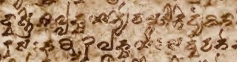

import ScriptDetails from '../../../../components/ScriptDetails.astro';
import WsList from '../../../../components/WsList.astro';
import ArticlesList from '../../../../components/ArticlesList.astro';
import SourceLinksList from '../../../../components/SourceLinksList.astro';
import BibList from '../../../../components/BibList.astro';
import Attribution from '/src/components/Attribution.astro';
import CaptionText from '/src/components/CaptionText.astro';

<CaptionText text="Illustrative leaf from Weber manuscripts, discovered in Kucha Xinjiang China."/>
<Attribution
    type="Image"
    copyholder="Ms Sarah Welch"
    copyurl=""
    copyyears="2019"
    license="CC BY-SA 4.0"
    licenseurl="https://creativecommons.org/licenses/by-sa/4.0/deed.en"
    author=""
    source="Wikimedia"
    sourceurl="https://commons.wikimedia.org/wiki/File:5th_or_6th_century_Weber_manuscripts_example,_Central_Asian_script,_Sanskrit,_with_caption.jpg"
/>

## Script details

<ScriptDetails />

## Script description

Turkestani is an early variety of the [Brahmi](/scrlang/scripts/brah) script, adapted with additional diacritics for use with various Central Asian languages including Tocharian, Uygur, and Tumshuqese.

Read the full description...
There are thought to have been two varieties of the script; North Turkestan Brahmi and South Turkestan Brahmi. It fell out of use following the Muslim invasions of Central Asia during the 7th century CE.

_This script is not currently recognized by [ISO 15924](http://www.unicode.org/iso15924/), but is included in Writing Systems Technical Resources for research purposes. If you have any information on this script, please add the information to the site. Your contributions can be a great help in refining and expanding the ISO 15924 standard._

## Languages that use this script

<WsList script='x-turkestani' wsMax='5' />

## Unicode status

The Turkestani script is not yet in Unicode. It may be disunified into Tocharian and Khotanese.

- [Full Unicode status for Turkestani](/scrlang/unicode/x-turkestani-unicode)

## Resources

<ArticlesList tag='script-x-turkestani' header='Related articles' />

<SourceLinksList tag='script-x-turkestani' header='External links' entrytype='online' />

<BibList tag='script-x-turkestani' header='Bibliography' entrytype='non-online' />
