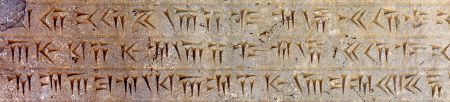

import ScriptDetails from '../../../../components/ScriptDetails.astro';
import ScriptResources from '../../../../components/ScriptResources.astro';
import WsList from '../../../../components/WsList.astro';

## Script details

<ScriptDetails />

## Script description

Old Persian cuneiform was the main script for writing the Old Persian language from 525-330 BC.

Read the full description...
Visually it resembles Sumero-Akkadian cuneiform; most of the letters are arrangements of between two and five horizontal, vertical or angle-shaped wedges. However, there appears to be no derivational relationship between the sound-to-symbol mapping of individual letters in the two scripts, nor has any other script been found which links the forms of the scripts. For this reason, Old Persian cuneiform is generally believed to have been an independent invention.

Old Persian was written from left to right and encoded three vowel ([a/a:], [i/i:] and [u/u:]) and twenty-two consonant sounds using three vowel and thirty-three consonant letters. Vowel length was generally not indicated; the exception to this was a long [a:] vowel. All vowels except for short [a] were written, so the script was essentially an alphabet, with some syllabic properties.

The twenty-two consonant signs were of two types. For thirteen consonant sounds, the following vowel sound was represented by the following vowel sign (or lack thereof). These consonants contained an inherent short 'a' vowel; when this vowel was missing its absence was not indicated in any way. So _p_ = [p] or [pa]. When the letter was followed by an _a_ letter, it indicated a long [a:] vowel: _p_+_a_ = [pa:] but _p_+_i_ = [pi] or [pi:] and _p_+_u_ = [pu] or [pu:]. The remaining nine consonant sounds each had a different shape depending on the quality of the following vowel. Of these, only 'd' and 'm' had three different forms to represent [-a/a:/Ø], [-i/i:] and [-u/u:]. The remaining seven letters only had a two-way distinction, either to distinguish [-u/u:] from [-a/a:/i/i:], or because only two of the three vowels were ever used after that particular consonant.

For those nine signs whose shape already implies the following vowel, the vowel was still written as a separate letter. So the sound [di/i:] was written with two letters _di_+_i_. This enabled diphthongs following one of these nine consonants to be easily expressed; _da_+_i_ represented [dai]. Diphthongs following one of the other thirteen consonants were a little more ambiguous; the letters _p_+_i_ could represent either [pi/i:] or [pai] because of the possible inherent 'a' vowel.

Some letters were subject to further orthographic rules; _n_ and (before stops) _m_ were not written at the end of a syllable, and _h_ was not written before _u_ or _m_. The vowel _i_ was generally not written after _h_.

In addition to the thirty-six phonetic letters, seven ideograms were used to represent common words or divine names, and there was a set of base numbers representing 1, 2, 10, 20, 100. These were added cumulatively with the biggest numbers to the left to represent other numbers, for example 5=2+2+1, 13=10+2+1, 60=20+20+20 etc.

## Languages that use this script

<WsList script='Xpeo' wsMax='5' />

## Unicode status

In The Unicode Standard, Old Persian script implementation is discussed in [Chapter 11 Cuneiform and Hieroglyphs](https://www.unicode.org/versions/latest/core-spec/chapter-11/#G26474).

- [Full Unicode status for Old Persian](/scrlang/unicode/xpeo-unicode)

## Resources

<ScriptResources detailSummary='seemore' />

