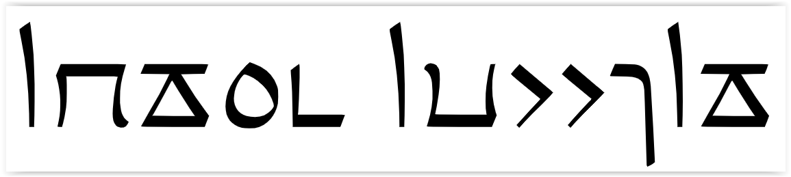

import ScriptDetails from '../../../../components/ScriptDetails.astro';
import ScriptResources from '../../../../components/ScriptResources.astro';
import WsList from '../../../../components/WsList.astro';

## Script details

<ScriptDetails />

## Script description

Yezidi (also spelled Yazidi) is a liturgical script used by approximately 100,000 followers of the Yezidi religion, mainly in Kurdistan but also in Iraq, Syria, Turkey and the Caucasus.

Read the full description...
Religious documents can be written in Kurdish or in Arabic; the Yezidi script is used for both languages.

Yezidi is an abjad; vowels are generally not written.

## Languages that use this script

<WsList script='Yezi' wsMax='5' />

## Unicode status

In The Unicode Standard, Yezidi script implementation is discussed in [Chapter 9 Middle East-I — Modern and Liturgical Scripts](https://www.unicode.org/versions/latest/core-spec/chapter-9/#G59804).

- [Full Unicode status for Yezidi](/scrlang/unicode/yezi-unicode)

## Resources

<ScriptResources detailSummary='seemore' />

