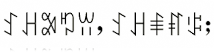

import ScriptDetails from '../../../../components/ScriptDetails.astro';
import ScriptResources from '../../../../components/ScriptResources.astro';
import WsList from '../../../../components/WsList.astro';

## Script details

<ScriptDetails />

## Script description

The Yi script is used for writing the Tibeto-Burman languages spoken by the Yi tribes of Southwest China - Nuosu (also called Sichuan Yi or Northern Yi), Eastern Yisu (also called Shiping-Jianshui Yi), Wusa Nasu (also called Eastern Yi), Sani, and Mantsu (also called Black Lolo or Flowery Lolo).

Read the full description...
The Yi tribes are geographically disparate, so significant internal variation can be displayed in writing. For example, there are approximately forty forms of the character meaning _stomach_. However, in 1974 the script was standardized for writing the Liangshan dialect of Nuosu. Efforts are underway to standardize the script across the other Yi languages as a pure syllabary, in which each sign represents all morphemes with the same pronunciation. A distinction is sometimes made between the standardized form, called Yi, and the non-standardized form, called Classic Yi.

Chinese legislation states that standardized Yi is written horizontally, from left to right. However, the traditional form, as used in southern Sichuan, is written in vertical columns from top to bottom and right to left, then rotated 90 degrees anticlockwise for reading, so that it is read in horizontal lines from left to right. 

Spoken Yi is largely monosyllabic. Yi characters are syllabic logographs, that is, each sign represents a syllable which is also a morpheme. A spoken Yi syllable is comprised of an optional consonant, a vowel, and a tone. The number of tones distinctive in speech varies from language to language, but only three are marked in writing. These are romanized as _t_ (high tone), _x_ (mid tone) and _p_ (low falling tone), or else using the superscript numbers 55, 33 and 21 respectively. In the Yi script, each character has an unmarked form and three variant forms to indicate each tone. As a result, the sign inventory is large. The proposed standardized variety of the script contains 819 signs.

Yi signs are made from five basic strokes; dot, horizontal line, vertical line, arch and circle. The script does not exhibit any structural influence from either the Chinese script or the alphabetic scripts of neighbouring languages such as Tibetan, Burmese or the Tai languages. It is thought to have developed independently, although its creation has not been attributed to a particular inventor. The script has an attested history of 500 years, but some scholars believe it to have been in use for as long as 5000 years.

## Languages that use this script

:::note
Languages listed as _unwritten_ would likely use Yi script if a writing system were developed. A status of _obsolete_ indicates that the writing system is no longer in use for that language; the language may still be spoken.
:::

<WsList script='Yiii' wsMax='5' />

## Unicode status

In The Unicode Standard, Yi script implementation is discussed in [Chapter 18: East Asia](https://www.unicode.org/versions/latest/core-spec/chapter-18/#G13042).

- [Full Unicode status for Yi](/scrlang/unicode/yiii-unicode)

## Resources

<ScriptResources detailSummary='seemore' />

