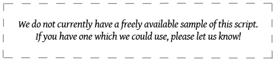

import ScriptDetails from '../../../../components/ScriptDetails.astro';
import ScriptResources from '../../../../components/ScriptResources.astro';
import WsList from '../../../../components/WsList.astro';

## Script details

<ScriptDetails />

## Script description

The ISO Standard includes the language tag "Code for Undetermined Script".

Read the full description...
This classification includes characters which are not part of a formal natural language writing system or are unified or "common" across many writing systems. For example, currency signs, and many punctuation marks can be used in more than one script. 

A separate classification - "Code for Inherited Script" (Zinh) - also includes characters which are unified across more than one writing system. The difference between 'Undetermined' and 'Inherited'  is that inherited characters take their script identification from the script of the preceding character, for example in the case of the zero width joiner/non-joiner characters, whereas undetermined/common characters do not need to identify with any script other than undetermined/common.

## Languages that use this script

:::note
It is unknown whether these languages are written or what script they use.
:::

<WsList script='Zyyy' wsMax='5' />

## Unicode status

_No Unicode status information is available._

## Resources

<ScriptResources detailSummary='seemore' />

