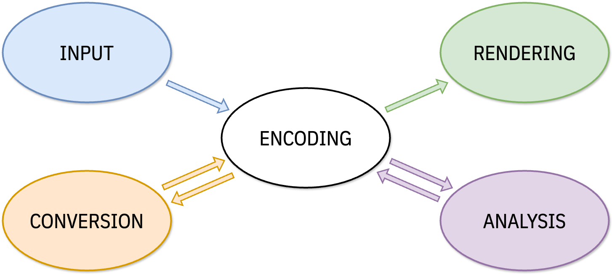

Successful writing system implementations (WSIs) depend on a wide variety of software, including operating systems, standalone applications, fonts, conversion tools and other utilities. Some of these, such as the underlying operating systems themselves, are outside the control of most WSI developers, and cannot be altered. Others are fully in the hands of independent companies and individuals. Despite these differences, it is possible to construct a general architectural model for WSIs.

## Model

The following model encompasses text input, storage, processing, and output.

### Encoding

The model begins with _data encoding_—how language information is stored. Information is given a digital representation, encoded in terms of binary numerical values. For text data, the encoding refers to a set of rules by which the sequence of characters that make up a text are represented in terms of a sequence of numbers.

All WSIs are based upon an encoding, whether public or private. An adequate encoding needs to store all the information needed to represent the text in a given writing system. For example, an encoding for English needs to maintain a difference between capital A and lowercase a, because capitalization is an important writing system feature.

The international standard for text encoding is [Unicode][the-unicode-standard], a system with almost unanimous support from software companies and government bodies. This standard assigns a distinct numerical range to individual scripts, and unique numeric identifiers to each character of each script. This allows data in a variety of languages to be stored together without confusion. It can be assumed that any adequate WSI stores its data according to The Unicode Standard.

See [Characters, Codepoints, Glyphs][characters-codepoints-glyphs] for more information on encoding.

Examples of encoding components:

- A set of Unicode codepoints defined for a given script that includes all needed characters (letters).
- A storage format that allows data to be encoded according to Unicode.

### Input

Data needs to be entered into the computer or device somehow. This process involves _input_, whether by a physical or virtual keyboard or through some other input method. The technical process of keyboarding involves translating keystroke sequences into character data in some given encoding. Since most keyboard layouts are designed around the entry of Latin-script data, the routines needed to interpret keystrokes into language data for other scripts can be very complex, and are commonly built directly into computer operating systems.

For more information on keyboarding and other input systems see [From Keystrokes to Codepoints][from-keystrokes-to-codepoints].

Examples of keyboarding components:

- A simple keyboard definition for the script, developed by Microsoft and included in distributions of Windows.
- A complex keyboard definition created for use with the Keyman program, that could be installed on a variety of systems.
- A mobile device input system with predictive text. 

### Rendering

_Rendering_ takes stored text in a given encoding and presents it visibly on a screen or printed page. If the stored data exactly parallels the individual letters in a line of text, this is a simple process: one code per letter. Even in this situation it is important that the letter be shaped correctly, and harmonize with the rest of the alphabet. Font design is a subtle but important process. See [Font Design and Development][font-design-and-development] .

In complex Latin and most other scripts, however, data must be interpreted to display or print properly. Users want to view their data in an easy, trouble-free manner that accurately reflects the spelling and word formation rules of their writing system. This can require ‘smart’ rendering components that perform sophisticated interpretations of the data before sending it to the computer screen. See [Shaping and Rendering][shaping-and-rendering].

Examples of rendering components:

- A simple font, such as for English, that does not require special ‘smart’ code for rendering.
- An OpenType font that has ‘smart’ code in order to display typographic ligatures required for fine Latin-script typesetting.
- A Devanagari font that includes complex rules for conjunct formation.

### Analysis

Many WSIs include _analysis_ components. This refers to a variety of actions in which data is processed or analyzed so that:

- the data can be transformed in some way specific to the writing system,
- the data can be presented to the user in some useful manner, or
- operations related to the editing, management or other processing of text data can be performed.

Such processes include sorting, word demarcation, hyphenation, and spell-checking, as well as more complex systems such as speech synthesis. Analysis may, at first, seem less important, but can be critical to language support. For example, a means of sorting language data is needed to produce dictionaries and telephone books. See [Analysis Overview][analysis-overview/]

Examples of analysis components:

- Standard sorting routines built into operating systems.
- Word demarcation (word breaking) rules built into an application that supports Thai.
- Systems that turn text into a series of phonemes for speech synthesis.
- A Spanish spell-checking module.

### Conversion

Basic _conversion_ components transform data from one encoding into another. Until the advent of Unicode, WSIs used hundreds of different encodings for their data. Some of these encodings were official standards, but others were proprietary and unique to a specific application program. Any time more than one encoding exists for a given language, there needs to be conversion routines and tools as a ‘bridge’ between them. This is especially relevant in the transition from older encodings to Unicode. Without reliable conversion, users were hesitant to migrate their data to newer systems.

Current applications almost universally use Unicode, although there are millions of old documents that may have data in old ‘legacy’ encodings. It is important that conversion tools, scripts, and mappings remain available to access this archival data.

Examples of conversion components:

- A small program that converts text files back and forth between two encodings (such as the old MacRoman encoding and Unicode).
- Definition files that document the differences and correspondences between encodings, and that could serve as input for a conversion tool.

## Example

(add example of a script that needs all 5 components)

_Portions of this content first appeared in [Guidelines for Writing System Support][wsig], copyright © 2003 UNESCO and SIL International._

[analysis-overview]: /topics/analysis/analysis-overview/
[characters-codepoints-glyphs]: /topics/encoding/characters-codepoints-glyphs/
[font-design-and-development]: /guides/font-design-and-development/
[from-keystrokes-to-codepoints]: /topics/input/from-keystrokes-to-codepoints/
[shaping-and-rendering]: /topics/fonts/shaping-and-rendering/
[the-unicode-standard]: /topics/encoding/the-unicode-standard
[wsig]: https://scripts.sil.org/wsi_guidelines.html
