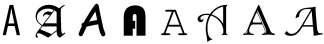
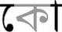
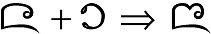
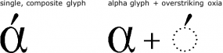
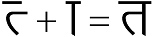
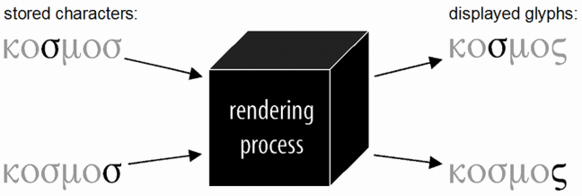
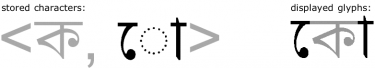
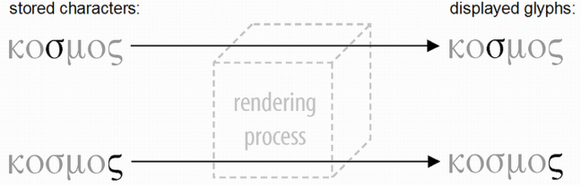

Software systems used for working with multilingual data are evolving, and it is increasingly important for users and support personnel to have an understanding of how these systems work. This section serves as an introduction to remaining technical sections, and explains some of the most basic concepts involved in working with multilingual text: characters, codepoints, and glyphs. Each notion is explained, as is the way they relate to one another and interact within a computer system.

## Characters

There are, in fact, different senses of the word character that are important for us. In common usage, though, the distinctions are not typically recognized. These differences must be understood in working with multilingual software technologies.

### Orthographies, characters and graphemes

The first and most common sense of the term [character][glo-character] has to do with orthographies and writing systems: languages are written using orthographies,[^1] and a character in this first sense, an orthographic character, is an element within an orthography. For example, the lower case letter “a” used to write English, the letter “&#x1A47;” used for Tai Tham, and the IPA symbol for a voiced, inter-dental fricative, “ð”, are characters.

[^1]: The familiar term **orthography** is used here in place of the more correct and more specialized but less well-known term **writing system**. Writing systems include not only conventional systems of graphic objects used for written linguistic communication—commonly known as **orthographies**, but also systems of written notation used to describe or transcribe language and linguistic utterances, such as IPA or shorthand.

It is easy to provide clear examples of characters in this sense of the word. Providing a formal definition is not so easy, though. To see why, let’s consider some of the things that can occur in an orthography.

Some orthographies contain elements that are complex, using multiple components to write a single sound. For example, in Spanish as well as in Slovak, “ch” functions as a single unit. This is an example of what is sometimes called a **digraph**. Some languages may have orthographies with even more complex elements. For instance, the orthographies of some languages of Africa have elements composed of three letters, such as “ngb”. Such combinations of two or more letters or written symbols that are used together within an orthography to represent a single sound are sometimes referred to as **multigraphs** or **polygraphs**.

Also, many languages use dependent symbols known as **accents** or **diacritics**. These are common in European languages; for example, in Danish “ë” and “å”, or French “é” and “ô”.

So, are multigraphs one character or several characters? And are the diacritics by themselves considered characters? There are not always clear answers to these kinds of questions. For a given written symbol, different individuals or cultures may have different perceptions of that symbol based on their own use of it. Speakers of English would not recognize the dot in “i” as a character, but they also would not hesitate to acknowledge the components of the digraph “th” as characters since “t” and “h” function independently in English orthography. The case of “th” might not be as clear to users of another language if, suppose, that language does not make independent use of “h”. Likewise, English speakers would probably not be as confident in commenting about the ring in “å”.

This uncertainty could be avoided by using a distinct term: [grapheme][glo-grapheme]. _A grapheme is anything that functions as a distinct unit within an orthography._ By this definition, the status of multigraphs are clear: multigraphs, such as Spanish “ch”, and “ngb” in the orthography of some Bantu languages, are all graphemes.[^2] Diacritics, either by themselves or in combination with base letters, may or may not be graphemes, depending on whether they function as distinct units with an orthography.

[^2]:Note that graphemes are not necessarily related to phonemes. For example, the English phoneme /ð/ is written as “th”, but “th” does not function as a unit in terms of the behaviors of English orthography.

The notion of **grapheme** is important for us. Obviously, though, it would still be helpful to be able to talk about things like the “h” in “th” or the ring diacritic in general terms, even if they don’t correspond to a grapheme in a given orthography. An approximate, informal definition could be: when speaking in terms of writing systems and orthographies, a **character** (or **orthographic character**) is _a written symbol that is conventionally perceived as a distinct unit of writing in some writing system._

### Characters as elements of textual information

A second sense of the term character, important to Writing System Implementation development, is particularly applicable within the domain of information systems and computers: _a minimal unit of textual information that is used within an information system._ In any given case, this definition may or may not correspond exactly with either our informal sense of the term **character** (i.e. **orthographic character**) or with the term **grapheme**. This will be made clearer as we consider some examples.

Note that this definition for **character** is dependent upon a given system. Just as the definition given for **grapheme** was dependent upon a given orthography, such that something might be a grapheme in one orthography but not in another, so also something may exist as a character in one information system but not in another.

For example, a computer system may represent the French word “hôtel” by storing a string consisting of six elements with meanings suggested by the sequence &lt;h, o, ^, t, e, l&gt;. Each of those six component elements, which are directly encoded in the system as minimal units, is a character within that system.

Note that a different system could have represented the same French word differently by using a sequence of five elements, &lt;h, ô, t, e, l&gt;. In this system, the O-CIRCUMFLEX is a single encoded element, and hence is a character in that system. This is different from the first system, in which O and CIRCUMFLEX were separate characters.

Up to now the characters which have been considered are all visible, orthographic objects (or are direct representations of such graphical objects within an information system). In using computers to work with text, other characters of a more abstract nature that may not be visible objects, such as “horizontal tab”, “carriage return” and “line feed” must be defined.

In technical discussions related to information systems, in talking about multilingual software, for example, it is the sense of the term **character** discussed in this section that is usually assumed. From here on, this usage will be adopted, referring to (**abstract**) **characters** as meaning units of textual information in a computer system, and using the term **grapheme** when talking about units within orthographies. Thus, something like this could be, “The Dutch grapheme ‘ij’ is represented in most systems as a character sequence, &lt;i, j&gt;, but in this system as a single character, &lt;ij&gt;.” Where the informal sense for  (**orthographic**) **characters** is used, that will be stated explicitly.

In developing a system for working with multilingual text, it is important to understand the distinction between abstract characters and graphemes. Systems are implemented to serve the needs of users, and users think in terms of the concrete objects with which they are familiar: the graphemes and orthographic characters that make up orthographies. They do not need to be aware of the internal workings of the system. In other words, it does not matter what abstract characters are used internally to represent text, just so long as users get the behavior and results they expect. 

## Codepoints and Glyphs

Potentially, though, the characters may be somewhat different from the elements of the orthography, just so long as the system can be implemented to give the right behavior. To explain how this might be possible, though, we first need to understand the key components that are used in a computer system for working with text.

Within a computer system, we work with text and writing systems primarily in terms of three main components:

- **input methods**: how we create the data, typically using keyboards
- **encodings**: how the data are stored, and
- **fonts & rendering**: how the data is displayed.

We have talked about graphemes and abstract characters as individual units. We need to look at their counterparts in these three components, and understand how they interact. These counterparts are **keystrokes**, **codepoints**, and **glyphs**. This section will introduce **codepoints** and **glyphs**, and look at how they interact within a system.

### Codepoints

Computers store information internally as numbers. A **codepoint** is merely the _number that is used to store an abstract character in the computer_.[^3] When working with text, each abstract character of the text (including control characters) is stored as a number with a unique number assigned to each different character. For example, whenever you enter **SHIFT + F** on an English keyboard, the computer will (on most systems) insert the number 70 at the current position in the data. This is the codepoint that is used on those systems for storing the character LATIN CAPITAL LETTER F.

[^3]:There is more that can be said about codepoints and encoding schemes than we have space to discuss here, particularly concerning multi-byte encodings. For more information regarding encoding schemes, see [The Unicode Standard][uni-encoding-schemes], and especially [Unicode Technical Report #17][uni-utr17]. For information on multi-byte encodings that are used for East Asian character sets, see Lunde, Ken. _CJK Information Processing_. Sebastopol, CA: O’Reilly, 1999.

An **encoding** (or **character encoding**) is a system of numbers used to represent a set of characters within a digital information system, such as a computer. There is, in principle, nothing special about the numbers that are used. For instance, in the example above, there is no _a priori_ reason that the number 42 could not have been used to represent LATIN CAPITAL LETTER F. The actual numbers that are used are specified by the encoding designer. There are only two necessary restrictions:

- Each abstract character that is represented in the encoding system must have exactly one numerical representation—one codepoint.
- In order for users to exchange data, their computer systems must agree on what the meaning is for a given number.

To achieve the latter end, encoding standards are devised, either by individual vendors, or across the entire industry. Two important examples of encoding standards are ASCII and Unicode. Every DOS, Windows and Macintosh computer understands the ASCII encoding standard and would know, for example, that the codepoint 104 corresponds to the character LATIN SMALL LETTER H (“h”).

The numerical value of codepoints can be expressed in different ways. Most computer users are aware that computers store numbers in binary rather than decimal. Thus, `70` to us would be `01000110` to a computer. Programmers often use a system known as **hexadecimal**, or **hex**. Thus, decimal `70` would also be `x46` (hex) to a programmer. Anyone involved in writing system implementation ought to be at least familiar with hex notation. For example, in any discussion of Unicode, codepoint values are almost always expressed using hex.

### Glyphs

Glyphs are the graphical elements used to visually represent characters. Because of their graphical nature, a user is likely to associate them closely with the (relatively) concrete objects in the domain of writing and orthographies. For our purposes, the notion of **glyph** has an additional, specific characteristic: glyphs are _graphic objects that are stored within a **font**_. Basically, they are the shapes for displaying characters that you see on a screen or a printer. In a simple sense, then, a font is simply a collection of glyphs, usually with common design characteristics. Since glyphs are contained within fonts, which are part of a computer system, glyphs are therefore a component within the domain of information systems, like abstract characters.

The notions of **character** and **glyph** are different. For example, LATIN CAPITAL LETTER A “A” can be displayed using any of a number of different glyphs:

In some scripts, characters can have more than one shape due to certain behaviors of the script. This has nothing to do with changing fonts. For example, in Greek script, the sigma has two different shapes, according to its position within a word. Sigma can be displayed by more than one glyph, but in each instance only one glyph is used.

There can also be situations in which a single character is displayed by multiple glyphs in every instance of its use. For example, Indic scripts of South and Southeast Asia are well known for having vowels that are written using multiple shapes that are distributed around the shape for the initial consonant. So, for example, in the following Bengali-script example, the two highlighted shapes represent a single instance of one character (one grapheme), the vowel o:

We have seen that one character can have many glyphs. The opposite is also possible: one glyph for multiple characters. In Tai Tham script, when the &#x1a36; character is followed by the character &#x1a81;, they may be written as shown in the example below. In this case, we have two characters that are presented by a single shape, forming what is known as a ligature.

These examples suggest that the number of glyphs is determined by the character elements in an orthography and by their behaviors. That is largely true, but not necessarily so, however. The glyphs used in a font are determined by the font designer, and a font designer may choose to implement behaviors in different ways. For example, for Greek, a font designer may choose to present the _alpha with oxia_ using a single, composite glyph, or by using two glyphs, one for _alpha_ and another for the over-striking diacritic:

Some font implementations may even use glyphs that only represent a portion of the written symbols in the orthography:

These examples raise some important questions: Does this mean that, within a computer system, there can be a mismatch between the characters that are stored and the glyphs that are needed to display them? If so, how is this handled? This brings us to the general issue of how glyphs relate to characters within an information system.

### From codepoints to glyphs

Textual information is stored within a computer as codepoints that directly correspond to abstract characters. In a process known as **rendering**, software will take a sequence of codepoints and transform that into a sequence of glyphs displayed on some presentation device (a monitor or a printer).

Consider a simple example: the English word “picture”. As this document was created, that word was stored on the computer as a string of seven characters, &lt;p, i, c, t, u, r, e&gt;, and was displayed on the monitor using seven glyphs selected from a particular font and arranged horizontally (using information also found in the font to control relative positioning). In this case, there was a simple one-to-one mapping between the codepoints in the data and the glyphs in the font.

That much was fairly obvious. What is more interesting is what happens in the more complicated situations described above, in which there is not a one-to-one relationship between “characters” and glyphs. In general, the answer is that it depends upon the given system. But to see what might possibly happen, let’s consider the same English example again, yet with a twist.

Suppose I am a font designer, and I want to create a font that closely mimics my handwriting. Of course, I will write English letters in many different ways, and I can’t capture every subtle variation. If I am willing to stay within some limits, though, perhaps I can have my font show each letter the way I might typically write it within a certain set of combinations. So, for example, I might write “c” with different types of connection on the left: in some instances with no connection (at the beginning of words, say), or with a connection near the bottom (after letters that terminate near the bottom, such as “a”), or in other instances with a connection near the top (for instance, after “o”).

As I work through all the details, I might actually decide that the only way to really get the word “picture” to display the way I want is to create it as a single, complex glyph for the entire word. (This may seem unusual, but such things are possible in fonts, and some fonts have even done things like this.) So, I have a single glyph for “picture”, but this is stored in data as a sequence of seven characters. What I need, then, is for some process to intervene between the stored data and the glyphs that will recognize this particular sequence of characters and select the single, combined glyph, rather than seven separate glyphs.

This is precisely the kind of processing that happens in modern systems that are designed to support complex scripts. These systems are sometimes referred to as “smart font” or “smart rendering” systems. Examples include Apple’s **TrueType GX**, which was renamed as **Apple Advanced Typography (AAT)**; the **OpenType** font standard, developed by Microsoft and Adobe; and SIL’s Graphite rendering system. It would go beyond the scope of this discussion to examine how these systems work in any detail. The main point to grasp is that they mediate between characters that are stored and the glyphs used to display them, and allow there to be complex processes that give many-to-many mappings between sequences of characters and sequences of positioned glyphs.

So let’s revisit the more typical examples presented above, and consider how the rendering process might apply in those cases. First, we saw that the Greek sigma is displayed using different shapes according to word position. Within a system, the single grapheme sigma can be represented as a single character, SIGMA, and a rendering process will determine when it does or does not occur at the end of a word and select glyphs on that basis:

In the case of Bengali, a similar process may occur: the system may store a sequence of two characters, &lt;LETTER KA, VOWEL O&gt;, and the rendering process will somehow transform that into the appropriate sequence of glyphs. The actual number of glyphs would be dependent upon a particular font implementation. It could be one composite glyph for the entire combination of characters. More likely, though, it would be rendered using three glyphs. Note, though, that the ordering of the three glyphs does not correspond to the ordering of the stored characters.

Similar processing could occur in rendering the Tai Tham ligature. In that case, an implementation will likely involve two stored characters displayed using a single glyph.

In these examples, we have described one way in which support for each of these examples can be implemented. But, as has been mentioned, the actual glyphs and number of glyphs can vary from one implementation to another. In the case of Bengali, for instance, we have seen that the grapheme for the /o/ vowel (“&#x09CB;”) can be represented in terms of a single character, VOWEL O. But another system could perhaps implement support for this grapheme using a pair of characters, <&#x09C7;, &#x09BE;>. This might make particular sense if each of these corresponded to other graphemes in the orthography or script being implemented. For Bengali script, it turns out that these do have separate identities. Thus, many systems would represent “&#x09CB;” using a character sequence of <VOWEL E, VOWEL AA>. Of course, such a difference would have an affect on how the rendering process needs to operate in order to generate the correct sequence of glyphs. The point here is that a smart rendering system that can support many-to-many mappings between characters and glyphs makes it possible to have different implementations for a given writing system. This flexibility can provide alternatives for a developer, or can also be used to provide special functionality for particular purposes.

Smart rendering systems can handle many-to-many transformations from characters to glyphs. In the past, computer software typically used rendering systems that supported only one-to-one relationships between characters and glyphs. Such systems were sometimes known as “basic”, or “dumb” rendering systems. For a writing system like that of English, for which the standard behaviors are very simple, a “dumb” rendering system is adequate for most use. For complex scripts, however, this limitation presents a problem.

For instance, if a Greek SIGMA requires context-based glyph selection but the system is limited to only one glyph per character, then the only possible solution is to have more than one SIGMA character: one character for each of the two glyphs. Since the mapping from characters to glyphs is a simple, one-to-one mapping, the rendering process becomes essentially transparent:

This approach to implementation is important for us to understand. It is important not because it reflects good practice or good technology—it is neither. Rather, it is important because it has been used for many years in a large number of implementations to support writing systems that involved complex behaviors, ranging from Arabic to IPA to Thai. This way of implementing a writing system imposes requirements not on the glyphs, but on the abstract characters: since there is a one-to-one mapping from characters to glyphs, one abstract character is required for every glyph that is needed For this reason, encoding systems that are designed to work in this way are often referred to as “glyph encodings”, “display encodings”, or “presentation-form encodings”.

In general, an encoding should be devised to accommodate the needs of all processes that need to be performed on the text: rendering, input, sorting, searching, etc. In the case of a presentation-form encoding, however, the encoding is designed to accommodate the needs of rendering alone. If any other processes can still be performed without additional processing, that is coincidental. In most situations, however, other processes are made significantly more difficult, or are considered expendable. 

_Portions of this content first appeared in [Guidelines for Writing System Support][sil-wsig], copyright © 2003 UNESCO and SIL International._

[glo-character]: /reference/glossary#char
[glo-grapheme]: /reference/glossary#grapheme
[sil-wsig]: https://scripts.sil.org/wsi_guidelines.html
[uni-utr17]: https://unicode.org/reports/tr17/
[uni-encoding-schemes]: https://www.unicode.org/versions/latest/core-spec/#G19273