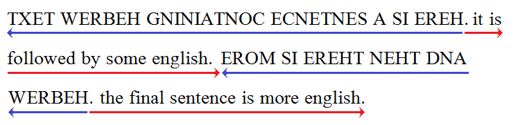
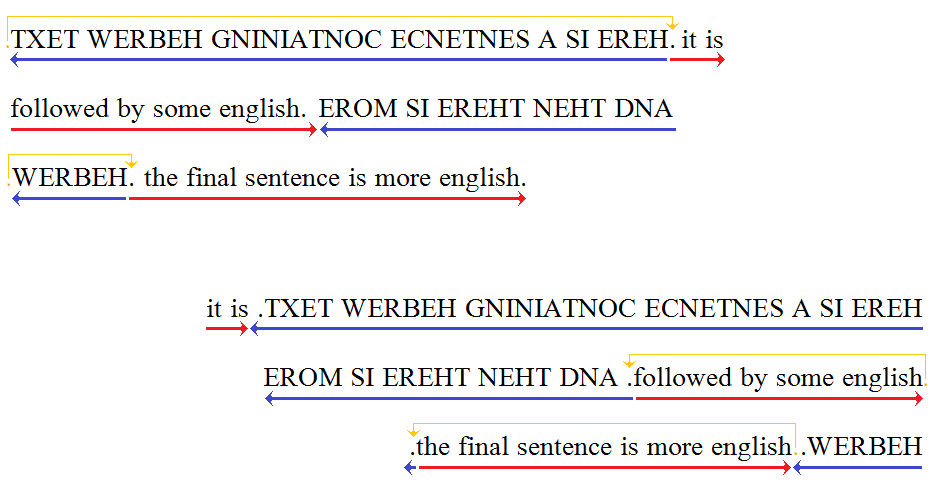

The [Unicode Bidirectional Algorithm (UAX#9)](http://www.unicode.org/reports/tr9/), often called the "bidi algorithm," describes specifications for the positioning of characters in text containing characters flowing from right to left, such as Arabic or Hebrew. 

## A gentle introduction

The Unicode report mentioned above describes the algorithm in great detail, but what is presented here is a gentle introduction.

Bidi processing is needed in two possible situations:

* A Semitic script like Hebrew or Arabic that is primarily written from right to left, but with numbers (usually) written from left to right.
* A combination of left-to-right and right-to-left scripts, such as Turkish containing an Arabic quote, or Hebrew that includes German phrases.

### Intra-script bidirectionality

Let's examine the first situation above. Many Semitic scripts, while written from right to left, have numbers written from left to right. This means that the order of the characters in memory does not match the order in which they are written. The bidi algorithm includes specifications for reordering the numeric characters, as shown in the Hebrew sentence below.

In the graphic above, the data is shown vertically, indicating that "logically" there is no direction, it is simply a sequence of characters. Notice the difference between a straightforward right-to-left rendering, and the correct rendering for Hebrew which reverses the order of the numbers.

Because of this, one of the main complexities of the bidi algorithm involves handling numerical data - numbers, arithmetic expressions, ranges, dates, etc. To further complicate things, Hebrew script, which uses European numbers, behaves differently than Arabic with its own traditional set of digits.

In addition to Hebrew and Arabic, bidirectional scripts include Thaana and modern Syriac using Arabic-Indic numerals. On the other hand, there are right-to-left scripts that are not bidirectional, such as N'Ko, Mende, and Tifinagh. For these scripts, numbers are simply written from right to left as the characters are.

### Multi-script bidirectionality

In the second situation, involving more than one language or script, the range of text that flows in the opposite direction may involve several words or even multiple sentences.

It is even possible to have several layers of embedded directionality, such as a German article that includes a Hebrew quote which in turn includes English phrases. The bidi algorithm is defined to handle many levels of embedded (up to 128, in fact), although in real life you rarely would see more than two or perhaps three.

## Paragraph direction and flow

When text from multiple languages in different directions is mixed together, the concept of the top level direction becomes important - this is the direction of the overall flow of text in the paragraph. So, for instance, a paragraph of Hebrew text that includes some English would be rendered differently than an English paragraph that includes Hebrew words, even if they contained the same characters. To begin with, you would expect the Hebrew paragraph to be right-aligned and the English to be left-aligned, but the differences go beyond just that.

### Language segment ordering

For the next example, let's pretend that the upper-case characters are Hebrew and the lower-case are English (since most of us - including me! - don't know Hebrew or Arabic. This is a common convention you'll see in documentation on bidi issues).

HERE IS A SENTENCE CONTAINING HEBREW TEXT. it is followed by some english. AND THEN THERE IS MORE HEBREW. the final sentence is more english.

In both cases there are four segments which alternate between Hebrew and English. When the paragraph direction is left-to-right (i.e., English is the primary language of the document), the overall flow of the various segments is also left-to-right, which places the initial Hebrew segment at the left side of the paragraph.

But when the paragraph is flowing from right to left (where Hebrew is the primary language), the initial Hebrew appears at the right side of the paragraph.

### Punctuation

You'll also notice that the punctuation at the end of the sentences is not necessarily in the place you might expect it. Where the primary language is English, the punctuation at the end of the Hebrew sentence is written to the right of the Hebrew. In other words, its directionality is left-to-right. Similarly, where the primary language is Hebrew, the English punctuation is written to the left of the English; its directionality is right-to-left.

Punctuation has "weak" directionality, meaning that its direction is influenced by the surrounding text. But in these cases the punctuation occurs between segments that are in different directions, so to break the tie, the direction of the punctuation is taken from the direction of the paragraph as a whole.

If this isn't what you want, there are ways to override the direction for any character you choose. How to do this is discussed below.

### Directionality codes

The main approach of the Unicode bidi algorithm involves assigning a directionality code to each character in the text, and then figuring out how they interact. Some directionality codes indicate left-to-right flow, others right-to-left. As well as direction, some codes are considered "strong", meaning that they are not influenced by neighboring text, while others are "weak", in that their directionality may change if they are next to characters with a different direction. Still other characters are assigned neutral codes, so their behavior is totally controlled by surrounding text or the paragraph direction.

Here are some of the most important bidi codes:

- L = left to right: used for the basic characters of left-to-right scripts (strong)
- R = right-to-left: used for the basic characters of Hebrew and non-bidi RTL scripts (e.g., N'Ko, Mende, Tifinagh) (strong)
- AL = right-to-left Arabic: basic characters and punctuation of Arabic and similar scripts (strong)
- EN = European Number: Latin numbers (1, 2, 3...) and other numbers that behave similarly (weak)
- AN = Arabic Number: &#x0661;, &#x0662;, &#x0663;, etc. (weak)
- ES = European Number Separator: plus and minus (weak)
- ET = European Number Terminator: degree sign, percent sign, number sign (#), currency symbols (weak)
- WS = Whitespace: spaces (neutral)
- ON = Other Neutrals: displayable characters that don't have any directionality associated with them - e.g., parentheses, underscore, equals sign (neutral)

A note on terminology: you might be used to referring to the numbers that are used with the Latin script (1, 2, 3) as "Arabic numbers", but this term is ambiguous, since Arabic script has its own set of numbers. So the bidi algorithm uses the term "European numbers" to refer to these characters. The numbers that are used with the Arabic script are often called "Arabic-Indic digits", but this is also somewhat ambiguous as there is a set of "eastern" Arabic-Indic numbers that behave somewhat differently!

The reason for distinguishing between Arabic and Hebrew, as well as European and Arabic numbers, is in order to properly handle the differences between the way European and Arabic numbers interact with certain symbols. For instance, in Hebrew using European numbers, the sequence "123-456+78" would be considered an expression that would be treated as a left-to-right unit, while in Arabic script, each number in the expression is treated as a unit (eg, &#x0661;&#x0662;&#x0663;-&#x0664;&#x0665;&#x0666;+&#x0667;&#x0668; which would be rendered right-to-left as &#x0667;&#x0668;+&#x0664;&#x0665;&#x0666;-&#x0661;&#x0662;&#x0663;). In addition, a terminator such as a degree symbol or percent sign is displayed to the right of a number in Hebrew, but to the left in Arabic.

After the directionality codes are assigned, the meat of the bidi algorithm is run. This consists of a whole series of rules that consider, combine, and adjust the directionality of each letter until the final flow of the text is determined.

## Mirroring

You may wonder why parentheses are assigned a "neutral" directionality code. The answer lies in one of the special complications of the bidirectional algorithm: the way that it interacts with other processes that happen during the course of rendering a piece of text.

Consider the following sentence:

THE QUICK (BROWN) FOX JUMPS OVER THE (LAZY) DOG.

Here we are using the convention, common in discussions of bidirectional text, that upper-case represents right-to-left text. So a simple right-to-left rendering of this text would be:

.GOD )YZAL( EHT REVO SPMUJ XOF )NWORB( KCIUQ EHT

Immediately you'll see something quite odd! The appearance of the parentheses is appropriate for left-to-right text but the opposite of what you would expect for right-to-left text.

The first thing you might be tempted to do is to just use the opposite character in your data - in other words use U+0029  for the opening parenthesis and U+0028  for the closing one. But that is not recommended, and it might not even be possible. For instance, if your text string is being constructed from various sources (e.g., fields in a database) you wouldn't necessarily know which kind of parenthesis is needed until the very last minute.

Most importantly, though, a key principle of Unicode is that characters should be used consistently according to the "meanings" assigned to them by the Unicode Standard.

(Now if you are savvy about Unicode, you might be aware that the name of the  character is in fact LEFT PARENTHESIS, which would seem to justify using it as a closing parenthesis in right-to-left text! The name is really incorrect, however: the semantics of the character indicate that it should only be used as an opening parenthesis.)

So okay, we'll be well-behaved citizens of Unicode Land and make sure to use U+0028 '(' consistently for the opening parenthesis and U+0029 ')' for the closing parenthesis. But this means that _something_ needs to be responsible for changing the shape of the parenthesis where appropriate. And that "something" can't do its work until after the bidi algorithm has run, because only then is the directionality of all the characters known for sure.

This "something" is a process called _mirroring_, which replaces the shape of the character with the one appropriate for the directional flow of the text.

A tricky thing about mirroring is that applications are not consistent with regard to when the bidi algorithm is run. Sometimes the application itself does very low-level rendering, including running the bidi algorithm. An application like [XeTeX](http://xetex.sourceforge.net/), for instance, which aims to achieve a very high quality of typography, breaks the text to be rendered into very small units and runs the bidi algorithm over them. This sort of application might want to handle the mirroring itself, or even give the user control over it.

But most applications expect the rendering to take care of both the bidi algorithm and mirroring. So both processes are most often handled by the smart-font rendering software. Notice, though, that if the application performs mirroring itself, the font rendering must _not_ do mirroring, or it will have the effect of turning the shapes back to what they were originally!

Another complexity is that there are characters, particularly mathematical symbols, that need to be mirrored but do not have a matching mirrored character. An example of this is the square root sign, which changes its orientation in right-to-left text.

However, there is no such thing as a "closing square root sign" to borrow the shape from! For characters like these, the _only_ option is for the replacement glyph to be provided by the smart-font rendering module once it has figured out what the directionality of the symbol is.

### OpenType and mirroring

Most applications use OpenType to perform smart rendering. Fortunately in recent years [OpenType has standardized its approach to mirroring](http://www.microsoft.com/typography/otspec/TTOCHAP1.htm#ltrrtl). It performs mirroring for pairs of characters in a canonical list (the [OpenType Mirroring Pairs List](http://dev.bowdenweb.com/css/fonts/opentype-specification/ompl.txt)), based on its knowledge of the pairs. For other characters that need mirroring but are not in this list, it marks them with the ['rtlm'](http://www.microsoft.com/typography/otspec/features_pt.htm#rtlm) feature which will cause the font - if it is implemented correctly - to substitute the mirrored form.

### Graphite and mirroring

 [Graphite](http://graphite.sil.org/) is an alternate smart-font rendering technology specifically designed to meet the needs of lesser-known (and less standardized) languages. The current Graphite engine, Graphite2, will perform both the bidi algorithm and mirroring, according to the specifications of the font (the [GDL language](http://scripts.sil.org/cms/scripts/page.php?site_id=projects&item_id=graphite_devFont) provides mechanisms to override the default directionality and mirroring properties of characters). However, it is possible for applications (like possibly XeTeX) to send a flag to to the Graphite engine indicating that it has already performed mirroring so that Graphite will not do it again - which would cancel out the effect of the first mirroring!

The original Graphite engine does not perform any mirroring.

## Overrides and embedding

As was previously mentioned, it is possible to adjust the behavior of bidirectional text by including override characters in the text. Here are some situations where you might want to do this:

- To indicate the embedded structure of the text. For instance, if you have a Spanish article that includes Hebrew sentences and those Hebrew sentences include English phrases, you need embedding codes to make the various levels clear. To achieve this you would use RLE/PDF around the Hebrew and LRE/PDF around the English.
    - _Example:_ este artículo está escrito en español. <RLE>HERE IS A HEBREW SENTENCE WITH AN <LRE>english phrase<PDF> INSIDE. AND THIS IS ANOTHER HEBREW SENTENCE THAT CONTAINS <LRE>more english <PDF> WORDS. <PDF> volvemos ahora al español.

- To use the characters differently from the way they were intended. Some examples:
    - In a right-to-left script, digits are not serving as numbers per se, but as elements of an ID tag such as a serial number. In this case you might want to force the digits to behave more like letters with regard to the way they are written. The RLO override character would be placed before the digits to make them act like letters.
        - _Example:_ AxT<RLO>139dm; in right-to-left text this would be displayed: md931TxA
    - A sequence of right-to-left letters within left-to-right text is being treated simply as a list of characters rather than as actual text. The LRO character before the right-to-left letters will make them act left-to-right.
        - _Example:_ Some Arabic letters (<LRO>&#x202D;&#x0627;, &#x062F;, &#x0631;, and &#x0648;) only connect cursively on the right side.
    - A chapter/verse range such as those used in Biblical verse references is using a colon as a numerical separator rather than punctuation.
        - _Example:_ MATTHEW&#x00A0;6<RTL>:9-13; as right-to-left text this would be displayed: 13-9:6&#x00A0;WEHTTAM. Without the RLM it would be displayed: 13-6:9&#x00A0;WEHTTAM.
 
- To force punctuation to behave as if it were associated with a certain range of text. For instance, final punctuation on an embedded sentence would take on the direction of the top-level paragraph; to make it use the direction of the embedded sentence instead, an override (RLO or RLM) or embedding character (RLE/PDF) could be used.

# Unicode Links

- [Unicode Webinar on Bidirectional Text: Part 1, The Basics of Bidi](https://www.youtube.com/watch?v=mVHuTkdKw8Q) -- Presentation by Richard Ishida, Questions and Answers by Roozbeh Pournader and Richard Ishida

- [Unicode Webinar on Bidirectional Text (Part 2): Delving into Bidi](https://www.youtube.com/watch?v=_gZUK-CJYDc) -- This second Bidi event gives three bidi experts an opportunity to share more information, including on UI, as well as answer more user specific questions.  