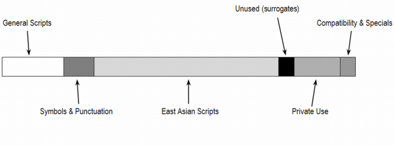
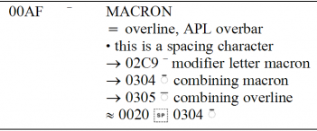
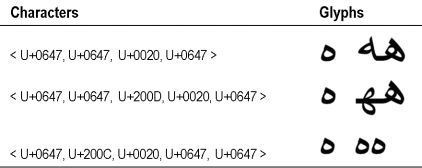
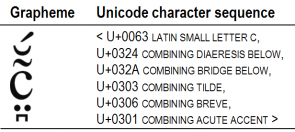
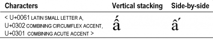

[Encoding][glo-encoding] refers to the process of representing information in some form. In computer systems, we encode written language by representing the [graphemes][glo-grapheme] or other **text elements** of the writing system in terms of sequences of [characters][glo-character], units of textual information within some system for representing written texts. These characters are in turn represented within a computer in terms of the only means of representation the computer knows how to work with: binary numbers.

A [character set encoding][glo-character-set-encoding] (or **character encoding**) is such a system for doing this. Any character set encoding involves at least these two components: a set of characters and some system for representing these in terms of the processing units used within the computer. 

Unicode is a standard encoding designed to be a universal character set that covers all of the scripts in the world. The parallel [ISO/IEC 10646][iso-10646] standard specifies the Universal Coded Character Set (UCS). It is intended to have the exact repertoire as is in The Unicode Standard (TUS).

## Codepoints and the Unicode codespace

The Unicode coded character set is coded in terms of integer values, which are referred to in Unicode as [Unicode scalar values][glo-usv] (USVs). By convention, Unicode codepoints are represented in hexadecimal notation with a minimum of four digits and preceded with “U+”; so, for example, “U+0345”, “U+10345”, and “U+20345”. Also by convention, any leading zeroes above four digits are suppressed; thus we would write “U+0456” but not “U+03456”.

Every character in Unicode can be uniquely identified by its codepoint, or also by its name. Unicode character names use only ASCII characters and by convention are written entirely in upper case. Characters are often referred to using both the codepoint and the name; e.g. U+0061 LATIN SMALL LETTER A. In discussions where the actual characters are unimportant or are assumed to be recognizable using only the codepoints, people will often save space and use only the codepoints. Also, in informal contexts where it is clear that Unicode codepoints are involved, people will often suppress the string “U+”. For clarity, this document will continue to use “U+”.

The Unicode codespace ranges from U+0000 to U+10FFFF. Borrowing terminology from ISO/IEC 10646, the codespace is described in terms of 17 [planes][glo-plane] of 64K codepoints each. Thus, Plane 0 includes codepoints U+0000..U+FFFF, Plane 1 includes codepoints U+10000..U+1FFFF, etc.

In the original design of Unicode, all characters were to have codepoints in the range U+0000..U+FFFF. In keeping with this, Plane 0 was set apart as the portion of the codespace in which all of the most commonly used characters were encoded, and is designated the [Basic Multilingual Plane][glo-bmp] (BMP). The remainder of the codespace, Planes 1 to 16, are referred to collectively as the [Supplementary Planes][glo-supplement]. As space ran out in the BMP, not only ancient scripts, but modern characters and scripts have been encoded in the Supplementary Multilingual Plane (SMP).

There are gaps in the Unicode codespace: codepoints that are permanently unassigned and reserved as non-characters. These include the last two codepoints in each plane, U+&#x200B;_n_&#x200B;FFFE and U+&#x200B;_n_&#x200B;FFFF (where _n_ ranges from 0 to 10<sub>16</sub>). These have always been reserved, and characters will never be assigned at these codepoints. One implication of this is that these codepoints are available to software developers to use for proprietary purposes in internal processing. Note, however, that care must be taken not to transmit these codepoints externally.

Unassigned codepoints can be reserved in a similar manner at any time if there is a reason for doing so. This has been done specifically in order to make additional codes available to programmers to use for internal processing purposes. Again, these should never appear in data.

### Surrogates

There is another special range of 2,048 codepoints that are reserved, creating an effective gap in the codespace. These occupy the range U+D800..U+DFFF and are reserved due to the mechanism used in the UTF-16 encoding form (see [Chapter 2 of the Unicode Standard][uni-ch2-encoding-forms]). In UTF-16, codepoints in the BMP are represented as code units having the same integer value. The code units in the range 0xD800–0xDFFF, serve a special purpose, however. These code units, known as [surrogate code units][glo-surrogate] (or simply **surrogates**), are used in representing codepoints from Planes 1 to 16. As a result, it is not possible to represent the corresponding codepoints in UTF-16. Hence, these codepoints are reserved.

## Blocks & Extensions

As mentioned above, the Basic Multilingual Plane is intended for those characters that are most commonly used. This implies that the BMP is primarily for scripts that are currently in use, and that other planes are primarily for scripts that are not in current use. This is no longer completely true. As the BMP has filled up, the SMP is also used for modern scripts.

As development of Unicode began, characters were first taken from existing industry standards. For the most part, those included characters used in writing modern languages, but also included a number of commonly used symbols. As these characters were assigned, they were added to the BMP. Assignments to the BMP were done in an organized manner, with some allowances for possible future additions.

The overall organization of the BMP is illustrated below.



There are a couple of things to note straight away. Firstly, note the range of unused codepoints. This is the range U+D800..U+DFFF that is reserved to allow for the surrogates mechanism in UTF-16, [as mentioned in the section above](#surrogates).

Secondly, note the range of codepoints designated “Private Use”. This is a block of codepoints called the [Private Use Area][glo-pua] (PUA). These codepoints are permanently unassigned, and are available for custom use by users or vendors. This occupies the range U+E000..U+F8FF, giving a total of 6,400 private-use codepoints in the BMP. In addition, the last two planes, Plane 15 and Plane 16, are reserved for private use, giving an additional 131,068 codepoints. Thus, there are a total of 137,468 private-use codepoints that are available for private definition. These codepoints will never be given any fixed meaning in Unicode. Any meaning is purely by individual agreement between a sender and a receiver or within a given group of users.

Let us briefly outline the organization of the supplementary planes. As just mentioned, Planes 15 and 16 are set aside for private use. Prior to TUS 3.1, no character assignments had been made in the supplementary planes. Beginning with TUS 3.1, however, a number of characters were assigned to Planes 1, 2 and 14. Plane 1 contains modern scripts, characters that were required for scripts in the BMP and for which there is no more space in the BMP, scripts that are no longer in use, and for large sets of symbols used in particular fields, such as music and mathematics. Plane 2 is set aside for additional Han Chinese characters. Plane 14 is designated for special-purpose characters; for example, characters that are required for use only in certain communications protocols.

In any of the planes, characters are assigned in named ranges referred to as **blocks**. Each block occupies a contiguous range of codepoints, and generally contains characters that are somehow related. Typically, a block contains characters for a given script. For example, the Thaana block occupies the range U+0780..U+07BF and contains all of the characters of the Thaana script.

The Unicode Standard includes a collection of data files that provide detailed information about semantic properties of characters in the Standard that are needed for implementations. These data files are always available from the Unicode Web site. These can be found online: [Unicode Character Database][uni-ucd]. Further information on the [data files is also available on the Unicode web site][uni-data-files].

One of these data files, [Blocks.txt][uni-blocks], lists all of the assigned blocks in Unicode, giving the name and range for each.

While a given language may be written using a script for which there is a named block in Unicode, that block may not contain all of the characters needed for writing that language. Some of the characters for that language’s writing system may be found in other blocks. For example, there are six Cyrillic blocks (U+0400..U+04FF, U+0500..U+052F, U+2DE0..U+2DFF, U+A640..U+A69F, U+1C80..U+1C8F, U+1E030..U+1E08F). However, those blocks do not contain most of the punctuation characters required for writing in Cyrillic. The writing system for a language such as Russian will require punctuation characters in the Basic Latin block (U+0020..U+007F) as well as the General Punctuation block (U+2000..U+206F).

Also, the characters for some scripts are distributed between two or more blocks. For example, the Basic Latin block (U+0020..U+007F) and the Latin 1 Supplement block (U+00A0..U+00FF) were assigned as separate blocks because of the relationship each has to source legacy character sets. There are many other blocks also containing Latin characters. Thus, if you are working with a writing system based on Latin script, you may need to become familiar with all of these various blocks. Fortunately, only a limited number of scripts are broken up among multiple blocks in this manner. There is also a data file, [Scripts.txt][uni-scripts], which identifies exactly which Unicode codepoints are associated with each script. The format and contents of this file are described in [UAX #24][uni-utr24]. You are best off simply familiarizing yourself with the character blocks in the Unicode character set, but if you need some help, these files are available.

The Unicode Standard gives a layout of all of the [blocks and scripts in the BMP][uni-bmp] as well as a similar layout for the existing (and projected) [blocks and scripts in the SMP][uni-smp]. Clicking on a particular block will take the user to the code chart for that particular block (or where the script is not encoded yet, the link will take you to the most recent Unicode proposal). (Note that there are a large number of additional Han ideographs in [Plane 2][uni-tip].) In addition, there are a number of blocks containing various dingbats and symbols, such as arrows, box-drawing characters, mathematical operators and Braille patterns. Apart from the Braille patterns, most symbols were taken from various source legacy standards. 
			
The [Unicode Core Specification][uni-core-spec] contains individual chapters that describe groups of related scripts. For example, Chapters 12-15 discuss scripts of South and Central Asia. If you need to learn how to implement support for a given script using Unicode, then the relevant chapter in the Standard for that script is essential reading. 

### Unicode characters and code charts

In addition to the chapters in the Standard that describe different scripts, the Standard also contains a complete set of code charts, organized by block. The best way to learn about the characters in the Unicode Standard is to read the Standard and browse through its charts.

The [Character Code Charts][uni-charts] are available online. The code charts include tables of characters organized in columns of 16 rows. The column headings show all but the last hexadecimal digit of the USVs; thus, the column labelled “21D” shows glyphs for characters U+21D0..U+21DF. Within the charts, combining marks are shown with a dotted circle that represents a base character with which the mark would combine (as explained at the start of this paper). Also, unassigned codepoints are indicated by table cells that are shaded in grey or that have a diagonal lined pattern fill.

The regular code charts are organized in the numerical order of Unicode scalar values. There are also various other charts available online that are organized in different orders. In particular, there are a set of charts available in [UAX #24][uni-utr24] that show all characters from all blocks for a given script, sorted in a default collating order. This can provide a useful way to find characters that you are looking for. Note that these other charts do not necessarily use the same presentation as the regular code charts, such as using tables with 16 rows. Also, you will probably find it helpful to use both these charts that are organized by scripts as well as the regular charts that are organized by blocks. Because the text describing characters and scripts and the code charts in the Standard itself are organized around blocks, it is important that you not only become familiar with the individual characters used in the writing systems that you work with but also with the blocks in which they are located.

Each of the regular code charts is accompanied by one or more pages of supporting information that is known as the names list. The names list includes certain useful information regarding each character. This includes some of the normative character properties, specifically the character name and the canonical or compatibility decompositions. In addition, it includes a representative glyph for each character as well as some additional notes that provide some explanation as to what this character is and how it is intended to be used.

If you take a quick glance at the names list, you will quickly note that certain special symbols are used. The organization and presentation of the names list is fully explained in the [introduction to Chapter 24][uni-ch24-code-charts]. As a convenience, we will briefly describe the meaning of some of the symbols. To illustrate, let us consider a sample entry:



This example is useful as it contains each of the different types of basic elements that may be found in a names list entry.

The first line of an entry always shows the Unicode scalar value (without the prefix “U+”), the representative glyph, and the character name.

If a character is also known by other names, these are given next on lines beginning with the equal sign “=”. If there are multiple aliases, they will appear one per line. These are generally given in lower case. In some cases, they will appear in all caps; that indicates that the [alternate name was the name used in TUS 1.0][uni-ch4.9], prior to the merger with ISO/IEC 10646.

Lines beginning with bullets “&#x00B7;” are informative notes. Generally, these are added to clarify the identity of the character. For example, the note shown above helps to prevent confusion with an over-striking (combining) macron. Informative notes may also be added to point out special properties or behaviour, such as a case mapping that might otherwise not have been expected. Notes are also often added to indicate particular languages for which the given character is used.

Lines that begin with arrows “&#x2192;” are cross-references. The most common purpose of cross-references is to highlight distinct characters with which the given character might easily be confused. For example, U+00AF is similar in appearance to U+02C9, but the two are distinct. Another use of cross-references is to point to other characters that are in some linguistic relationship with the given character, such as the other member of a case pair (see, for instance, U+0272 &#x0272; LATIN SMALL LETTER N WITH LEFT HOOK), or a transliteration (see, for instance, U+045A &#x045A; CYRILLIC SMALL LETTER NJE).

Lines that begin with an equivalence sign “≡” or an approximate equality sign “≈” are used to indicate canonical and compatibility decompositions respectively.

The complete [NamesList.txt][uni-nameslist] is available online as an ASCII-encoded plain text file (without representative glyphs for characters). The format used for this file is documented at [NamesList File Format][uni-nameslist-html].

As you look through the code charts and the names list, bear in mind that this is not all of the information that the Standard provides about characters. It is just a limited amount that is generally adequate to establish the identity of each character. That is the main purpose they are intended for. If you need to know more about the intended use and behaviour of a particular character, you should read the section that describes the particular block containing that character ([Chapters 7–20 of TUS Core Specification][uni-core-spec]), and also check the semantic character properties for that character in the relevant parts of the Standard.

There are additional things you need to know in order to work with the characters in Unicode, particularly if you are trying to determine how the writing-system of a lesser-known language should be represented in Unicode. Before we look further at the details of the Unicode character set, however, we will explore the various encoding forms and encoding schemes used in Unicode.

## Transformation Formats

**All text should be read and interpreted according to the proper encoding and transformation format.**

There are three main encoding forms that are part of Unicode: UTF-8, UTF-16, and UTF-32. This section describes these forms, however, explicit specifications are provided in [Appendix A: Mapping codepoints to Unicode encoding forms](#appendix-a-mapping-codepoints-to-unicode-encoding-forms). There are also two alternative encoding forms used for ISO/IEC 10646, each with relative merits. Finally, this section covers various encoding schemes defined as part of Unicode and the mechanism provided for resolving byte-order issues.

### UTF-16

Because of the early history of Unicode and the original design goal to have a uniform 16-bit encoding, many people today think of Unicode as a 16-bit-only encoding. This is so even though Unicode now supports three different encoding forms, none of which is, in general, given preference over the others. UTF-16 might be considered to have a special importance, though, precisely because it is the encoding form that matches popular impressions regarding Unicode.

The original design goal of representing all characters using exactly 16 bits had two benefits. First it made processing efficient since every character was exactly the same size, and there were never any special states or escape sequences. Secondly, it made the mapping between codepoints in the coded character set and code units in the encoding form trivial: each character would be encoded using the 16-bit integer that is equal to its Unicode scalar value. Although it is no longer possible to maintain this fully in the general case, there would still be some benefit it this could be maintained in common cases. UTF-16 does this.

As mentioned earlier, the characters that are most commonly used, on average, are encoded in the Basic Multilingual Plane (BMP). Thus, for many texts it is never necessary to refer to characters above U+FFFF. If a 16-bit encoding form were used in which characters in the range U+0000..U+FFFF were encoded as 16-bit integers that matched their scalar values, this would work for such texts, but fail if any supplementary-plane characters occurred. If, however, some of the codepoints in that range were permanently reserved, perhaps they could somehow be used in some scheme to encode characters in the supplementary planes. This is precisely the purpose of the **surrogate code units** in the range 0xD800–0xDFFF.

The surrogate range covers 2,048 code values. UTF-16 divides these into two halves: 0xD800–0xDBFF are called **high surrogates**; 0xDC00–0xDFFF are called **low surrogates**. With 1,024 code values in each of these two sub-ranges, there are 1,024 x 1,024 = 1,048,576 possible combinations. This matches exactly the number of codepoints in the supplementary planes. Thus, in UTF-16, a pair of high and low surrogate code values, known as a surrogate pair, is used in this way to encode characters in the supplementary planes. Characters in the BMP are directly encoded in terms of their own 16-bit values.

So, UTF-16 is a 16-bit encoding form that encodes characters either as a single 16-bit code unit or as a pair of 16-bit code units, as follows:

Codepoint range|Number of UTF-16 code units per codepoint
--- | ---
U+0000..U+D7F|one
U+D800..U+DFFF|none (reserved—no characters assignable)
U+E000..U+FFFF|one
U+10000..U+10FFFF|two: one high surrogate followed by one low surrogate

It should be pointed out that a surrogate pair must consist of a high surrogate followed by a low surrogate. If an unpaired high or low surrogate is encountered in data, it is considered ill-formed, and must not be interpreted as a character.

The calculation for converting from the code values for a surrogate pair to the Unicode scalar value of the character being represented is described in [Appendix A: Mapping codepoints to Unicode encoding forms](#appendix-a-mapping-codepoints-to-unicode-encoding-forms).

One of the purposes of Unicode was to make things simpler than the existing situation with legacy encodings such as the multi-byte encodings used for Far East languages. On learning that UTF-16 uses either one or two 16-bit code units, many people ask how this is any different from what was done before. There is a very significant difference in this regard between UTF-16 and legacy encodings. In the older encodings, the meaning of a code unit could be ambiguous. For example, a byte `0x73` by itself might represent the character U+0073, but it might also be the second byte in a two-byte sequence `0xA4 0x73` representing the Traditional Chinese character &#x5C71; ‘mountain’.

In order to determine what the correct interpretation of this byte should be, it is necessary to backtrack in the data stream, possibly all the way to the beginning. In contrast, the interpretation of code units in UTF-16 is never ambiguous: when a process inspects a code unit, it is immediately clear whether the code unit is a high or low surrogate. In the worst case, if the code unit is a low surrogate, the process will need to back up one code unit to get a complete surrogate pair before it can interpret the data.

### UTF-8

The UTF-8 encoding form was developed to work with existing software implementations that were designed for processing 8-bit text data. In particular, it had to work with file systems in which certain byte values had special significance. (For example, `0x2A`, which is “*” in ASCII, is typically used to indicate a wildcard character). It also had to work in communication systems that assumed bytes in the range `0x00` to `0x7F` (especially the control characters) were defined in conformance to certain existing standards derived from ASCII. In other words, it was necessary for Unicode characters that are also in ASCII to be encoded exactly as they would be in ASCII using code units `0x00` to `0x7F`, and that those code units should never be used in the representation of any other characters.

UTF-8 uses byte sequences of one to four bytes to represent the entire Unicode codespace. The number of bytes required depends upon the range in which a codepoint lies.

The details of the mapping between codepoints and the code units that represent them is described in [Appendix A: Mapping codepoints to Unicode encoding forms](#appendix-a-mapping-codepoints-to-unicode-encoding-forms). An examination of that mapping reveals certain interesting properties of UTF-8 code units and sequences. Firstly, sequence-initial bytes and the non-initial bytes come from different ranges of possible values. Thus, you can immediately determine whether a UTF-8 code unit is an initial byte in a sequence or is a following byte. Secondly, the first byte in a UTF-8 sequence provides a clear indication, based on its range, as to how long the sequence is.

These two characteristics combine to make processing of UTF-8 sequences very efficient. As with UTF-16, this encoding form is far more efficient than the various legacy multi-byte encodings. The meaning of a code unit is always clear: you always know if it is a sequence-initial byte or a following byte, and you never have to backup more than three bytes in the data in order to interpret a character.

Another interesting by-product of the way UTF-8 is specified is that ASCII-encoded data automatically also conforms to UTF-8.

It should be noted that the mapping from codepoints to 8-bit code units used for UTF-8 could be misapplied so as to give more than one possible representation for a given character. The UTF-8 specification clearly limits which representations are legal and valid, however, allowing only the shortest representation. This matter is described in detail in [Appendix A: Mapping codepoints to Unicode encoding forms](#appendix-a-mapping-codepoints-to-unicode-encoding-forms).

### UTF-32

The UTF-32 encoding form is very simple to explain: every codepoint is encoded using a 32-bit integer equal to the scalar value of the codepoint. This is described further in [Appendix A: Mapping codepoints to Unicode encoding forms](#appendix-a-mapping-codepoints-to-unicode-encoding-forms).

### ISO/IEC 10646 encoding forms: UCS-4 and UCS-2

It is also useful to know about two additional encoding forms that are allowed in ISO/IEC 10646. UCS-4 is a 32-bit encoding form that supports the entire 31-bit codespace of ISO/IEC 10646. It is effectively equivalent to UTF-32, except with respect to the codespace: by definition UCS-4 can represent codepoints in the range U+0000..U+7FFFFFFF (the entire ISO/IEC 10646 codespace), whereas UTF-32 can represent only codepoints in the range U+0000..U+10FFFF (the entire Unicode codespace).

UCS-2 is a 16-bit encoding form that can be used to encode only the Basic Multilingual Plane. It is essentially equivalent to UTF-16 but without surrogate pairs, and is comparable to what was available in TUS 1.1. References to UCS-2 are much less frequently encountered than was true in the past. You may still come across the term, though, so it is helpful to know. Also, it can be useful in describing the level of support for Unicode that certain software products may provide.

Further resource: A [Code Converter][res-code-converter] that enables online comparison of formats

## Principles & Compromises

### Which encoding is the right choice?

With three different encoding forms available, someone creating content is faced with the choice of which encoding they should use for the data they create. Likewise, software developers need to consider this question both for what they use as the internal memory representation of data and what they use when storing data on a disk or transmitting it over a wire. The answer depends on a variety of factors, including the nature of the data, the nature of the processing, and the contexts in which it will be used.

One of the original concerns people had regarding Unicode was that a 16-bit encoding form would automatically double file sizes in relation to an 8-bit encoding form. Unicode’s three encoding forms do differ in terms of their space efficiency, though the actual impact depends upon the range of characters being used and on the proportions of characters from different ranges within the codespace. Consider the following:

Codepoint range|Number of bytes: UTF-8|Number of bytes: UTF-16|Number of bytes: UTF-32
--- | --- | --- | ---
U+0000..U+007F|one|two|four
U+0080..U+07FF|two|two|four
U+0800..U+D7FF, U+E000..U+FFFF|three|two|four
U+10000..U+10FFFF|four|four|four

_Table 1: Bytes required to represent a character in each encoding form_

Clearly, UTF-32 is less efficient, unless a large proportion of characters in the data come from the supplementary planes, which is usually not likely. (For supplementary-plane characters, all three encoding forms are equal, requiring four bytes.) For characters in the Basic Latin block of Unicode (equivalent to the ASCII character set), i.e. U+0000..U+007F, UTF-8 is clearly the most efficient. On the other hand, for characters in the BMP used for Far East languages, UTF-8 is less efficient than UTF-16.

Another factor particularly for software developers to consider is efficiency in processing. UTF-32 has an advantage in that every character is exactly the same size, and there is never a need to test the value of a code unit to determine whether or not it is part of a sequence. Of course, this has to be weighed against considerations of the overall size of data, for which UTF-32 is generally quite inefficient. Also, while UTF-32 may allow for more efficient processing than UTF-16 or UTF-8, it should be noted that none of the three encoding forms is particularly inefficient with respect to processing. Certainly, it is true that all of them are much more efficient than are the various legacy multibyte encodings.

For general use with data that includes a variety of characters mostly from the BMP, UTF-16 is a good choice for software developers. BMP characters are all encoded as 16-bits, and testing for surrogates can be done very quickly. In terms of storage, it provides a good balance for multilingual data that may include characters from a variety of scripts in the BMP, and is no less efficient than other encoding forms for supplementary-plane characters. For these reasons, many applications that support Unicode use UTF-16 as the primary encoding form.

There are certain situations in which one of the other encoding forms may be preferred, however. In situations in which a software process needs to handle a single character (for example, to pass a character generated by a keyboard driver to an application), it is simplest to handle a single UTF-32 code unit. On the other hand, in situations in which software has to cooperate with existing implementations that were designed for 8-bit data only, then UTF-8 may be a necessity. UTF-8 has been most heavily used in the context of the Internet for this reason.

On first consideration, it may appear that having three encoding forms would be less desirable. In fact, having three encoding forms based on 8-, 16- and 32-bit code units has provided considerable flexibility for developers and has made it possible to begin making a transition to Unicode while maintaining operability with existing implementations. This has been a key factor in making Unicode a success within industry.

There is another related question worth considering here: _Given a particular software product, which encoding form does it support?_ Some software may be able to handle “16-bit” Unicode data. Note, however, that this may actually mean UCS-2 data and not UTF-16; in other words, it is able to handle characters in the BMP, but not supplementary-plane characters encoded as surrogate pairs. 

The question of support for supplementary-plane characters does not necessarily apply only to UTF-16. For example, many Web browsers are able to interpret HTML pages encoded in UTF-8, but that does not necessarily mean that they can handle supplementary-plane characters. For example, the software may convert data in the incoming file into 16-bit code units for internal processing, and that processing may not have been written to deal with surrogates correctly. Or, that application may have been written with proper support for supplementary-plane characters, but may depend on the host operating system for certain processing, and the host operating system on a given installation may not have the necessary support.

In general, when choosing software, you should verify whether it supports the encoding forms you would like to use. For both UTF-8 and UTF-16, you should explicitly verify whether the software is able to support supplementary-plane characters, if that is important to you. 

### Byte order: Unicode encoding schemes

As explained in “[Character set encoding basics][iws-character-encoding-basics]”, 16- and 32-bit encoding forms raise an issue in relation to byte ordering. While code units may be larger than 8-bits, many processes are designed to treat data in 8-bit chunks at some level. For example, a communication system may handle data in terms of bytes, and certainly memory addressing with personal computers is organized in terms of bytes. Because of this, when 16- or 32-bit code units are involved, these may get handled as a set of bytes, and these bytes must get put into a serial order before being transmitted over a wire or stored on a disk.

There are two ways to order the bytes that make up a 16- or 32-bit code unit. One is to start with the high-order (most significant) byte and end with the low-order (least significant) byte. This is often referred to as **big-endian**. The other way, of course, is the opposite, and is often referred to as **little-endian**. For 16- and 32-bit encoding forms, the specification of a particular encoding form together with a particular byte order is known as a [character encoding scheme][glo-character-encoding-scheme].

In addition to defining particular encoding forms as part of the Standard, Unicode also specifies particular encoding schemes. A distinction must be made between the actual form in which the data is organized (what it really is) versus how a process might describe the data (what gets said about it).

Clearly, for data in the UTF-16 encoding form, it can only be serialized in one of two ways. In terms of how it is actually organized, it must be either big-endian or little-endian. However, Unicode allows three ways in which the encoding scheme for the data can be described: big-endian, little-endian, or unspecified-endian. The same is true for UTF-32.

Thus, Unicode defines a total of seven encoding schemes:

- UTF-8
- UTF-16BE
- UTF-16LE
- UTF-16
- UTF-32BE
- UTF-32LE
- UTF-32

Note that the labels “UTF-8”, “UTF-16” and “UTF-32” can be used in two ways: either as encoding form designations or as encoding scheme designations. In most situations, it is either clear or irrelevant which is meant. There may be situations in which you need to clarify which was meant, however.

Before a software process can interpret data encoded using the UTF-16 or UTF-32 encoding forms, the question of byte order does need to be resolved. Clearly, then, it is always preferable to tag data using an encoding scheme designation that overtly indicates which byte order is used. As Unicode was being developed, however, it was apparent that there would be situations in which existing implementation did not provide a means to indicate the byte order. Therefore the ambiguous encoding scheme designations “UTF-16” and “UTF-32” were considered necessary.

When the ambiguous designators are applied, however, the question of byte order still has to be resolved before a process can interpret the data. One possibility is simply to assume one byte order, begin reading the data and then check to see if it appears to make sense. For example, if the data were switching from one script to another with each new character, you might suspect that it was not being interpreted correctly. This approach is not necessarily reliable, though some software vendors have developed algorithms that try to detect the byte order, and even the encoding form, and these algorithms work in most situations.

To solve this problem, the codepoint U+FEFF was designated to be a [byte order mark][glo-bom] (BOM). When encountered at the start of a file or data stream, this character can always make clear which byte order is being used. The reason is that the codepoint that would correspond to the opposite byte order, U+FFFE, is reserved as a non-character.

For example, consider a file containing the Thai text “ความจริง”. The first character “ค” THAI CHARACTER KHO KHWAI has a codepoint of U+0E04. Now, suppose that the file is encoded in UTF-16 and is stored in big-endian order, though the encoding scheme is identified ambiguously as “UTF-16”. Suppose, then, that an application begins to read the file. It encounters the byte sequence `0x0E 0x04`, but has no way to determine whether to assume big-endian order or little-endian order. If it assumes big-endian order, it interprets these bytes as U+0E04 THAI CHARACTER KHO KHWAI; but if it assumes little-endian order, it interprets these bytes as U+040E CYRILLIC CAPITAL LETTER SHORT U. Only one of these interpretations is correct, but the software has no way to know which.

But suppose the byte order mark, U+FEFF, is placed at the start of the file. Thus, the first four bytes in sequence are `0xFE 0xFF 0x0E 0x04`. Now, if the software attempts to interpret the first two bytes in little-endian order, it interprets them as U+FFFE. But that is a non-character and, therefore, not a possible interpretation. Thus, the software knows that it must assume big-endian order. Now it interprets the first four bytes as U+FEFF (the byte-order mark) and U+0E04 THAI CHARACTER KHO KHWAI, and it is assured of the correct interpretation.

It should be pointed out that the codepoint U+FEFF has a second interpretation: ZERO WIDTH NO-BREAK SPACE. Unicode specifies that if data is identified as being in the UTF-16 or UTF-32 encoding scheme (not form) so that the byte order is ambiguous, then the data should begin with U+FEFF and that it should be interpreted as a byte order mark and not considered part of the content. If the byte order is stated explicitly, using an encoding scheme designation such as UTF-16LE or UTF-32BE, then the data should not begin with a byte order mark. It may begin with the character U+FEFF, but if so it should be interpreted as a ZERO WIDTH NO-BREAK SPACE and counted as part of the content.

The use of the BOM works in exactly the same way for UTF-32, except that the BOM is encoded as four bytes rather than two.

Note that the BOM is useful for data stored in files or being transmitted, but it is not needed for data in internal memory or passed through software programming interfaces. In those contexts, a specific byte order will generally be assumed.

The byte order mark is often considered to have another benefit aside from specifying byte order: that of identifying the character encoding. In most if not all existing legacy encoding standards, the byte sequences `0xFE 0xFF` and `0xFF 0xFE` are extremely unlikely. Thus, if a file begins with this value, software can infer with a high level of confidence that the data is Unicode, and also be able to deduce the encoding form. This also applies for UTF-32, though in that case the byte sequences would be `0x00 0x00 0xFE 0xFF` and `0xFF 0xFE 0x00 0x00`. It is also applicable in the case of UTF-8. In that case, the encoded representation of U+FEFF is `0xEF 0xBB 0xBF`.

When the BOM is used in this way to identify the character set encoding of the data, it is referred to as an **encoding signature**.

### Compromises in the principle of unification

The first type of duplication we will consider involves a simple violation of unification: Unicode has pairs of characters that are effectively one-for-one duplicates. For instance, U+212A KELVIN SIGN “K” was encoded as a distinct character from U+004B LATIN CAPITAL LETTER K because these were distinguished in some source standard; otherwise, there is no need to distinguish these in shape or in terms of how they are processed. The same situation applies to other pairs, such as U+212B ANGSTROM SIGN versus U+00C5 LATIN CAPITAL LETTER A WITH RING ABOVE, and U+037E GREEK QUESTION MARK versus U+003B SEMICOLON.

In the source legacy standards, the two characters in a pair would have been assumed to have distinct functions. In these cases, however, the distinctions can be considered artificial. For example, in the case of the Kelvin sign and the letter K, there is no distinction in shape or in how they are to be handled by text processes. This is purely a matter of interpretation at a higher level. Distinguishing these would be like distinguishing the character “I” when used as an English pronoun from “I” used as an Italian definite article. This is not the type of distinction that needs to be reflected in a character encoding standard.

In TUS 3.1, there were over 800 exact duplicates for Han ideographs. These are located in the CJK Compatibility Ideographs (U+F900..U+FAFF) and the CJK Compatibility Ideographs Supplement (U+2F800..U+2FA1F) blocks. Note, however, that not every character in the former block is a duplicate. As the characters were being collected from various sources, these were prepared as a group and kept together. There are, in fact, twelve characters in this block that are unique and are not duplicates of any other character, such as U+FA0E &#xFA0E; CJK COMPATIBILITY IDEOGRAPH-FA0E. Thus, you need to pay close attention to details in order to know what the status of any character is. In particular, you cannot assume that a character is a duplicate just because it is in the compatibility area of the BMP (U+F900..U+FFFF) or is from a block that has “compatibility” in the name.

Beyond the duplicate Han characters, there are another 33 of these singleton (one-to-one) duplicates in the lower end of the BMP, most of them in the Greek (U+0370..U+03FF) or Greek Extended (U+1F00..U+1FFF) blocks.

### Compromises in the principle of dynamic composition

The second type of duplication we will look at involves cases in which a character duplicates a sequence of characters. As described in [Dynamic Composition][iws-dynamic-composition], a text element may be represented as a combining character sequence. For instance, Latin a-circumflex with dot-below “&#x0061;&#x0323;&#x0302;” can be represented as a sequence <U+0061 LATIN SMALL LETTER A, U+0323 COMBINING DOT BELOW, U+0302 COMBINING CIRCUMFLEX ACCENT>. In such cases, it is assumed that an appropriate rendering technology will be used that can do the glyph processing needed to correctly position the combining marks. In many cases, however, legacy standards encoded precomposed base-plus-diacritic combinations as characters rather than composing these combinations dynamically. As a result, it was necessary to include precomposed characters such as U+1EAD &#x1EAD; LATIN SMALL LETTER A WITH CIRCUMFLEX AND DOT BELOW in Unicode.

Unicode has a very large number of precomposed characters, including 730 for Greek and Latin, and over 11,000 for Korean! Most of the Latin Extended Additional (U+1E00..U+1EFF) and the Greek Extended (U+1F00..U+1FFF) blocks and the entire Hangul Syllables block (U+AC00..U+D7AF) are filled with precomposed characters. There are also over 200 precomposed characters for Japanese, Cyrillic, Hebrew, Arabic and various Indic scripts.

Not all of the precomposed characters are from scripts used in writing human languages. There are a few dozen precomposed mathematical operators; for example, U+2260 NOT EQUAL TO, which can also be represented as the sequence &lt;U+003D EQUALS SIGN, 0338 COMBINING LONG SOLIDUS OVERLAY&gt;. There are also 13 precomposed characters for Western musical symbols in Plane 1; for example U+1D15F MUSICAL SYMBOL QUARTER NOTE, which can also be represented as the sequence &lt;U+1D158 MUSICAL SYMBOL NOTEHEAD BLACK, U+1D165 MUSICAL SYMBOL COMBINING STEM&gt;.

Precomposed characters go against the principle of dynamic composition, but also against the principle that Unicode encodes abstract characters rather than glyphs. In principle, it should be possible for a combining character sequence to be rendered so that the glyphs for the combining marks are correctly positioned in relation to the glyph for the base, or even so that the character sequence is translated into a single precomposed glyph. In these cases, though, that glyph is directly encoded as a distinct character.

There are other cases in which the distinction between characters and glyphs is compromised. Those cases have some significant differences from the ones we have considered thus far. Before continuing, though, there are some important additional points to be covered in relation to the characters described in [Compromises in the principle of unification](#compromises-in-the-principle-of-unification) and [Compromises in the principle of dynamic composition](#compromises-in-the-principle-of-dynamic-composition). We will return to look at the remaining areas of compromise in [Compromises in the distinction between characters and glyphs](#compromises-in-the-distinction-between-characters-and-glyphs). 

### Compromises in the distinction between characters and glyphs

Returning to our discussion of compromises in the design principles, the next cases we will look at blur the distinction between characters and glyphs. As explained earlier, Unicode assumes that software will support rendering technologies that are capable of the glyph processing needed to handle selection of contextual forms and ligatures. Such capability was not always available in the past, however. The result is that Unicode includes a number of cases of **presentation forms**—glyphs that are directly encoded as distinct characters but that are really only rendering variants of other characters or combinations of characters. For example, U+FB01 &#xFB01; LATIN SMALL LIGATURE FI encodes a glyph that could otherwise be represented as a sequence of the corresponding Latin characters.

There are five blocks in the compatibility area that primarily encode presentation forms. Two of these are the Arabic Presentation Forms-A block (U+FB50..U+FDFF) and the Arabic Presentation Forms-B block (U+FE70..U+FEFF). These blocks mostly contain characters that correspond to glyphs for Arabic ligatures and contextual shapes that would be found in different connective relationships with other glyphs (initial, medial, final and isolate forms). So, for example, U+FEEC &#xFEEC; ARABIC LETTER HEH MEDIAL FORM encodes the glyph that would be used to present the Arabic letter heh (nominally, the character U+0647 ARABIC LETTER HEH) when it is connected on either side. Unicode includes 730 such characters for Arabic presentation forms.

Characters like this constitute duplicates of other characters. There is a difference between this situation and that described in [Compromises in the principle of unification](#compromises-in-the-principle-of-unification) and [Compromises in the principle of dynamic composition](#compromises-in-the-principle-of-dynamic-composition), however. In the case of the singleton duplicates, the two characters were, for all intents and purposes, identical: in principle, they could be exchanged in any situation without any impact on text processing or on users. Likewise for the precomposed characters and the corresponding (fully or partially) decomposed sequences. In the case of the Arabic presentation forms, though, they are equivalent only in certain rendering contexts. For example, U+FEEC could not be considered equivalent to a word-initial occurrence of U+0647. For situations like this, Unicode defines a lesser type of equivalence known as _compatibility equivalence_: two characters are in some sense duplicates but with some limitations and not necessarily in all contexts. Formally, the compatibility equivalence relationship between two characters is shown in a compatibility decomposition mapping that is part of the Unicode character properties. The relationship between compatibility equivalence and canonical equivalence are discussed in [(De)Composition and Normalization](#decomposition-and-normalization).

In general, use of the characters in the Arabic Presentation Forms blocks is best avoided whenever possible. Note, though, that these blocks contain three characters that are unique characters and are not duplicates of any others: U+FD3E &#xFD3E; ORNATE LEFT PARENTHESIS, U+FD3F &#xFD3F; ORNATE RIGHT PARENTHESIS and U+FEFF ZERO WIDTH NO-BREAK SPACE. As we saw earlier, you need to check the details on characters in the Standard before you make assumptions about them.

The other three blocks that contain primarily presentation forms are the Alphabetic Presentation Forms block (U+FB00..U+FB4F), the CJK Compatibility Forms block (U+FE30..U+FE4F), and the Combining Half Marks block (U+FE20..U+FE2F). The first of these contains various Latin, Armenian and Hebrew ligatures, such as the “&#xFB01;” ligature mentioned above. This block also has wide variants of certain Hebrew letters, which were used in some legacy systems for justification of text, and two Hebrew characters that are no more than font variants of existing characters. The CJK Compatibility Forms block contains rotated variants of various punctuation characters for use in vertical text; for example, U+FE35 &#xFE35; PRESENTATION FORM FOR VERTICAL LEFT PARENTHESIS. Finally, the Combining Half Marks block contains presentation forms representing the left and right halves of glyphs for diacritics that span multiple base characters; for example, U+FE22 &#xFE22;  COMBINING DOUBLE TILDE LEFT HALF and U+FE23 &#xFE23; COMBINING DOUBLE TILDE RIGHT HALF. These are not variants of other characters or sequences of characters. Rather, pairs of these are variants of other characters. Unicode does not formally define any type of equivalence that covers such situations.

Outside the compatibility area at the top of the Basic Multilingual Plane, there are no characters for contextual presentation forms (like the Arabic positional variants), and there are but a handful of ligatures, such as U+0587 &#x0587; ARMENIAN SMALL LIGATURE ECH YIWN, and U+0EDC &#x0EDC; LAO HO NO.

### Compromises in the distinction between characters and graphemes

The next category of compromise has to do with the distinction between characters and graphemes. In particular, Unicode includes some characters for Latin digraphs. For example, U+01F2 &#x01F2; LATIN CAPITAL LETTER D WITH SMALL LETTER Z and U+1E9A &#x1E9A; LATIN SMALL LETTER A WITH RIGHT HALF RING. Most of these are to be found in the Latin Extended-B block (U+0180..U+024F). Others are in the Latin Extended-A block (U+0100..U+017F), and there is one (U+1E9A) in the Latin Extended Additional block (U+1E00..U+1EFF).

All of these digraphs are duplicates for sequences involving the corresponding pairs of characters. In each case, Unicode designates the digraph character to be a compatibility equivalent to the corresponding sequence.

## Character Properties

### Character semantics and behaviours

Software creates the impression of understanding the behaviours of writing systems by attributing **semantic character properties** to encoded characters. These properties represent parameters that determine how various text processes treat characters. For example, the SPACE character needs to be handled differently by a line-breaking process than, say, the U+002C  COMMA character. Thus, U+0020 SPACE and U+002C COMMA have different properties with respect to line-breaking.

One of the distinctive strengths of Unicode is that the Standard not only defines a set of characters, but also defines a number of semantic properties for those characters. Unicode is different from most other character set encoding standards in this regard. In particular, this is one of the key points of difference between Unicode and ISO/IEC 10646.

In addition to the semantic properties, Unicode also provides reference algorithms for certain complex processes for which the correct implementation may not be self evident. In this way, the Standard is not only defining semantics properties for characters, but is also guiding how semantics should be interpreted. This has an important benefit for users in that it leads to more consistent behaviour between software implementations. There is also a benefit for software developers who are suddenly faced with supporting a wide variety of languages and writing systems: they are provided with important information regarding how characters in unfamiliar scripts behave.

**It is important that characters are used in a way that is consistent with their properties**

### Where the character properties are listed and described

The character properties and behaviours are listed and explained in various places, including the [Unicode Core Specification][uni-core-spec], some of the [technical reports and annexes][uni-utr], and in [online data files][uni-data-files]. An obvious starting point for information on character properties is [Chapter 4 of TUS][uni-ch4]. That chapter describes or lists some of the properties directly, and otherwise indicates the place in which many other character properties are covered. 

The complete listing of character properties is given in the data files that comprise the Unicode Character Database (UCD). These [data files][uni-data-files] are available online. A complete reference regarding the files that make up the UCD and the place in which each is described is provided in the document at [UnicodeCharacterDatabase.html][uni-ucd-html].

The original file that contained the character properties is `UnicodeData.txt`. This is considered the main file in the UCD and is one that is perhaps most commonly referred to. It is just one of several, however. This file was first included as part of the Standard in Version 1.1.5. Like all of the data files, it is a machine readable text database. As new properties were defined, additional files were created. This was done rather than adding new fields to the original file in order to remain compatible with software implementations designed to read that file. 

### Normative versus informative properties and behaviours

Unicode distinguishes between **normative properties** and **informative properties**. Software that conforms to Unicode is required to observe all normative properties. The informative properties are provided as a guide, and it is recommended that software developers generally follow them, but implementations may override those properties while still conforming to the Standard. All of the properties are defined as part of the Standard, but only the normative properties are required to be followed.

One reason for this distinction is that some properties are provided for documentation purposes and have no particular relevance for implementations. For example, the **Unicode 1.0 Name** property is provided for the benefit of implementations that may have been based on that version. Another similar property is the **10646 comment** property, which records notes from that standard consisting primarily of alternate character names and the names of languages that use that character. Another example is the informative notes and cross-references in `NamesList.txt`, which provide supplementary information about characters that is helpful for readers in identifying and distinguishing between characters.

Another reason for the distinction is that it may not be considered necessary to require certain properties to be applied consistently across all implementations. This would apply, for instance, in the case of a property that is not considered important enough to invest the effort in giving careful thought to the definition and assignment of the property for all characters. For example, the **kMainlandTelegraph** property identifies the telegraph code used in the People’s Republic of China that corresponds to a given unified Han character. This property may be valuable in some contexts, but is not likely to be something that is felt to need normative treatment within Unicode.

For some properties, it may also be considered inappropriate to impose particular requirements on conformant implementations. This might be the case if it is felt that a given category of processes is not yet well enough understood to specify what the normative behaviour for those processes should be. For example, **Line Breaking** properties are defined in Unicode for each character, and they reflect what are considered to be best practices to the extent that line breaking is understood. The treatment of line breaking properties is thought to largely reflect best practices that are valid for many situations, but is not considered to have completely covered all aspects of line breaking behaviour. Current knowledge regarding line breaking is not complete enough to make a complete and normative specification of line breaking behaviour that becomes a conformance requirement on software. As a result, some line breaking properties are normative—for instance, a break is always allowed after a ZERO-WIDTH SPACE and is always mandatory after a CARRIAGE RETURN—but most line-breaking properties are informative and can be modified in a given implementation.

It is also inappropriate to impose normative requirements in the case of properties for which the status of some characters is controversial or simply unclear. For example, a set of case-related properties exist that specify the effective case of letter-like symbols. For instance, U+24B6 &#x24B6; CIRCLED LATIN CAPITAL LETTER A is assigned the **Other_Uppercase** property. For some symbols, however, it is unclear what effective case they should be considered to have. The character U+2121 &#x2121; TELEPHONE SIGN, for instance, has been realized using a variety of glyphs. Some glyphs use small caps while others use all caps. It is difficult to have any confidence in making a property such as Other_Uppercase normative when the status of some characters in relation to that property is unclear.

The normative and informative distinction applies to the specification of behaviours as well as to character properties. For example, [UAX #9][uni-utr9] describes behaviour with regard to the layout of bi-directional text (the “bi-directional algorithm”) and that behaviour is a normative part of the Standard. Likewise, the properties in `ArabicShaping.txt` (described in [The Unicode Core Specification, Chapter 9][uni-ch9-arabic]) that describe the cursive shaping behaviour of Arabic and Syriac characters are also normative. On the other hand, [UAX #14][uni-utr14] describes an algorithm for processing the line breaking properties, but that algorithm is not normative. Similarly, [Section 5.12 of TUS][uni-ch5.12] discusses the handling of non-spacing combining marks in relation to processes such as keyboard input, but the guidelines it presents are informative only.

There is one other point that is important to note in relation to the distinction between normative and informative properties: the fact that a property is normative does not imply that it can never change. Likewise, the fact that a property is informative does not imply that it is open to change. For example, the Unicode 1.0 Names property is informative but is not subject to change. On the other hand, several changes were made in TUS 3.0 to the **Bi-directional Category**, **Canonical Combining Class** and other normative properties in order to correct errors and refine the specification of behaviours. As a rule, though, it is the case that changes to normative properties are avoided, and that some informative properties can be more readily changed.

It is also true that some normative properties are not subject to change. In particular, the Character name property is not permitted to change, even in cases in which, after the version of the Standard in which a character is introduced is published, the name is found to be inappropriate. The reason for this is that the sole purpose of the character name is to serve as a unique and fixed identifier.

### A summary of significant properties

The properties that are probably most significant are those found in the main character database file, `UnicodeData.txt`. 

The format for the UnicodeData.txt file is described in [UAX #44][uni-utr44]. `UnicodeData.txt` is a semicolon-delimited text database with one record (i.e. one line) per character. There are 15 fields in each record, each field corresponding to a different property. All of the properties in this file apart from the Unicode 1.0 Name and 10646 comment (described above) are normative.

The first field corresponds to the codepoint for a given character, the significance of which is obvious. The next field contains the character name, which provides a unique identifier in addition to the codepoint. There is an importance to the character name as an identifier over the codepoint in that, while the codepoint is applicable only to Unicode, the character name may be constant across a number of different character set standards, facilitating comparisons between standards.

The next field contains the **General Category** properties. This categorises all of the characters into a number of useful character types: **letter**, **combining mark**, **number**, **punctuation**, **symbol**, **control**, **separator**, and **other**. Each of these is further divided into subcategories. Thus, letters are designated to be **uppercase**, **lowercase**, or **titlecase**. Each of these subcategories is indicated in the data file using a two-letter abbreviation. The complete list of general category properties and their abbreviations is listed in Table 2:

&#x00A0;| | | &#x00A0;
---|---|---|---			
Cc|Other, Control|No|Number, Other
Cf|Other, Format|Pc|Punctuation, Connector
Cn|Other, Not Assigned|Pd|Punctuation, Dash
Co|Other, Private Use|Pe|Punctuation, Close
Cs|Other, Surrogate|Pf|Punctuation, Final quote
Ll|Letter, Lowercase|Pi|Punctuation, Initial quote
Lm|Letter, Modifier|Po|Punctuation, Other
Lo|Letter, Other|Ps|Punctuation, Open
Lt|Letter, Titlecase|Sc|Symbol, Currency
Lu|Letter, Uppercase|Sk|Symbol, Modifier
Mc|Mark, Spacing Combining|Sm|Symbol, Math
Me|Mark, Enclosing|So|Symbol, Other
Mn|Mark, Non-Spacing|Zl|Separator, Line
Nd|Number, Decimal Digit|Zp|Separator, Paragraph
Nl|Number, Letter|Zs|Separator, Space

_Table 2: General category properties and their abbreviations_

This set of properties forms a partition of the Unicode character set; that is, every character is assigned exactly one of these general category properties.

Space does not permit a detailed description of all of these properties. General information can be found in [Chapter 4.5 of the Unicode Core Specification][uni-ch4.5]. Some of these properties are not discussed in detail in the Standard using these explicit names, so information may be difficult to find. For some of the properties, it may be more likely to find information about individual characters than about the groups of characters as a whole. Many of these categories are significant in relation to certain behaviours, though. Several are discussed in [Chapter 5 of TUS][uni-ch5]. Many of them are particularly relevant in relation to line breaking behaviour, described in [UAX #14][uni-utr14].

The control, format and other special characters are discussed in [Chapter 23][uni-ch23] of TUS. Numbers are described in [Chapter 22][uni-ch22-numerals] and in most of the various sections covering different scripts in Chapters 7–20. Punctuation and spaces are discussed in [Chapter 6][uni-ch6] of TUS. Symbols are the topic of [Chapter 22][uni-ch22] of TUS. Line and paragraph separators are covered in [Chapter 5][uni-ch5.8].

It will be worth describing letters and case in a little more detail, and we will do so after finishing this general survey of character properties. [Combining marks](#stacking-of-non-spacing-combining-marks) will also be discussed.

Returning to our discussion of the fields in the `UnicodeData.txt` database file, the fourth, fifth and sixth fields contain particularly important properties: the **Canonical Combining Classes**, **Bi-directional Category** and **Decomposition Mapping** properties. Together with the general category properties, these three properties are the most important character properties defined in Unicode. Accordingly, each of these will be given additional discussion. The canonical combining classes are relevant only for combining marks (characters with general category properties of Mn, Mc and Me), and will be described in more detail in [Canonical Ordering](#canonical-ordering). The bi-directional categories are used in relation to the bi-directional algorithm, which is specified in [UAX #9][uni-utr9]. A brief outline of this is provided in [Rendering Behaviors](#rendering-behaviours). Finally, the character decomposition mappings specify canonical and compatibility equivalence relationships. We will discuss this further in [(De)Composition and Normalization](#decomposition-and-normalization).

Most of the next six fields contain properties that are of more limited significance. Fields seven to nine relate to the numeric value of numbers (characters with general category properties (Nd, Nl and No)). These are covered in [Section 4.6 of TUS][uni-ch4.6]. The tenth field contains the **Mirrored** property, which is important for right-to-left scripts, and is described in [Section 4.7 of TUS][uni-ch4.7] and also in [UAX #9][uni-utr9] (the bi-directional algorithm). I will say more about it in [Rendering Behaviors](#rendering-behaviours). Fields eleven and twelve contain the Unicode 1.0 Name and 10646 properties.

The last three fields contain case mapping properties: **Uppercase Mapping**, **Lowercase Mapping**, and **Titlecase mapping**. These are considered further in [Case Mappings](#case-mappings).

As mentioned earlier, `UnicodeData.txt` is a semicolon-delimited text database. Now that each of the fields have been described, here are some examples:

```
0028;LEFT PARENTHESIS;Ps;0;ON;;;;;Y;OPENING PARENTHESIS;;;;
0031;DIGIT ONE;Nd;0;EN;;1;1;1;N;;;;;
0061;LATIN SMALL LETTER A;Ll;0;L;;;;;N;;;0041;;0041
0407;CYRILLIC CAPITAL LETTER YI;Lu;0;L;0406 0308;;;;N;;Ukrainian ;;0457;
```

Note that not every field necessarily contains a value. For example, there is no uppercase mapping property for U+0028. Every entry in this file contains values, however, for the following fields: codepoint, character name, general category, canonical combining class, bi-directional category, and mirrored.

Looking at the first of these entries, we see that U+0028 has a general category of “Ps” (opening punctuation—see Table 2), a canonical combining class of “0”, a bi-directional category of “ON”, and a mirrored property of “Y”. It also has a Unicode 1.0 name of “OPENING PARENTHESIS”.

The entry for U+0031 shows a general category of “Nd” (decimal digit number), a combining class of “0”, a bi-directional category of “EN”, and a mirrored property of “N”. Since this character is a number, fields seven to nine (having to do with numeric values) contain values, each of them “1”.

The character U+0061 has a general category of “Ll” (lowercase letter), a combining class of “0”, a bi-directional category of “L”, and a mirrored property of “N”. It also has uppercase and titlecase mappings to U+0041.

Finally, looking at the last entry, we see that U+0407 has a general category of “Lu” (uppercase letter), a combining class of 0, a bi-directional category of “L”, and a mirrored property of “N”. It also has a canonical decomposition mapping to < U+0406, U+0308 >, a 10646 comment of “Ukrainian”, and a lowercase mapping to U+0457.

`UnicodeData.txt` has been described the main file in the Unicode character database in some detail. There are a number of other files listing character properties in the Unicode character database. Some of the more significant files have been mentioned in earlier sections. Of the rest, it would be beyond the scope of an introduction to explain every one, and all of them are described in [UAX #44][uni-utr44]. More details are give below on those that are most significant. In particular, additional properties related to case are discussed in [Case Mappings](#case-mappings) together with a fuller discussion of the case-related properties mentioned in this section; and the properties listed in the `ArabicShaping.txt` and `BidiMirroring.txt` files will be described in [Rendering Behaviors](#rendering-behaviours), together with further details on the mirrored property mentioned here.

### Glyph Similarities

The Unicode Standard does not unify letter shapes or characters across scripts (unless those characters are common to all, for example combining diacritics). Thus there is both a Latin "A" (U+0041 LATIN CAPITAL LETTER A) and a Cyrillic "А" (U+0410 CYRILLIC CAPITAL LETTER A). A font supporting both Latin and Cyrillic scripts might use the exact same glyph to display both of these Unicode characters. 

The existence of these "confusable" characters also offers the possibility of deliberate, malicious attempts to deceive users. 

**You will do your users a great service if your software can warn users when they use a character from a different script.**

Additional resources: 
- [Dotless letters and movable combining marks][dotless-letters]
- [Unicode Utilities: Confusables][res-confusables]
- [Unicode's Where is my Character?][uni-where-character]
- [Unicode Character Properties spreadsheet][ucd-spreadsheet]

## Case Mappings

Case is an important property for characters in Latin, Greek, Cyrillic, Armenian, Georgian and a few other scripts. For these scripts, both upper- and lowercase characters are encoded. Because some Latin and Greek digraphs were included in Unicode, it was necessary to add additional case forms to deal with the situation in which a string has an initial uppercase character. Thus, for these digraphs there are upper-, lower- and titlecase characters; for example, U+01CA NJ LATIN CAPITAL LETTER NJ, U+01CB Nj LATIN CAPITAL LETTER N WITH SMALL LETTER J, and U+01CC nj LATIN SMALL LETTER NJ. Likewise, there are properties giving uppercase, lowercase and title case mappings for characters. Thus, U+01CA has a lowercase mapping of U+01CC and a titlecase mapping of U+01CB.

Case has been indicated in Unicode by means of the general category properties “Ll”, “Lu” and “Lt”. These have always been normative character properties. Prior to TUS 3.1, however, case mappings were always informative properties. The reason was that, for some characters, case mappings are not constant across all languages. For example, U+0069 i LATIN SMALL LETTER I is always lower case, no matter what writing system it is used for, but not all writing systems consider the corresponding uppercase character to be U+0049 I LATIN CAPITAL LETTER I. In Turkish and Azeri, for instance, the uppercase equivalent to “i” is U+0130 İ LATIN CAPITAL LETTER I WITH DOT ABOVE. The exceptional cases such as Turkish and Azeri were handled by special casing properties that were listed in a file created for that purpose: `SpecialCasing.txt`.

The `SpecialCasing.txt` file was also used to handle other special situations, in particular situations in which a case mapping for a character is not one-to-one. These typically involve encoded ligatures or precomposed character combinations for which the corresponding uppercase equivalent is not encoded. For example, U+01F0 ǰ LATIN SMALL LETTER J WITH CARON is a lowercase character, and its uppercase pair is not encoded in Unicode as a precomposed character. Thus, the uppercase mapping for U+01F0 must map to a combining character sequence, &lt;U+004A LATIN CAPITAL LETTER J, U+030C COMBINING CARON&gt;. This mapping is given in `SpecialCasing.txt`.

Note that not all characters with case are given case mappings. For example, U+207F ⁿ SUPERSCRIPT LATIN SMALL LETTER N is a lowercase character (indicated by the general category “Ll”), but it is not given uppercase or titlecase mappings in either `UnicodeData.txt` or in `SpecialCasing.txt`. This is true for a number of other characters as well. Several of them are characters with compatibility decompositions, like U+207F, but many are not. In particular the characters in the IPA Extensions block are all considered lowercase characters, but many do not have uppercase counterparts.

In TUS 3.1, case mappings were changed from being informative to normative. The reason for the change was that it was recognized that case mapping was a significant issue for a number of processes and that it was not really satisfactory to have all case mappings be informative. Thus, the mappings given in `UnicodeData.txt` are now normative properties. Special casing situations are still specified in `SpecialCasing.txt`, but this file is now considered normative as well.

Note that `UnicodeData.txt` indicates the case of characters by means of the general categories “Ll”, “Lu” and “Lt”, and not by case properties that are independent of the “letter” category. There are instances, however, in which a character that does not have one of these properties should be treated as having case or as having case mappings. This applies, for example, to U+24D0 ⓐ CIRCLED LATIN SMALL LETTER A, which has an uppercase mapping of U+24B6 Ⓐ CIRCLED LATIN CAPITAL LETTER A but does not have a case property since it has a general category of “So” (other symbol). As an accident of history in the way that the general category was developed, case was applied to characters that are categorized as **letters**, but not to characters categorized as **symbols**. This made case incompatible with being categorized as a symbol, even though case properties should be logically independent of the letter/symbol categories.

To deal with such situations, extended properties **Other_Lowercase** and **Other_Uppercase** have been defined. These are two of various extended properties that are listed in the file `PropList.txt` (described in `PropList.htm`). Furthermore, derived properties Lowercase and Uppercase have been defined (described in `DerivedProperties.htm`) that combine characters with the general categories “Ll” and “Lu” together with characters that have the **Other_Lowercase** and **Other_Uppercase** properties. Thus, the lowercase property (as listed in `DerivedCoreProperties.txt`) can be thought of as identifying all characters that can be deemed to be lowercase, regardless of their general category. This may be useful for certain types of processing. Note, however, that these extended and derived case-related properties are as yet only informative, not normative.

For some types of processing, there may be additional issues related to case that need to be considered. See the Unicode Standard sections [Default Case Algorithms][uni-dflt-case-algorithms], [Case][uni-case-normative], and [Case Mappings][uni-case-mappings] for further discussion of case-related issues.


## (De)Composition and Normalization

Unicode was originally designed to round trip to many of the smaller standards of the day. This means that some "composed characters" have two ways of being stored in Unicode, either as a single code that can be roundtripped to a smaller standard, or a sequence of a base and diacritic.

For instance, the following are two ways of representing the same data:

- á U+00E1 - LATIN SMALL LETTER A WITH ACUTE
- a U+0061 - LATIN SMALL LETTER A  +  ́ U+0301 - COMBINING ACUTE ACCENT

They are _canonically equivalent_, that is, they both represent the same item and your software should treat them as identical (for example, when searching text). Fortunately most programming languages have functions available to convert between these forms.

Unicode defines normalization forms, with specific rules on how to create them. The most common forms are:

- Normalization Form Composed (NFC)
- Normalization Form Decomposed (NFD)

In NFD, each component has a separate code point. In NFC, components will be combined, provided a composite character exists in Unicode, according to specific algorithms. In the example above, the first sequence is NFC and the second is NFD. 

In many cases, the NFC and NFD forms are identical. For example, U+0254 U+0301 is the "open o" character with an acute accent. Since there is no composite character for "open o with acute" in Unicode, this sequence is already as composed as possible.

NFC often provides the most compact storage. NFD may provide advantages for working with the data, since each component is a separate character. 

**Applications should not assume any normalization on data input unless it controls the data source, and should generally output data in NFC.** See [To compose or decompose: that is the question][compose-decompose].

### Character decomposition mappings

In the previous section we saw cases in which a Unicode character is identical in meaning to a decomposed sequence of one or more characters, and that these two representations are said to be canonically equivalent. We also considered other cases in which a Unicode character duplicates a sequence of one or more characters in some more limited sense: the two representations are equivalent in certain contexts only, or the one character is equivalent to the sequence when supplemented with certain non-textual information. In these cases, the two representations are said to be _compatibility equivalent_.

For both types of equivalence, the relationship between two encoded representations is formally expressed by means of a decomposition mapping. These mappings are given in the sixth field of `UnicodeData.txt`. So, for example, the character U+1EA1 &#x1EA1; LATIN SMALL LETTER A WITH DOT BELOW is canonically equivalent to the combining sequence &lt;U+0061 LATIN SMALL LETTER A, U+0323 COMBINING DOT BELOW&gt;. This relationship is indicated by the decomposition mapping given in the entry in `UnicodeData.txt` for U+1EA1:

```
1EA1;LATIN SMALL LETTER A WITH DOT BELOW;Ll;0;L;0061 0323;;;;N;;; 1EA0;;1EA0
```

_Decomposition mapping in UnicodeData.txt entry for U+1EA1_

The same field in `UnicodeData.txt` is used to list both canonical and compatibility decomposition mappings. The two types of equivalence do need to be distinguished, however. As noted, characters with compatibility decompositions typically have some additional non-character element of meaning or some specific contextual associations. Accordingly, when giving a decomposition mapping for such a character, it makes sense also to indicate what this additional element of meaning is. This is precisely what is done: in compatibility decomposition mappings, the mapping includes the decomposed character sequence as well as a tag that indicates the additional non-character information contained in the compatibility character. This is illustrated below:

```
02B0;MODIFIER LETTER SMALL H;Lm;0;L;<super> 0068;;;;N;;;;;
2110;SCRIPT CAPITAL I;Lu;0;L;<font> 0049;;;;N;SCRIPT I;;;;
FB54;ARABIC LETTER BEEH INITIAL FORM;Lo;0;AL;<initial> 067B;;;;N;;;;;
FF42;FULLWIDTH LATIN SMALL LETTER B;Ll;0;L;<wide> 0062;;;;N;;;FF22;; FF22
```

_Sample entries from UnicodeData.txt with compatibility decomposition mappings_

This additional tag in the decomposition mappings is what distinguishes between canonical equivalence relationships and compatibility equivalence relationships.

There are a total of 16 tags used to indicate compatibility decompositions. A brief description of each is given in Table 3 below:

Tag|Description
--- | -----
&lt;font&gt;|A font variant (e.g. a blackletter form).
&lt;nobreak&gt;|A non-breaking version of a space or hyphen.
&lt;initial&gt;|An initial presentation form (for Arabic).
&lt;medial&gt;|A medial presentation form (for Arabic).
&lt;final&gt;|A final presentation form (for Arabic).
&lt;isolated&gt;|An isolated presentation form (for Arabic).
&lt;circle&gt;|An encircled form.
&lt;super&gt;|A superscript form.
&lt;sub&gt;|A subscript form.
&lt;vertical&gt;|A vertical layout presentation form.
&lt;wide&gt;|A wide variant form.
&lt;narrow&gt;|A narrow variant form.
&lt;small&gt;|A small variant form.
&lt;square&gt;|A Far East compatibility form involving internal square character layout
&lt;fraction&gt;|A precomposed fraction.
&lt;compat&gt;|Other unspecified compatibility relationships

_Table 3: Tags used in compatibility decomposition mappings_

Table 4 gives examples showing the use of each of these tags:

Tag|Sample character|Decomposition mapping for sample
---|-----|----
&lt;font&gt;|U+2110 SCRIPT CAPITAL I|&lt;font&gt; 0049
&lt;nobreak&gt;|U+00A0 NO-BREAK SPACE|&lt;nobreak&gt; 0020
&lt;initial&gt;|U+FB54 ARABIC LETTER BEEH INITIAL FORM|&lt;initial&gt; 067B
&lt;medial&gt;|U+FB55 ARABIC LETTER BEEH MEDIAL FORM|&lt;medial&gt; 067B
&lt;final&gt;|U+FB53 ARABIC LETTER BEEH FINAL FORM|&lt;final&gt; 067B
&lt;isolated&gt;|U+FB52 ARABIC LETTER BEEH ISOLATED FORM|&lt;isolated&gt; 067B
&lt;circle&gt;|U+2460 CIRCLED DIGIT ONE|&lt;circle&gt; 0031
&lt;super&gt;|U+00B9 SUPERSCRIPT ONE|&lt;super&gt; 0031
&lt;sub&gt;|U+2080 SUBSCRIPT ZERO|&lt;sub&gt; 0030
&lt;vertical&gt;|U+FE31 PRESENTATION FORM FOR VERTICAL EM DASH|&lt;vertical&gt; 2014
&lt;wide&gt;|U+FF42 FULLWIDTH LATIN SMALL LETTER B|&lt;wide&gt; 0062
&lt;narrow&gt;|U+FF66 HALFWIDTH KATAKANA LETTER WO|&lt;narrow&gt; 30F2
&lt;small&gt;|U+FE50 SMALL COMMA|&lt;small&gt; 002C
&lt;square&gt;|U+3315 SQUARE KIROGURAMU|&lt;square&gt; 30AD 30ED 30B0 30E9 30E0
&lt;fraction&gt;|U+00BC VULGAR FRACTION ONE QUARTER|&lt;fraction&gt; 0031 2044 0034
&lt;compat&gt;|U+0132 LATIN CAPITAL LIGATURE IJ|&lt;compat&gt; 0049 004A

_Table 4: Examples of different types of compatibility decomposition mappings_

Note that the &lt;compat&gt; tag is used for a variety of characters that stand in one of several types of relationship to their corresponding decomposed counterparts. For example, the ligature presentation forms described in [Compromises in the distinction between characters and glyphs](#compromises-in-the-distinction-between-characters-and-glyphs) and the digraphs described in [Compromises in the distinction between characters and graphemes](#compromises-in-the-distinction-between-characters-and-graphemes) use this tag. It is also used for several of the types of compatibility decomposition described in [Appendix B: A review of characters with compatibility decompositions](#appendix-b-a-review-of-characters-with-compatibility-decompositions).

Some cases of equivalence involve one-to-one relationships, for example in the case of the exact character duplicates discussed in [Compromises in the principle of unification](#compromises-in-the-principle-of-unification). Hence, not all of the decomposition mappings contain sequences of two or more characters, as illustrated in the following example:

```
212A;KELVIN SIGN;Lu;0;L;004B;;;;N;DEGREES KELVIN;;;006B;
```

_Single-character decomposition mapping in the entry for U+212A_

Compatibility decomposition mappings always gives the completely decomposed representation. This is illustrated by the entry for U+3315:

```
3315;SQUARE KIROGURAMU;So;0;L;<square> 30AD 30ED 30B0 30E9 30E0;;;; N;SQUARED KIROGURAMU;;;;
```

_Multiple-character compatibility decomposition mapping_

As a consequence of this, it should be noted that an instance of compatibility equivalence always involved exactly two representations: the compatibility character and the corresponding decomposed representation given in the mapping.

For canonical decompositions, the decomposition mapping lists a sequence of one or two characters, but never more than two. In the case of precomposed characters that involve multiple diacritic characters, this generally means that the precomposed character decomposes into a partially decomposed sequence. If a fully decomposed sequence is needed, further decomposition mappings can be applied to the partially decomposed sequences. So, for example, U+1FA7 &#x1FA7; GREEK SMALL LETTER OMEGA WITH DASIA AND PERISPOMENI AND YPOGEGRAMMENI has a decomposition involving two characters, one of which is U+1F67 &#x1F67; GREEK SMALL LETTER OMEGA WITH DASIA AND PERISPOMENI , which in turn has a decomposition of two characters, and so on.

```
1FA7;GREEK SMALL LETTER OMEGA WITH DASIA AND PERISPOMENI AND YPOGEGRAMMENI;Ll;0;L;1F67 0345;;;;N;;;1FAF;;1FAF
1F67;GREEK SMALL LETTER OMEGA WITH DASIA AND PERISPOMENI;Ll;0;L;1F61 0342;;;;N;;;1F6F;;1F6F
1F61;GREEK SMALL LETTER OMEGA WITH DASIA;Ll;0;L;03C9 0314;;;;N;;; 1F69;;1F69
```

_Decomposition of precomposed characters with multiple diacritics_

In principle, it would be possible for Unicode to include a precomposed character involving multiple diacritics but not to include any precomposed character involving some subset of those diacritics. In such a situation, the character would decompose directly into the fully decomposed combining sequence, meaning that the decomposition mapping includes more than two characters. In practice, though, this situation does not occur in the Unicode character set. Furthermore, the Unicode Consortium has given an explicit guarantee that canonical decompositions will never involve mapping to more than two characters.

The fact that a precomposed character with multiple diacritics has a decomposition involving partially composed forms means that there may be several canonically equivalent representations for a given text element (see examples below). Canonical equivalence is a transitive relationship, and so we intuitively know that all of the representations are canonically equivalent. Software processes cannot rely on such intuition, however. Software requires explicit and efficient algorithms that let it know that all of these representations are canonically equivalent. This is accomplished by means of normalization, which was discussed in the section on [(De)Composition and Normalization](#decomposition-and-normalization).

Text element | Representations
--| --
&#x01FA; | &lt;U+01FA LATIN CAPITAL LETTER A WITH RING ABOVE AND ACUTE&gt;
&#x00C5;&#x0301; | &lt;U+00C5 LATIN CAPITAL LETTER A WITH RING ABOVE, U+0301 COMBINING ACUTE ACCENT&gt;
&#x212B; | &lt;U+212B ANGSTROM SIGN, U+0301 COMBINING ACUTE ACCENT&gt;
&#x0041;&#x030A;&#x0301; | &lt;LATIN CAPITAL LETTER A, COMBINING RING ABOVE, U+0301 COMBINING ACUTE ACCENT&gt;

_Equivalent precomposed, decomposed, and partially composed representations_

Additional resources:

- [Precomposed Characters in Unicode][res-precomposed]
- Video (27min) [Why Determining the Length of a String is More Complicated Than You Think][res-string-length] (IUC 44, Oct 2020 presentation)

## Rendering Behaviours

The Unicode character set assumes a design principle of encoding characters but not glyphs. This in turn implies an assumption that applications that use Unicode will incorporate rendering processes that can do the glyph processing required to make text appear the way it should, in accordance with the rules of each given script and writing system. Unicode does not specify in complete detail how the rendering process should be done. There are a number of approaches that an application might utilize to deal with the many details involved, and it is outside the scope of the Unicode Standard to stipulate how such processing should be done.

This does not mean that Unicode has nothing to say regarding the rendering process, however. There are some key issues that pertain to the more complex aspects of rendering that require common implementation in order to ensure consistency across all implementations. For example, under certain conditions consonant sequences in Devanagari script can be represented as ligatures, though in certain circumstances the sequence can also be rendered with the first consonant in a reduced “half” form instead. It is considered necessary that this distinction be reflected in plain text, and thus in the encoding of data. It is important that different implementations employ the same mechanisms for controlling this, and so the encoding mechanism is defined as a normative part of the Unicode Standard. One implication of this is that Unicode specifies how that aspect of the rendering of Devanagari script is to be done.

There are three major areas in which Unicode specifies the rendering behaviour of characters. The control of Indic conjuncts and half-forms is one of these. A second has to do with the connecting behaviour of cursive scripts, specifically Arabic and Syriac. The third has do with bi-directional text, meaning horizontal text with mixed left-to-right and right-to-left line directions. A brief overview of each of these is included here, beginning with bi-directional text and the bi-directional algorithm.

Those three areas are of particular significance because they affect important scripts in rather pervasive ways; one simply cannot render Arabic script, for example, without addressing the issues of bi-directionality and cursive connection. There are some other less significant rendering-related issues that Unicode addresses. These are described briefly.

### Bi-directional text and the bi-directional algorithm

There are two issues that need to be dealt with in relation to bi-directional text. The bigger issue is the mixing of text with different directionality. The other has to do with certain characters that require glyphs for right-to-left contexts that are mirror images of those required for left-to-right contexts. Both of these issues are dealt with in Unicode by the [Unicode Bidirectional Algorithm][wstr-unicode-bidi-algorithm].

### Cursive connections

Certain scripts, such as Arabic and Syriac, have a distinctive characteristic of being strictly cursive: they are never written in non-cursive styles. The implication is that characters typically have at least four shapes corresponding to initial, medial, final and isolated (non-connected) contexts. Not all characters connect in all contexts, however. Thus, some characters connect to characters on both sides, others connect only on one side, and other never connect. Ultimately, the _joining_ behaviour of a character depends upon the properties of that character as well as the properties of the characters adjacent to it.

Another behaviour that is closely associated with cursive writing is _ligature formation_. Both Arabic and Syriac scripts make use of a number of ligatures, many of which are optional, though some are obligatory in all uses of those scripts.

Unicode assigns normative properties to characters in the Arabic and Syriac blocks that specify their joining behaviour. These are described and listed in the Unicode chapter on [Middle East][uni-middle-east] scripts, and are also listed in machine-readable form in the `ArabicShaping.txt` data file. Explicit rules for interpreting the joining properties, as well as rules specifying the formation of obligatory ligatures in Arabic are also discussed. For most of the rules, the action of the rule is essentially predictable from the meaning of the character properties involved. For example,

> **R2** A right-joining character X that has a right join-causing character on the right will adopt [a right-joining glyph form].

Thus, for those concerned with Arabic or Syriac rendering, it is the joining properties that are most significant.

Most Arabic and Syriac characters are in one of two joining classes: **dual-joining**, that is, characters that join to characters on both sides; and **right-joining**, that is characters that join to characters on the right side only. The other significant classes of characters are non-joining, transparent and join-causing. The join-causing characters are U+200D ZERO WIDTH JOINER and U+0640 ARABIC TATWEEL. The non-joining characters include U+0621 &#x0621; ARABIC LETTER HAMZA, U+0674 &#x0674; ARABIC LETTER HIGH HAMZA, U+06D5 &#x06D5; ARABIC LETTER AE, U+200C ZERO WIDTH NON-JOINER as well as spaces, digits, punctuation and, of course, characters from other scripts. The transparent characters include all combining marks, such as U+0654 ARABIC HAMZA ABOVE, and all other format control characters.

There are some additional rules and classes for Syriac that pertain to the shaping of U+0710 &#x0710; SYRIAC LETTER ALAPH. Details are presented in the [Syriac section][uni-ch9-syriac] of the Unicode Standard.

It should be noted that certain characters happen to occur only word-finally. These are classed as **right-joining**, even though these are derived from other characters that are classed as **dual-joining**. For example, U+0629  &#x0629; ARABIC LETTER TEH MARBUTA is classified as right-joining, although that Arabic letter is derived from the letter heh (U+0647 &#x0647; ARABIC LETTER HEH), which is a dual-joining character.

The characters U+200C ZERO WIDTH NON-JOINER (ZWNJ) and U+200D ZERO WIDTH JOINER (ZWJ) are control characters that can be used to control the shape of cursively-connecting characters. ZWNJ can be used to prevent a cursive connection that otherwise would occur. Likewise, ZWJ can be used to cause a connecting shape for a character to be used that otherwise would not occur. This is illustrated below:



Note, however, that adding U+200D to the left of (following) a right-joining character does not force it to become dual-joining or to join on the left.

The fact that the joining properties of characters are normative can have an important bearing on how to apply characters in the Syriac or Arabic blocks to the writing of lesser-known languages. In particular, if a language community adopts Arabic script for writing their language but uses a character with different joining behaviour than is common, it may not be clear how to encode that character. The two scenarios that would be problematic would be if a character that is classified in Unicode as right-joining only is used in a given writing system with dual-joining behaviour, or if a character that is classified as non-joining is used in a given writing system with joining behaviour. There are no clear guidelines as to what the best course of action might be in such situations. Because the right-joining property of the encoded character is normative, a conformant application is expected to treat it as such. In this event, there are three options: to request that the property of the existing Unicode character be revised, to propose that a new character be added to Unicode, or to convince that language community to revise their orthography. The latter option may be feasible if literacy in that language is just being introduced and orthography decisions are still open. It would not likely be an option, however, if the orthography is in established usage. It should be noted that, although the joining properties are normative, it is possible for them to be amended, though such changes are not generally made lightly as they may have an impact on existing data and implementations.

### Indic shaping behaviour

Primary resource: [An Introduction to Indic Scripts][uni-utn10]

### Stacking of non-spacing combining marks

When multiple non-spacing combining marks are applied to a single base character, the different marks might each have the same default position in relation to the base character. For example, there may be a pair of marks that would be centred directly over the base character if they occurred on their own. When they occur together, however, they would not both occur in exactly the same position. That would lead to an illegible result. In these situations, the usual way in which this is handled is to have the combining marks stack vertically outward from the base character, with the marks that are nearest after the base character in the data corresponding to the glyphs that are positioned most closely to the glyph of the base. This can be seen in the following example:



Note that this is not followed in all writing systems, however. In some situations, certain combinations of combining marks that have the same positioning behaviour will be positioned side-by-side rather than vertically. This happens, for example, in Vietnamese. The two behaviours are illustrated in the following example:



### Variation selectors

Unicode includes some special control characters known as **variation selectors**. The purpose of these characters is to control the actual shape of a graphic character where the choice is not required by the context or otherwise determined by the behaviours for that script as a whole. The kind of variation this might be designed to deal with might be comparable to a change between similar font designs, such as between selecting between a handwritten “&#x0251;” and “&#x0061;”, yet for certain reasons it is decided in the given instances that this should be controlled by a character-based mechanism. Note however, that these variation selector characters are not open to free use by users or font vendors as they might determine. When Unicode adds a variation selector to the standard, it is done on the basis that it has only a local effect, operating on a single character and not a run of text, and that it can be used only with specific characters and only with specific effects, both of which are specified in the Standard.

The variation selectors for Mongolian are described in "[Encoding and Shaping of the Mongolian Script][uni-utn57]."

### Control of ligature formation

It was mentioned above that a script may have obligatory ligatures that are always required, such as the _lam-alef_ ligature in Arabic. Many scripts have discretionary ligatures, which can be added as the user considers appropriate by applying font formatting properties in rich-text data. In certain circumstances, however, it may be necessary for the choice of ligatures to be preserved in plain text, implying the need for a character-based control mechanism.

The semantics of U+200C ZERO WIDTH NON-JOINER and of U+200D ZERO WIDTH JOINER were extended in TUS 3.1 in order to control ligature formation as well as their original functions of controlling the shaping behaviour of cursively-connected characters. Specifically, ZWJ can be used to request a ligature form, and ZWNJ can be used to prevent a ligature form. For example, a ligature for “ct” would not typically be expected in text, but it could be requested by encoding the sequence &lt;U+0063 LATIN SMALL LETTER C, U+200D ZERO WIDTH JOINER, U+0074 LATIN SMALL LETTER T&gt;. Similarly, the “fi” ligature is relatively common, but one could ensure that the ligature is avoided by encoding the sequence &lt;U+0066 LATIN SMALL LETTER F, U+200C ZERO WIDTH NON-JOINER, U+0069 LATIN SMALL LETTER I&gt;.

It is important to note that this use of ZWJ does not require conformant implementations to produce ligatures; it merely requests that a ligature be used if possible. Thus, older fonts that do not support this behaviour are not considered non-conformant. At the same time, font developers should take note of this new mechanism in order to provide support for it in fonts. Because of the nature of ligatures and the mechanism for using ZWNJ to block ligatures, however, it should not require any special steps in order to make it work, as long as an instance of ZWNJ in data does not result in the display of a visible glyph.

It should also be noted that this general principle does not apply to Indic scripts, for which ZWNJ and ZWJ have specific behaviours, as described above.

See the Unicode Core Specification for more details on controlling ligature formation through the use of [ZWJ][uni-ch23-zwj] and [ZWNJ][uni-ch23-zwnj].

### Other rendering behaviours

The previous sections focused focused on particular rendering behaviours because they are likely to be highly important for many implementations, because they involve important issues that apply in a number of situations, or in the last two cases, because they are specialized behaviours that may be unfamiliar. There are a number of other rendering behaviours that are relevant to other situations, but which are not being described in any detail here. Some of these do not involve normative behaviours defined by the Standard. For example, there are different preferences for the shapes of Han ideographs in different locales. This is an important issue for certain implementations, but it is not a normative behaviour that is specified by Unicode. Also, some of these other rendering behaviours would be of less importance to many implementations. For example, the details for rendering Khmer script that differ from the common patterns described for Indic scripts in general are fairly particular to that script.

Even for the groups of scripts that pertain to the rendering behaviours described above, only a summary has been given. Thus, for any script, the reader is advised to read the appropriate section within [Chapters 7–20][uni-core-spec] of TUS to learn about the complete details that relate to that particular script.

## Canonical Ordering

When multiple combining marks occur with a single base, those combining marks may or may not interact typographically. If they don’t, then the order in which they occur in the file doesn’t correspond to any change in appearance, and therefore doesn’t correspond to any meaningful difference. This results in another way in which a given text element can have different encoded representations in Unicode.

If the combining marks do interact typographically, however, then different orders do correspond to different appearance—typically the diacritics are stacked out from the base. This will represent a difference in meaning to the user. Thus, there are some cases in which differently ordered sequences are semantically different, and other cases in which they should be considered equivalent.

A canonical combining class is assigned to every character in order to indicate when combining marks do or do not interact typographically—those with the same combining class do interact. This can be used by software to determine when a difference in ordering is significant or not: different orderings only matter when the combining classes are the same.

Canonical ordering is a process that puts combining marks into a specific order. The sole purpose of this is in determining whether or not two combining sequences are canonically equivalent or not: put two combining sequences into canonical order; then if the sequences are identical, they are canonically equivalent. It is not necessary for data to be stored with combining marks in canonical order; software should be able to accommodate combining marks in any order. In many situations, though, it may not be a bad idea to generate data in canonical order. Note, however, that there are some cases in which the canonical order is not what one might normally encounter in actual data. This is not a problem, however, since strictly speaking the only purpose for canonical ordering is in comparing strings to tell whether they are canonically equivalent or not.

The possibility of equivalent sequences of combining marks occurring in different orders can have implications for other processes. For example, a sorting specification or a rendering system might be configured assuming a particular order. As a result, it is important that such processes allow for alternate equivalent orderings, or that canonical ordering be included in a pre-processing stage. Processes should be designed anticipating different but equally valid possibilities in the data.

Canonical ordering can also be an important factor in normalization.

## Deprecation

Deprecated characters are encoded characters whose use is strongly discouraged for either architectural reasons, or because they may cause implementation problems. They remain in the standard for data to remain comformant, but they should not be used. Unicode code charts explicitly indicate this in the annotations.  

---

## Appendix A: Mapping codepoints to Unicode encoding forms

In [Transformation Formats](#transformation-formats), we examined each of the three character encoding forms defined within Unicode. This section describes in detail the mappings from Unicode codepoints to the code unit sequences used in each encoding form.

In this description, the mapping will be expressed in alternate forms, one of which is a mapping of bits between the binary representation of a Unicode scalar value and the binary representation of a code unit. Even though a coded character set encodes characters in terms of numerical values that have no specific computer representation or data type associated with them, for purposes of describing this mapping, we are considering codepoints in the Unicode codespace to have a width of 21 bits. This is the number of bits required for binary representation of the entire numerical range of Unicode scalar values, 0x0 to 0x10FFFF.

### UTF-32

The UTF-32 encoding form was formally incorporated into Unicode as part of TUS 3.1. The definitions for UTF-32 are specified in TUS 3.1 and in [The Unicode Standard Core Specification, Chapter 3: Conformance][uni-conformance]. The mapping for UTF-32 is, essentially, the identity mapping: the 32-bit code unit used to encode a codepoint has the same integer value as the codepoint itself. Thus if U represents the Unicode scalar value for a character and C represents the value of the 32-bit code unit then:

>U = C

The mapping can also be expressed in terms of the relationships between bits in the binary representations of the Unicode scalar values and the 32-bit code units, as shown below.

Codepoint range|Unicode scalar value (binary)|Code units (binary)
---|---|---
U+0000..U+D7FF, U+E000..U+10FFFF|xxxxxxxxxxxxxxxxxxxxx|00000000000xxxxxxxxxxxxxxxxxxxxx

_Table A.1: UTF-32 USV to code unit mapping_

### UTF-16

The UTF-16 encoding form was formally incorporated into Unicode as part of TUS 2.0. The current definitions for UTF-16 are specified as:

>U = (C<sub>H</sub> – D800<sub>16</sub>) * 400<sub>16</sub> + (C<sub>L</sub> – DC00<sub>16</sub>) + 10000<sub>16</sub>

Likewise, determining the high and low surrogate values for a given Unicode scalar value is fairly straightforward. Assuming the variables C<sub>H</sub>, C<sub>L</sub> and U as above, and that U is in the range U+10000..U+10FFFF,

>C<sub>H</sub> = (U – 10000<sub>16</sub>) &#x005C; 400<sub>16</sub> + D800<sub>16</sub>

>C<sub>L</sub> = (U – 10000<sub>16</sub>) mod 400<sub>16</sub> + DC00<sub>16</sub>

where “&#x005C;” represents integer division (returns only integer portion, rounded down), and “mod” represents the modulo operator.

Expressing the mapping in terms of a mapping of bits between the binary representations of scalar values and code units, the UTF-16 mapping is as shown below:

Codepoint range|Unicode scalar value (binary)|Code units (binary)
---|---|---
U+0000..U+D7FF, U+E000..U+EFFF|00000xxxxxxxxxxxxxxxx|xxxxxxxxxxxxxxxx
U+10000..U+10FFFF|Uuuuuxxxxxxyyyyyyyyyy|110110wwwwxxxxxx 110111yyyyyyyyyy (where uuuuu = wwww + 1)

_Table A.2: UTF-16 USV to code unit mapping_

### UTF-8

The UTF-8 encoding form was formally incorporated into Unicode as part of TUS 2.0. As with the other encoding forms, calculating a Unicode scalar value from the 8-bit code units in a UTF-8 sequence is a matter of simple arithmetic. In this case, however, the calculation depends upon the number of bytes in the sequence. Similarly, the calculation of code units from a scalar value must be expressed differently for different ranges of scalar values.

Let us consider first the relationship between bits in the binary representation of codepoints and code units. This is shown for UTF-8 below:

Codepoint range|Scalar value (binary)|Byte 1|Byte 2|Byte 3|Byte 4
---|---|---|---|----|----
U+0000..U+007F|00000000000000xxxxxxx|0xxxxxxx|||
U+0080..U+07FF|0000000000yyyyyxxxxxx|110yyyyy|10xxxxxx||
U+0800..U+D7FF, U+E000..U+FFFF|00000zzzzyyyyyyxxxxxx|1110zzzz|10yyyyyy|10xxxxxx|
U+10000..U+10FFFF|uuuzzzzzzyyyyyyxxxxxx|11110uuu|10zzzzzz|10yyyyyy|10xxxxxx

_Table A.3: UTF-8 USV to code unit mapping_

>**Note:** There is a slight difference between Unicode and ISO/IEC 10646 in how they define UTF-8 since Unicode limits it to the roughly one million characters possible in Unicode’s codespace, while for the ISO/IEC standard, it can access the entire 31-bit codespace. For all practical purposes, this difference is irrelevant since the ISO/IEC codespace is effectively limited to match that of Unicode, but you may encounter differing descriptions on occasion.

As mentioned, UTF-8 byte sequences have certain interesting properties. These can be seen from the table above. Firstly, note the high-order bits in non-initial bytes as opposed to sequence-initial bytes. By looking at the first two bits, you can immediately determine whether a code unit is an initial byte in a sequence or is a following byte. Secondly, by looking at the number of non-zero high-order bits of the first byte in the sequence, you can immediately tell how long the sequence is: if no high-order bits are set to one, then the sequence contains exactly one byte. Otherwise, the number of non-zero high-order bits is equal to the total number of bytes in the sequence.

Table A.3 also reveals the other interesting characteristic of UTF-8 that was described above. Note that characters in the range U+0000..U+007F are represented using a single byte. The characters in this range match ASCII codepoint for codepoint. Thus, any data encoded in ASCII is automatically also encoded in UTF-8.

Having seen how the bits compare, let us consider how code units can be calculated from scalar values, and vice versa. If U represents the value of a Unicode scalar value and C<sub>1</sub>, C<sub>2</sub>, C<sub>3</sub> and C<sub>4</sub> represent bytes in a UTF-8 byte sequence (in order), then the value of a Unicode scalar value U can be calculated as follows:

---
If a sequence has one byte, then

U = C<sub>1</sub>

Else if a sequence has two bytes, then

U = (C<sub>1</sub> – 192) * 64 + C<sub>2</sub> – 128

Else if a sequence has three bytes, then

U = (C<sub>1</sub> – 224) * 4,096 + (C<sub>2</sub> – 128) * 64 + C<sub>3</sub> – 128

Else

U = (C<sub>1</sub> – 240) * 262,144 + (C<sub>2</sub> – 128) * 4,096 + (C<sub>3</sub> – 128) * 64 + C<sub>4</sub> – 128

End if

---

Going the other way, given a Unicode scalar value U, then the UTF-8 byte sequence can be calculated as follows:

---

If U <= U+007F, then

C<sub>1</sub> = U

Else if U+0080 <= U <= U+07FF, then

C<sub>1</sub> = U &#x005c; 64 + 192

C<sub>2</sub> = U mod 64 + 128

Else if U+0800 <= U <= U+D7FF, or if U+E000 <= U <= U+FFFF, then

C<sub>1</sub> = U &#x005c; 4,096 + 224

C<sub>2</sub> = (U mod 4,096) &#x005c; 64 + 128

C<sub>3</sub> = U mod 64 + 128

Else

C<sub>1</sub> = U &#x005c; 262,144 + 240

C<sub>2</sub> = (U mod 262,144) &#x005c; 4,096 + 128

C<sub>3</sub> = (U mod 4,096) &#x005c; 64 + 128

C<sub>4</sub> = U mod 64 + 128

End if

---

where “&#x005c;” represents integer division (returns only integer portion, rounded down), and “mod” represents the modulo operator.

If you examine the mapping in Table A.3 carefully, you may notice that by ignoring the range constraints in the left-hand column, certain codepoints can potentially be represented in more than one way. For example, substituting U+0041 LATIN CAPITAL LETTER A into the table gives the following possibilities:

Codepoint|Pattern|Byte 1|Byte 2|Byte 3|Byte 4
---|---|---|---|---|---
000000000000001000001|00000000000000xxxxxxx|01000001|||
000000000000001000001|0000000000yyyyyxxxxxx|11000001|10000001||
000000000000001000001|00000zzzzyyyyyyxxxxxx|11100000|10000001|10000001|
000000000000001000001|uuuzzzzzzyyyyyyxxxxxx|11110000|10000000|10000001|10000001

_Table A.4 “UTF-8” non-shortest sequences for U+0041_

Obviously, having these alternate encoded representations for the same character is not desirable. Accordingly, the UTF-8 specification stipulates that the shortest possible representation must be used. In TUS, this was made more explicitly clear by specifying exactly what UTF-8 byte sequences are or are not legal. Thus, in the example above, each of the sequences other than the first is an **illegal code unit sequence**.

Similarly, a supplementary-plane character can be encoded directly into a four-byte UTF-8 sequence, but someone might (possibly from misunderstanding) choose to map the codepoint into a UTF-16 surrogate pair, and then apply the UTF-8 mapping to each of the surrogate code units to get a pair of three-byte sequences. To illustrate, consider the following:

&#x00A0; | &#x00A0;
---|---
Supplementary-plane codepoint|U+10011
Normal UTF-8 byte sequence|0xF0 0x90 0x80 0x91
UTF-16 surrogate pair|0xD800 0xDC11
“UTF-8” mapping of surrogates|0xED 0xA0 0x80 0xED 0xB0 0x91

_Table A.5: UTF-8-via-surrogates representation of supplementary-plane character_

Again, the Unicode Standard expects the shortest representation to be used for UTF-8. For certain reasons, non-shortest representations of supplementary-plane characters are referred to as **irregular code unit sequences** rather than illegal code unit sequences. The distinction here is subtle: software that conforms to the Unicode Standard is allowed to _interpret_ these irregular sequences as the corresponding supplementary-plane characters, but is not allowed to _generate_ these irregular sequences. In certain situations, though, software will want to reject such irregular UTF-8 sequences (for instance, where these might otherwise be used to avoid security systems), and in these cases the Standard allows conformant software to ignore or reject these sequences, or remove them from a data stream.

The main motivation for making the distinction and for considering these 6-byte sequences to be _irregular_ rather than _illegal_ is this: suppose a process is re-encoding a data stream from UTF-16 to UTF-8, and suppose that the source data stream had been interrupted so that it ended with the beginning of a surrogate pair. It may be that this segment of the data will later be re-united with the remainder of the data, it also having been re-encoded in UTF-8. So, we are assuming that there are two segments of data out there: one ending with an unpaired high surrogate, and one beginning with an unpaired low surrogate.

Now, as each segment of the data is being trans-coded from UTF-16 to UTF-8, the question arises as to what should be done with the unpaired surrogate code units. If they are ignored, then the result after the data is reassembled will be that a character has been lost. A more graceful way to deal with the data would be for the trans-coding process to translate the unpaired surrogate into a corresponding 3-byte UTF-8 sequence, and then leave it up to a later receiving process to decide what to do with it. Then, if the receiving process gets the data segments assembled again, that character will still be part of the information content of the data. The only problem is that now it is in a 6-byte pseudo-UTF-8 sequence. Defining these as irregular rather than illegal is intended to allow that character to be retained over the course of this overall process in a form that conformant software is allowed to interpret, even if it would not be allowed to generate it that way.

## Appendix B: A review of characters with compatibility decompositions

_This appendix was written at the time of Unicode 3.1. The list of characters is quite likely incomplete. However, the concepts remain relevant._

The section on [(De)Composition and Normalization](#decomposition-and-normalization) provided an overview of some main groups of characters that have canonical or compatibility decompositions. That discussion covered all of the characters in Unicode that have canonical decompositions. Among those with compatibility decompositions, we looked at presentation forms that would otherwise be handled as glyphs by complex rendering technology, and combinations that correspond to digraphs in certain writing systems. Those two groupings only covered a portion of the characters with compatibility decompositions, however. There are over 2,300 others that were not covered. Many of these might possibly be construed as ligatures or as multi-graphs, except for the fact that they generally appear to be not as simple to explain as the cases in the above section. Whereas those characters are compromising primarily just one or another of the Unicode design principles, many of these remaining characters compromise several principles at once. The only way to classify them is into ad hoc groups.

For many users, most of these characters are likely to be unimportant. Some of them can be rather puzzling for someone who is still early on in learning about Unicode, however. It is also easier to find information on well-behaved characters than on all the oddities. In a number of cases, the notes printed in the name lists that accompany the code charts give you what you need to understand how or whether to use a given compatibility-decomposable character. More often, though, the explanation is buried in the text of the Standard within the descriptions of the script blocks (Chapters 7-20). For a number of characters, no background information is provided at all.

This discussion is by no means a thorough explanation of all of these characters or a substitute for the content in the Standard. Everything mentioned here is also mentioned somewhere in the Standard. The Standard is large, though, and many readers may not notice the details because they are overwhelmed by the size. This appendix is intended, therefore, to provide an introduction to this set of characters, which constitute perhaps the least principled elements of the Standard.

Note that this Appendix is not intended for readers who are still at the beginner stage. There are a number of detailed references to characters and blocks within the character set that a beginner might find confusing. If you have just read the earlier sections of Unicode Concepts for the first time, you might want to just skim this Appendix. If you do want to follow it closely, it is recommended that you do so with the [code charts][uni-charts] at your side.

A large portion of these miscellaneous compatibility-decomposable characters are found in a limited number of blocks within the Standard. The following table shows their locations broken down by major areas within the character set. In order to reflect that most of these characters are concentrated within a few small ranges, the table also shows the number of blocks within each region that contain these characters, the contiguous range of those blocks, and the ratio of the number of these characters in that range to the total number of characters in that range.

Area|Characters with compatibility decompositions|# of blocks|Contiguous range of blocks|Ratio to total # of characters in range
---|---|---|---|---
General Scripts|56|8|U+0000.. U+1FFF|1%
Symbols & Punctuation|271|7|U+2000..U+24FF|21%
East Asian|813|8|U+2E80..U+33FF|58%
Compatibility|256|3|U+FE30..U+FFEF|57%
Plane 1|991|1|U+1D400..U+1D7FF|100%

_Table B.1. Characters with miscellaneous compatibility decompositions by area of the Unicode character set (Note: this table is outdated)_

Note that these numbers do not include the presentation forms and digraphs discussed in [Compromises in the distinction between characters and glyphs](#compromises-in-the-distinction-between-characters-and-glyphs) and  [Compromises in the distinction between characters and graphemes](#compromises-in-the-distinction-between-characters-and-graphemes). The only significant impact on Table B.1 of including those additional characters would have been to bring the ratio quoted for the Compatibility area to nearly 80%. These numbers point to the fact that, while there are a large number of these special-case compatibility characters, most of them are in blocks that many users will not be dealing with. There is still a relatively small portion of them that many users will likely have to deal with, though, such as U+00B9 &#x00B9; SUPERSCRIPT ONE or U+0E33 &#x0E33; THAI CHARACTER SARA AM.

A significant number of these characters have one thing in common: they come from legacy character set standards defined for East Asia. Typically, those standards were designed for use with encoding systems that were capable of supporting very large character sets, rather larger than the number of characters commonly used for the writing systems of that region. This provided a luxury of being able to encode a wide variety of forms as individual characters, including things that otherwise would require non-trivial formatting and layout controls. Presumably, this was done because it was much easier to encode some complex combination as a single character and use it with software that had few capabilities with regard to formatting and layout control (especially before the days of operating systems that provide sophisticated graphic device support) rather than to develop more sophisticated software systems.

For example, there are 88 characters in the CJK Compatibility block (U+3300..U+33FF) that represent words spelled in Katakana and arranged in a square so as to fill a single em-square display cell. For instance, the character U+3315 &#x3315; SQUARE KIROGURAMU corresponds to a Japanese transliteration of “kilogram”, but presented in a square cell. The same block contains 100 other squared characters that correspond to Latin abbreviations for units of measure, such as U+33AF &#x33AF; SQUARE RAD OVER S SQUARED, and some for certain Japanese terms involving multiple Kanji, such as U+337F &#x337F; SQUARE CORPORATION (meaning ‘incorporated’). The remainder of this block constitutes characters for combinations of numbers and ideographs designating hours of the day and days of the month, such as U+3367 &#x3367; IDEOGRAPHIC TELEGRAPH SYMBOL FOR HOUR FIFTEEN.

The Enclosed Alphanumerics (U+2460..U+24FF) and Enclosed CJK Letters and Months (U+3200..U+32FF) blocks contain another 340 characters that are similar in nature. These include combinations for months of the year (like the series for hours and days mentioned above), and over 300 characters for things like numbers and letters enclosed within circles, within parentheses, or punctuated with a full stop. For example, U+2499 &#x2499; NUMBER EIGHTEEN FULL STOP, and U+32D5 &#x32D5; CIRCLED KATAKANA KA. There is one other enclosed form in another block: U+3036 &#x3036; CIRCLED POSTAL MARK.

The 36 Roman numerals in the Number Forms block (U+2150..U+218F) also came from East Asian standards. Four of them, such as U+2181 &#x2181; ROMAN NUMERAL FIVE THOUSAND, are unique and do not duplicate any other characters in Unicode. The rest, though, such as U+2166 &#x2166; ROMAN NUMERAL SEVEN, do have compatibility decompositions.

There are another handful of characters representing special combinations taken from East Asian standards in the Letterlike Symbols block (U+2100..U+214F), such as U+2100 &#x2100; ACCOUNT OF.

All of these 630 or so East Asian characters are compatibility equivalents to other character sequences, most with additional layout or formatting applied. These all go against several of Unicode’s design principles at once. They blur the distinctions between characters and glyphs, between characters and graphemes or higher-level linguistic units, and between plain text and rich text or higher-level layout-control protocols. They violate the principle of unification, and many of them very much fly in the face of the basic notion that text is encoded in terms of dynamically composed sequences of characters rather than encoding entire strings as a single unit. Nevertheless, they were considered expedient for certain systems in the past and so made their way into national standards, and as a result have found their way into Unicode today. Unless you are working with East Asian legacy data or systems, however, you would not be likely to have any need for them. Certainly someone writing technical documents in English should not consider using a character like U+3392 &#x3392; SQUARE MHZ as a convenient way to represent the abbreviation for “megahertz”!

The characters described above were compatibility equivalents to sequences of multiple characters. There are a number of other characters from East Asian standards that are singleton variants of other characters, but still have special additional characteristics, such as formatting. One large group are the characters in the Halfwidth and Fullwidth Forms block (U+FF00..U+FFEF). Characters from Chinese, Japanese and Korean are generally wider than Latin characters, and they also tend to be largely consistent in width. East Asian systems typically implement Latin characters using glyphs that are half the width of East Asian characters. In addition, they generally also include a set of Latin characters that are the full width of the Asian characters, and also a set of Katakana and Hangul characters that are half their normal width to supplement the narrow Latin letters. Early systems used a mixture of double-byte and single-byte character set encodings, and associated the full-width glyphs with the double-byte characters. Similarly, they associated the half-width glyphs with the single-byte characters. Later encoding standards made it possible to merge the character sets, and this was done with the width variations retained. This resulted in distinct full- and half-width variants of a number of characters in those standards, and these have been carried into Unicode. The Halfwidth and Fullwidth Forms block contains wide variants of Latin characters, such as U+FF29 &#xFF29; FULLWIDTH LATIN CAPITAL LETTER I, and narrow variants of Katakana and Hangul characters, such as U+FFCE &#xFFCE; HALFWIDTH HANGUL LETTER WAE.

The Small Form Variants block (U+FE50..U+FE6F) is related the half-width and full-width characters. This block contain characters that represent narrow variants of punctuation set within full-width cells, such as U+FE57 &#xFE57; SMALL EXCLAMATION MARK.

The Kanbun block (U+3190..U+319F) is another small set of East Asian singleton variant characters. These are superscripted marks used to indicate Japanese reading order of Classical Chinese texts. Two of these characters are unique, but the other 14 are variants of other existing characters. These were not added for reasons of backward compatibility, but they are considered compatibility equivalents of the corresponding Han characters.

There are three other major blocks of Asian characters to be noted. Two of these, the CJK Radicals Supplement block (U+2E80..U+2EFF) and the KangXi Radicals block (U+2F00..U+2FDF), contain Han radicals. Radicals behave and are used differently than the ideographs. In particular, the radicals are used as symbols rather than as words or parts of words. The KangXi radicals all correspond to other existing characters in Unicode, and so are compatibility equivalents of those characters. On the other hand, all but two of the characters in the CJK Radicals Supplement block are considered unique and do not have decompositions. Yet the Standard is clear regarding the usage of both blocks of characters: these are not ideographs and should not be used as such.

The third block is the Hangul Compatibility Jamo block (U+3130..U+318F). In Hangul script, the jamo are letters that basically represent phonemes (comparable to a typical alphabet), but they combine together graphically by forming an arrangement corresponding to a syllable occupying a square cell. The Hangul Jamo block (U+1100..U+11FF) encodes jamo that combine graphically with one another in this way. The Hangul Compatibility Jamo block, on the other hand, contains duplicates of those characters that differ in that they do not graphically combine with one another or with other combining jamo characters. The characters in this block are compatibility equivalents of the corresponding characters in the Hangul Jamo block. They should not normally be used, except in case you specifically do not want the jamo to combine with one another. This might be appropriate, for example, in a document describing the workings of Hangul script.

That covers most of the characters related to East Asian standards. There are another dozen or so in various other blocks.

Turning at last to non-East Asian characters, the largest group is a set of 1,018 characters that are singleton duplicates of other characters but with special font formatting properties. The special formatting is typically understood in certain contexts to have special meaning. There are two subgroups among these that need to be distinguished. Firstly, there are 27 characters in the Letterlike Symbols block (U+2100..U+214F), such as U+2111  BLACK-LETTER CAPITAL I (which is used in mathematics to denote imaginary numbers). The second subgroup is the Mathematical Alphanumeric Symbols block (U+1D400..U+1D7FF), which was added to Plane 1. This block contains over 900 specially-formatted symbol variants of Latin and Greek letters and numbers, such as U+1D5FC &#x1D5FC; MATHEMATICAL SANS-SERIF BOLD SMALL O.

The characters in the Letterlike Symbols block were added because they existed in source standards. The characters in the Mathematical Alphanumeric Symbols block, however, were created _de novo_. The decision to create new characters that seemingly violate the distinction between plain text and fancy text was not made without considerable debate, and was done only to meet the specific needs of mathematicians on the basis that these characters are used as symbols rather than as letters, and that they are needed to reflect meaningful distinctions in mathematical formulas. Note that these characters are not to be used to achieve the formatting effects of rich text within plain text; it would not a good idea to use them for writing email, for example!

Similar to these, there about a dozen characters that are variants of Latin, Greek and Hebrew letters. U+2107 &#x2107; EULER CONSTANT is a variant of a Latin letter used as a symbol. The Hebrew characters, like U+2135 &#x2135; ALEF SYMBOL, are distinguished from their nominal counterparts because they likewise are used as symbols and, significantly, have left-to-right directionality. At least some of the Greek characters, such as U+00B5  MICRO SIGN, are clearly to be used as symbols. The others are most likely just variant glyph forms. For people working with Greek text, though, all of these characters can probably be safely ignored. If variant glyph forms are needed, it is better to rely upon font feature mechanisms provided by “smart font” rendering technologies, or simply to find a typeface that has the desired glyphs designs using the nominal characters.

Like the East Asian legacy standards, the non-East Asian standards included characters corresponding to multi-character sequences, though not nearly as many. The largest group of these are characters for vulgar fractions. Fractions can be represented in Unicode as character sequences using U+2044 FRACTION SLASH; for example, can be represented as &lt;U+0031 DIGIT ONE, U+2044 FRACTION SLASH, U+0032 DIGIT TWO&gt;. Various precomposed fractions came in from source standards, though, such as U+00BD VULGAR FRACTION ONE HALF. Most are in the Number Forms block (U+2150..U+218F), though three are in the Latin-1 Supplement block (U+00A0..U+00FF). As applications supporting advance rendering technologies emerge, it should eventually become possible to present any fraction in text without needing to encode a precomposed form.

There are a handful of additional characters that correspond to combinations within the symbols and punctuations blocks, such as U+2034 &#x2034; TRIPLE PRIME.

Another significant group are the superscripts and subscripts. These are distributed among the Latin-1 Supplement block (U+00A0..U+00FF), the Spacing Modifier Letters block (U+02B0..U+02FF), and the Superscripts and Subscripts block (U+2070..U+209F). In certain contexts, some of these might be understood to have special meanings. For example, U+00B2 &#x00B2; SUPERSCRIPT TWO might denote a footnote reference in text, a pitch in a phonetic transcription, or an exponent in a mathematical expression. In each case, there is an extra element of meaning beyond what is inherent in the counterpart to this character, U+0032 &#x0032; DIGIT TWO.

One of the smaller groups of characters with compatibility decompositions are spacing variants of combining marks. There are 20 of these, such as U+00A8  DIAERESIS, located in a number of different blocks. All of these have decompositions consisting of U+0020 SPACE followed by a corresponding combining mark. These might be useful in talking about the corresponding combining marks, but otherwise are probably not that useful (though presumably they were included in legacy standards for some purpose).

An even smaller group are the variants of U+0020 SPACE: there are twelve, most of them having specific widths for typographic use. There are three that prohibit line breaking, though: U+00A0 NO-BREAK SPACE, U+2007 FIGURE SPACE, and U+202F NARROW NO-BREAK SPACE. Similar to the latter three, U+2011 NON-BREAKING HYPHEN is, obviously, a variant of U+2010 HYPHEN that prohibits line breaks.

The categories discussed above have covered essentially all of the characters with compatibility decompositions defined in TUS 3.1, leaving only a dozen or less. Two that are hard to categorize: U+0E33 &#x0E33; THAI CHARACTER SARA AM, and U+0EB3 &#x0EB3; LAO VOWEL SIGN AM. Because these both decompose into a combining mark followed by a base character, with the former combining with some preceding character, it is difficult to know which of the preceding categories, if any, to put them into.

Of course, assigning every last compatibility-decomposable character to some category really is not important. Those are mostly ad hoc categories anyway; they were only introduced for instructional purposes. All that truly matters for a user with regard to these or any other character in Unicode is that the user knows when and how a given character should be used. The keys to that are to learn what you can about the characters you think you may need, understanding the semantic properties and the implication of issues such as normalization or interaction with markup languages, and that you know what is already common practice among users. It is easy to be idealistic and say that the right way to represent a text element is by using a decomposed sequence, but if in actual practice the overwhelming majority of users are using a compatibility character, then it may not be a good idea to do otherwise without carefully considered reasons.

_Portions of this content first appeared in [Guidelines for Writing System Support][wsig], copyright © 2003 UNESCO and SIL International._


[compose-decompose]: https://scripts.sil.org/cms/scripts/page.php?id=nfc_vs_nfd&site_id=nrsi
[dotless-letters]: https://scriptsource.org/entry/k3fmzy7abd

[glo-bmp]: /reference/glossary#bmp
[glo-bom]: /reference/glossary#bom
[glo-character-encoding-form]: /reference/glossary#charencform
[glo-character-encoding-scheme]: /reference/glossary#charencsch
[glo-character-set-encoding]: /reference/glossary#charsetenc
[glo-character]: /reference/glossary#char
[glo-encoding]: /reference/glossary#enc
[glo-grapheme]: /reference/glossary#grapheme
[glo-grapheme]: /reference/glossary#grapheme
[glo-plane]: /reference/glossary#plane
[glo-pua]: /reference/glossary#pua
[glo-supplement]: /reference/glossary#supplement
[glo-surrogate]: /reference/glossary#surrogate
[glo-usv]: /reference/glossary#usv

[iso-10646]: https://en.wikipedia.org/wiki/Universal_Coded_Character_Set
[iws-character-encoding-basics]: https://scripts.sil.org/cms/scripts/page.php?id=iws-chapter03&site_id=nrsi
[iws-dynamic-composition]: https://scripts.sil.org/cms/scripts/page.php?id=iws-chapter04a&site_id=nrsi#f4c798b1
[res-code-converter]: https://r12a.github.io/app-conversion/
[res-confusables]: https://util.unicode.org/UnicodeJsps/confusables.jsp
[res-precomposed]: https://scriptsource.org/entry/r8cbwvep6z
[res-string-length]: https://www.youtube.com/watch?v=wCExnGiMeF0
[ucd-spreadsheet]: https://github.com/silnrsi/unicode-resources/tree/main/ucd-spreadsheet

[uni-ucd-html]: http://www.unicode.org/Public/UNIDATA/UnicodeCharacterDatabase.html
[uni-ucd]: https://www.unicode.org/Public/UNIDATA/
[uni-blocks]: https://www.unicode.org/Public/UNIDATA/Blocks.txt
[uni-bmp]: https://www.unicode.org/roadmaps/bmp/
[uni-case-mappings]: https://www.unicode.org/versions/latest/core-spec/chapter-5/#G21180
[uni-case-normative]: https://www.unicode.org/versions/latest/core-spec/chapter-4/#G124722
[uni-ch2-encoding-forms]: https://www.unicode.org/versions/latest/core-spec/chapter-2/#G13708
[uni-ch22-numerals]: https://www.unicode.org/versions/latest/core-spec/chapter-22/#G12146
[uni-ch22]: https://www.unicode.org/versions/latest/core-spec/chapter-22/
[uni-ch23]: https://www.unicode.org/versions/latest/core-spec/chapter-23/
[uni-ch24-code-charts]: https://www.unicode.org/versions/latest/core-spec/chapter-24/
[uni-ch4.5]: https://www.unicode.org/versions/latest/core-spec/chapter-4/#G124142
[uni-ch4]: https://www.unicode.org/versions/latest/core-spec/chapter-4/
[uni-ch4.6]: https://www.unicode.org/versions/latest/core-spec/chapter-4/#G124206
[uni-ch4.7]: https://www.unicode.org/versions/latest/core-spec/chapter-4/#G30078
[uni-ch4.9]: https://www.unicode.org/versions/latest/core-spec/chapter-4/#G131216
[uni-ch5.12]: https://www.unicode.org/versions/latest/core-spec/chapter-5/#G1050
[uni-ch5.8]: https://www.unicode.org/versions/latest/core-spec/chapter-5/#G10213
[uni-ch5]: https://www.unicode.org/versions/latest/core-spec/chapter-5/
[uni-ch6]: https://www.unicode.org/versions/latest/core-spec/chapter-6/
[uni-ch9-arabic]: https://www.unicode.org/versions/latest/core-spec/chapter-9/#G20596
[uni-ch9-syriac]: https://www.unicode.org/versions/latest/core-spec/chapter-9/#G13005
[uni-ch23-zwj]: https://www.unicode.org/versions/latest/core-spec/chapter-23/#G22742
[uni-ch23-zwnj]: https://www.unicode.org/versions/latest/core-spec/chapter-23/#G22789
[uni-charts]: https://www.unicode.org/charts/
[uni-conformance]: https://www.unicode.org/versions/latest/core-spec/chapter-3/
[uni-core-spec]: https://www.unicode.org/versions/latest/core-spec
[uni-data-files]: https://www.unicode.org/unicode/onlinedat/online.html
[uni-dflt-case-algorithms]: https://www.unicode.org/versions/latest/core-spec/chapter-3/#G33992
[uni-middle-east]: https://www.unicode.org/versions/latest/core-spec/chapter-9/
[uni-nameslist-html]: https://www.unicode.org/Public/UNIDATA/NamesList.html
[uni-nameslist]: https://www.unicode.org/Public/UNIDATA/NamesList.txt
[uni-scripts]: https://www.unicode.org/Public/UNIDATA/Scripts.txt
[uni-smp]: https://www.unicode.org/roadmaps/bmp/
[uni-tip]: https://www.unicode.org/roadmaps/sip/
[uni-utn10]: https://www.unicode.org/notes/tn10/
[uni-utn57]: https://www.unicode.org/notes/tn57/
[uni-utr14]: https://www.unicode.org/reports/tr14/
[uni-utr24]: https://www.unicode.org/reports/tr24/
[uni-utr44]: https://www.unicode.org/reports/tr44/
[uni-utr9]: https://www.unicode.org/reports/tr9/
[uni-utr]: https://www.unicode.org/reports/
[uni-where-character]: https://www.unicode.org/standard/where/

[wsig]: https://scripts.sil.org/wsi_guidelines.html
[wstr-unicode-bidi-algorithm]: /topics/encoding/unicode-bidi-algorithm

