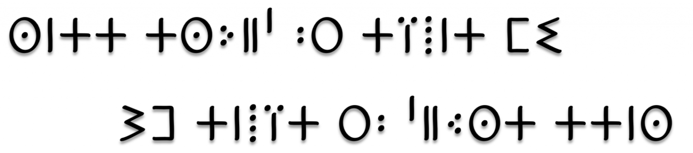

Topic pages are ideal for outlining how things work in terse and clear terms.
Less concerned with telling a story or addressing a specific use case, they should give a comprehensive outline of what you're documenting.

## Further reading

* The [Diátaxis framework](https://diataxis.fr/reference/) calls these Reference pages
