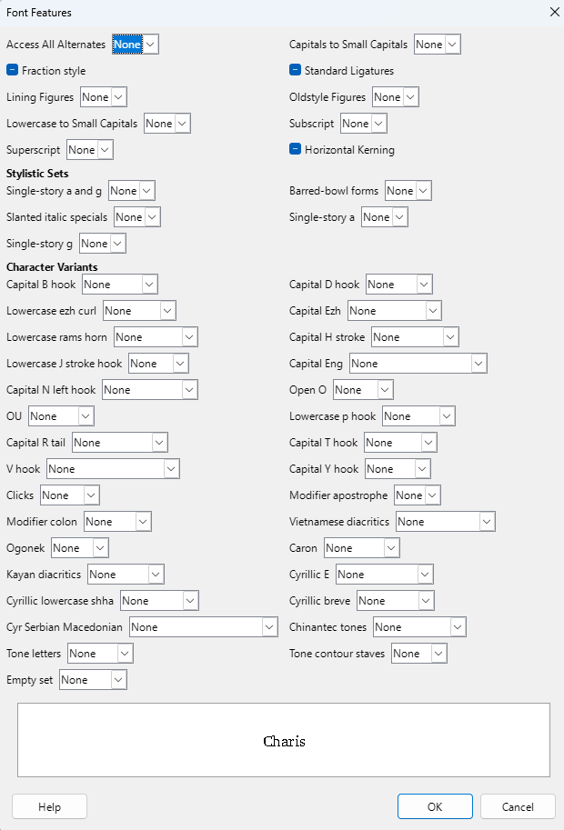
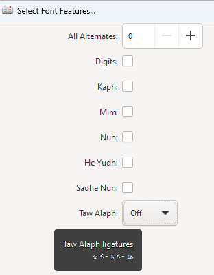

_This is a work in progress._

## Feature UI

Fonts can support a wide variety of [OpenType features][ot-features]. User-selectable font features should be exposed to the user in the application UI. Developing a User Interface to access the user-selectable features has long been neglected. 

Features could just all be dumped into one big dialog box, as LibreOffice does below, but it could be easier for the user if they are more organized.

Various applications have implemented a User Interface for selecting the user-selectable features in different ways.

* In macOS, many of the user-selectable features are available through a **Typography** menu.
* In Word, some of the user-selectable features are available through the **Font** menu, and other are available through the **Font / Advanced** menu.
* In LibreOffice, they are available through the **Character / Font** menu or **Character / Font Effects** menu.
* InDesign has an **OpenType** menu from which various features can be selected.
* ptxPrint has provided for selecting them in the **Font** menu.

### Sample UI

This document gives some ideas for developing a fairly compact way to display the user-selectable features, and still allow the user to select the various options.

The “twisty” divisions are somewhat arbitrary. Using the twisties would allow for a fairly compact menu. If a font doesn’t support a particular topic and/or feature it should either not be displayed or grayed out. (The table below shows what should be under each twisty.)

> In the example below, there is no need to include the four-letter feature tag in the UI. It is simply included for the developer to know which OpenType feature is related to the friendly name. 

When one of the twisties is selected you might see either a checkbox (for on and off) in the case of Stylistic Sets, or multiple options for  selection in the case of Character Variants.

Languages are sometimes selected at the bottom of an application window. The following example has language selection in the dialog box, but it could be selected elsewhere. If the font supports language features, then the language choice will also affect the features that are selected.

<table border="2">
<tr>
<td colspan="2">

  
Language

  
  * Assyrian (select language tag?)
  * Spanish
  * Syriac
  * etc

</td>
</tr>

<tr>
  <td>

  
Effects

  
  * ☐ Subscript [subs]
  * ☐ Superscript [sups]
  * ☑ Optical size [size]
  * ☐ Randomize [rand]
  * ☐ Ornaments [ornm]
  * ☐ Left Bounds [lfbd]
  * ☐ Right Bounds [rtbd]

</td>

<td>

  
Kerning

  * ☑ Horizontal Kerning [kern] 
  * ☐ Kerning for Alternate Proportional Widths [apkn]

</td>
</tr>

<tr>
<td>

  
Ligatures

  * ☑ Standard Ligatures [liga]
  * ☑ Contextual Ligatures [clig]
  * ☐ Discretionary Ligatures [dlig]
  * ☐ Historical Ligatures [hlig]

</td>

<td>

  
Alternates

  * ☐ Access All Alternates [aalt]
  * ☐ Contextual Alternates [calt]
  * ☐ Stylistic Alternates [salt]
  * ☐ Historical Forms [hist]
  * ☐ Justification Alternates [jalt]
  * ☐ Slashed Zero [zero]
  * ☐ Contextual Swash [cswh]
  * ☐ Swash [swsh]
  * ☑ Vertical Alternates and Rotation[vr2t]
  * ☐ Final Glyph on Line Alternates [falt]

  
</td>
</tr>

<tr>
<td>

  
Figures/Fractions

  * ☐ Proportional Figures [pnum]
  * ☐ Tabular Figures [tnum]
  * ☐ Lining Figures [lnum]
  * ☐ Oldstyle Figures [onum]
  * ☐ Alternative Fractions [afrc]
  * ☐ Fractions [frac] (Numerators [numr] should usually be turned on together with frac)
  * ☐ Ordinals [ordn]

  
</td>

<td>

  
Casing

  * ☐ Small Capitals [smcp]
  * ☐ Small Capitals from Capitals [s2sc]
  * ☐ Case-Sensitive Forms [case]
  * ☐ Petite Capitals From Capitals [c2pc]
  * ☐ Petite Capitals [pcap]
  * ☑ Capital Spacing [cpsp]
  * ☐ Titling  [titl]
  * ☐ Unicase [unic]

  
</td>
</tr>

<tr>
<td>

  
Notations

  * ☐ Mathematical Greek [mgrk]
  * ☐ Ruby Notation Forms [ruby]
  * ☐ Scientific Inferiors [sinf]

 
</td>
<td>
</td>
</tr>

<tr>
<td>

  
Stylistic Sets (up to 20)

  * ☐ Single-story a and g
  * ☐ Barred-bowl forms ᵬ đ ǥ

</td>

<td>

Character Variants (up to 99)

 Ħ)">Capital H stroke

* None
* Vertical stroke

 Ŋ > Ŋ)">Capital Eng

* None
* Lowercase no descender
* Capital form

</td>
</tr>

</table>

The full specification for Character Variants allows for tooltips (for example, hover over the Character Variant "Capital H stroke" and see the tooltip). The specification also includes the ability to list the default glyph and each alternate. Although the sample text is extremely small, ptxPrint supports this.

### Resources

* [font.py][ptx-font.py] in the ptxprint repo has a list of “OTFeatNames” which are valid features to display in the feature UI. And “OTInternalFeats” are the ones that should _not_ be displayed in a UI. “OTLangs” has a list of OpenType language tags which can be used for selecting a language.

[ot-features]: https://learn.microsoft.com/en-us/typography/opentype/spec/featuretags
[ptx-font.py]: https://github.com/sillsdev/ptx2pdf/blob/master/python/lib/ptxprint/font.py

