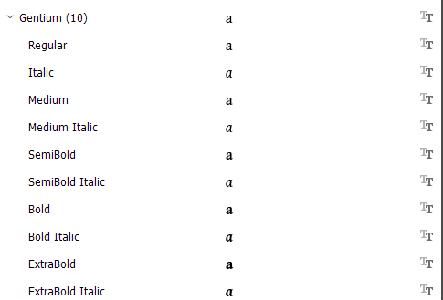

Font families can be structured in many ways, but most families are one of three types: RIBBI, Axis-based (Static), or Variable. In general, standard applications should be able to support the first two types: RIBBI and Axis-based. Variable fonts are used mainly for the web and require special application support to handle the various axes. 

## RIBBI families

Traditionally most digital font families were distributed as a set of four standard styles: Regular, Italic, Bold, and Bold Italic (RIBBI). Applications built their UIs based on this structure, with **B** and _I_ buttons. This traditional structure is becoming much less common, and applications that make this assumption in their UIs will find that an increasing number of font families will not work well, which may be frustrating to users. 

## Axis-based families

[Axis-based][axis-based] (or Static) font families generally go beyond the standard Regular, Italic, Bold, and Bold Italic styles. They commonly provide a wider range of weights such as Thin, ExtraLight, Light, Medium, SemiBold, ExtraBold, and Black. They may also provide other styles as well, such as different widths. They are called Axis-based as the styles refer to specified points along one or more axes, but each font file provides only a single (static) instance. 

Some applications have trouble with these families, and may display these other weights as separate font families (except Bold). Ideally, an application should see, for example, **Gentium** as one family with ten **styles** rather than as separate fonts.

The application should then allow the user to specify which weights should be used for specific uses (text, headings, emphasis, etc.) through a styles mechanism, similar to how it is handled in CSS. Adobe InDesign is a good example of an application that handles Axis-based families well - and that does not have **B** or _I_ buttons. 

## Variable fonts

Variable fonts have all the potential styles in a single font file - or two if italic is included. They are primarily used in web-based applications, and in that environment they can be more flexible than static fonts. Variable fonts allow the user to specify the style as a set of arbitrary values along all provided axes, such as:

- weight (the most common axis)
- width
- optical size

Sliders or input fields are generally used to set the exact values required, but other UIs are possible. Standard CSS properties like font-weight, font-style, or font-variation-settings can be used to fine-tune the preferred values.

[Introducing variable fonts][google-vf] gives more details on Variable fonts.

[axis-based]: https://software.sil.org/fonts/axis-based-fonts/
[google-vf]: https://fonts.google.com/knowledge/introducing_type/introducing_variable_fonts