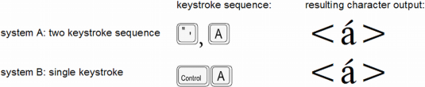
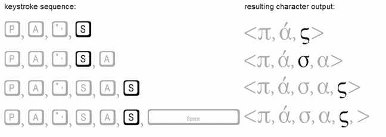

Keyboards are often used to input text data. A user touches keys in a certain order, whether depressing actual keys on a physical keyboard or tapping images of keys on a touch keyboard, to communicate to the device what codepoints to store. These codepoints represent the characters the user desires to enter.

For simple writing systems, one keystroke may correspond to one character. For example, type the key labeled 'A' and an 'a' character is entered.

Writing systems with many characters may require multiple keystrokes to produce one character. For example, type the key for the Ethiopic character 'መ', which represents the syllable 'ma', then type the key for the vowel 'i' and the result is the Ethiopic character 'ሚ', a single codepoint which represents the syllable 'mi'.

In writing systems where digraphs such as 'gb' are regarded as a unit, users may prefer to assign two characters to a single key. For example, type the key labeled 'GB' and the characters 'g' and 'b' are output.

## Keystrokes and codepoints

Input methods represent one [three basic components][codepoints-glyphs] for working with text data on a computer that were introduced earlier. In general, input methods can include things like voice- or handwriting-recognition. Keyboards are the most common form of input, however, and also the only one that is easily extended or modified. This discussion will therefore focus on keyboard input.[^1]

[^1]: It will not, however, cover systems for Far Eastern scripts (Chinese, Japanese, Korean) that typically require sophisticated [input method editors (IMEs)][glo-ime].

### From keystrokes to codepoints

Just as codepoints and glyphs are the counterparts to characters in the encoding and rendering components, keystrokes are the counterpart to characters in the keyboarding component. Whereas characters (or codepoints) get transformed into glyphs in the rendering process, keystrokes are transformed into codepoints in the input process.

All computer operating systems include software to handle keyboard input, and many provide more than one keyboard layout; that is, more than one set of mappings from keys to characters. Many keyboard input methods use a strictly one-to-one mapping from keystrokes to characters: for each keystroke, there is one particular character that is generated.[^2] 
But some keyboards provide alternative mappings--for instance it is common to make use of “dead keys”, which do not generate a character but affect the character generated by the following keystroke. For example, typing “&#x0060;” followed by “a” to get “à”, but “&#x0060;” followed by “o” to get “ò”.

[^2]:We will use the term **keystroke** to refer to the pressing of any basic (non-modifier) key in combination with zero or more modifier keys. By modifier keys, we mean keys such as **Alt**, **Control**, **Shift**, **Alt-Graph**,  **Option**, and **Command**.

Just as the mapping from characters to glyphs might involve complex, many-to-many mappings, the same is potentially true for keyboard input. For example, it would be possible to have a single keystroke that generated a sequence of several characters, such as &lt;n, g, b&gt;, or &lt;GREEK SMALL ALPHA, COMBINING ROUGH BREATHING MARK, COMBINING ACUTE, COMBINING IOTA SUBSCRIPT&gt;. Similarly, it would be possible for a sequence of keystrokes to generate single characters, perhaps with each keystroke in the sequence changing the previous output.

")

Different input methods might generate exactly the same characters, though in different ways. For example, one may use a single keystroke to generate a given character, while another uses two or more keystrokes (the first, perhaps, being a **dead key**) to generate that character.

Complex input methods can map a single keystroke to different characters, depending on context. For example, in the case of Greek sigma, an input method may use a single key, such as the **s** key, to enter all forms of _sigma_, with the input method generating either a FINAL SIGMA or NON-FINAL SIGMA according to the context:

Note that, when the **s** key is pressed, the _sigma_ is at that point word-final. It is the next character that is entered that determines whether or not the _sigma_ will remain word-final. If another word-forming character is entered, then the FINAL SIGMA is changed to NON-FINAL SIGMA.[^3]

[^3]: As to be expected, there are many possible implementations for a Greek keyboard. Another implementation might provide separate keystrokes for final versus non-final characters.

The point to see in this discussion of input methods is that the mapping of keystrokes into characters is potentially a complex process involving many-to-many mappings, just as in the rendering process. Users familiar with systems designed to support English would certainly be familiar with keyboards that use one-to-one mappings only. But keyboard processing need not be limited in this manner, and many keyboard implementations are not.

See [Keyboards and Tools][keyboards-and-tools] for information on available keyboarding utilities. Input methods other than keyboards are covered in [Other Input Methods][other-input-methods]. 

_Portions of this content first appeared in [Guidelines for Writing System Support][sil-wsig], copyright © 2003 UNESCO and SIL International._

[glo-ime]: /reference/glossary#ime
[keyboards-and-tools]: /topics/input/keyboards-and-tools
[other-input-methods]: /topics/input/other-input-methods
[codepoints-glyphs]: /topics/encoding/characters-codepoints-glyphs#codepoints-and-glyphs

