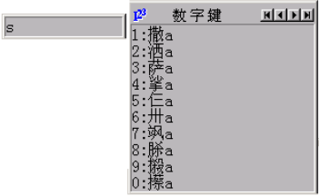

_[Characters, Codepoints, Glyphs][characters-codepoints-glyphs] should be read prior to reading this section._

## Types of data interaction

**Entry** of textual data is a process of translating physical key presses into individual chunks of data. This is relatively easy: you just allocate codepoints to keystrokes. The difficulty comes when trying to decide what codepoints to assign to what keystrokes. Do you design based around the characters on the keytops of a user’s physical keyboard hardware or the relative position of the keys? What do you do if you want to be able to type more characters than there are keys in your keyboard?

**Editing** of data is even more complicated. On top of the issues regarding what happens when keys are pressed, there are issues of cursor position, text selection, directionality. For example, when a user clicks in the middle of a word and starts typing, what should happen? This is easy for text that is linear (one letter after another), but what if tone marks and vowel symbols are involved, some of which could be typed after a consonant, but appear before? The details of this are too complex for this brief paper, but need to be considered in addition to basic keystroke to codepoint translations.

This rest of this section will examine various design tradeoffs for software keyboards and look at some of the different approaches used in different situations and technologies. Note that, as yet, there is no technology which can support all the different approaches presented here. So in addition to making decisions based on the particular keyboard behavior required, you will also need to take into consideration the limitations of your keyboarding software.

First we consider issues of keyboard layout and then issues of large keyboards (those where there are more characters to be typed than keys to type them). Note that this section contains information relevant to those designing keyboards with very few characters as well. Then we look at sequence checking and the whole issue of how different types of keyboards are expressed as rule systems. At the end is a listing of tools that can be used to create software keyboards.

## Keyboard layout

The primary consideration in keyboard design is the layout of the keys. Whether the physical keyboard is a variant of a standard European keyboard, or one localized for the script, there are ways to adjust the layout to accommodate new or rearranged letters. Much of what we need to consider can be brought out in the simple example of adding support for the character “ÿ” to a Latin keyboard. There are two ways of doing this.

### Mnemonic

The first way is to consider the “ÿ” as two components: “y” + _umlaut_. In this case we would have a special keystroke to add the _umlaut_ on top of the “y”, for example the keystroke `"` following a **y** might add the umlaut. In other words we are using existing information on the keys of a user's keyboard to help the user remember the keying of the character. We use the term **mnemonic keyboard** for this type of keyboard. Mnemonic keyboards are commonly used with Latin-based scripts, since there is a close correspondence between what people want to type and what they see printed on the keyboard in front of them.

### Positional

The second approach to the design of a keyboard is to reconsider the position of the letters on the keyboard. Of course, this means that there may be differences between the letters that appear on the keytops and the results when typing. There are physical ways to assist users in using rearranged keyboards, but those are not discussed here.

The easiest way to implement “ÿ” in this case is to consider “ÿ” as a unit. We might want a single key to press to type this character. In addition, we would like it on the periphery of the keyboard, since it is a rarely typed letter, and goes just as well on the right, where there are punctuation characters we can use. So we might specify that it is associated with the second row right-most key on the keyboard, which on some keyboards represents the “]” key. This is a departure from the standard keyboard, but one that users can readily accept.

A more complex, but possibly better, method is to still give “ÿ” a special key, but arrange it positionally close to the “y”. This would be helpful if “ÿ” was a very common letter combination. For example, the UIOP keys could be shifted right (with the **P** replacing the **[** key), and the new letter placed in the place of **U**.

This type of rearranged layout is a **positional keyboard**, where keys are defined positionally in relation to each other. Thus it does not matter what is printed on the keytops of the keys; what is important is what character is generated by each position in the grid of keys. This approach is most commonly used when implementing a keyboard based on a typewriter layout or some other standard.

This approach of defining keyboards in terms of the relative positions of keys is less common for the addition of a single character to an existing keyboard than it is for the implementation of a whole keyboard, particularly if that keyboard emulates an existing keyboard layout. For example, there is no mnemonic relationship between the keytops on a physical keyboard created for the UK and the de facto standard for typing Thai. The Thai keyboard is designed in terms of the old typewriter layout, which is a good layout. That is, the most commonly typed letters are positioned in easy-to-reach locations, and rarely-typed letters are more difficult to reach, without respect to the traditional QWERTY layout.

When designing a complete new layout for a keyboard purely in terms of relative positioning, it is useful to do some analysis of common letters and combinations. The keyboard designer can then allow typists to type quickly by placing commonly typed letters on the keys in the middle of the keyboard. This is a radical departure from QWERTY, which was originally designed to slow typists down so that the typewriter would be less likely to jam. The DVORAK layout for English keyboards was an attempt to provide a keyboard layout which allows typists to type English faster.

## Extending the keyboard

In many cases, the requirement is to design a keyboard which supports more characters than can be accessed simply from a single press of the 101 or 102 keys on a normal physical keyboard. There are numerous approaches which are used to extend keyboards and we present most of them here.

### Modifier keys

The most common approach is to extend a keyboard using modifier keys such as **Shift** (a traditional modifier key) or **Ctrl**,  **Alt**, **Alt-Gr**[^1], **Command**,  **Option**, etc., depending upon what type of keyboard you have. The Macintosh, for example, allows access to all the 8-bit codes directly through use of combinations of the option and shift keys.

[^1]:Some keyboards, particularly European keyboards, have an extra key called  **Alt-Gr** (Alternative Graphics) which may be used to access a 3rd character on a key. The **Alt-Gr** key can be simulated on keyboards without it, by using **Ctrl-Alt**.

The problem is that modifier keys are often used by applications for speed keys or for controlling the application, and requiring their use for typing can preclude their use by the application. Or worse, the application may take precedence over the modified key and not allow that combination to be used for typing a character. The Macintosh, at least, is reasonably tidy: combinations including the  **Command** key are for “speed keys”, those without aren’t (except in non-text-oriented applications or situations such as games). So combinations including the **Shift** and  **Option** modifiers are safe for generating characters. On Windows, **Alt** is typically used for accessing menu items, whereas **Alt-Gr** (or **right-alt**) may be used for entering extra characters.

### Dead keys

**Dead keys** are a popular approach to extending the keyboard for Latin keyboards. This approach allows the user to type a single character as a sequence of two or more keys on the keyboard. All but the last key do not result in anything being displayed, but change the state of the keyboard for subsequent keystrokes.

For example, on the International English keyboard, pressing the `'` key results in nothing being displayed. Following that by the **a** key results in “á” being output. If a key, such as **b** were to follow, then “'b” would be output.

Dead keys work well where there is a very strong mnemonic relationship between the key being pressed and its function. Dead key sequences should be obvious and short, so the user is less likely to forget where they are. The problem with dead keys is that they easily confuse users since pressing a dead key results in no initial visual feedback.

### Operator keys

A different approach to dead keys is to place the modifier after the key it modifies. Thus we might type **a** followed by `'` to get “á”. On pressing the **a**, an “a” would be output. Then when the `'` is pressed, the “a” preceding the cursor is replaced by a “á”. This is a very powerful approach in that it allows the user to always have feedback regarding what they are typing.

The major difficulty with this approach is the implementation. You first need a system which can handle complex editing as well as typing. Thus, if I were to click in a document following an “a” and then press `'`, I would expect that “a” to change. But that might well not be possible, technically. Tools such as [Keyman][keyman] work hard to emulate this behavior, but even then have limitations.

Secondly, all intermediate output characters need to be supported by the system. When implementing a keyboard for the International Phonetic Alphabet, which has hundreds of symbols, it may be nice to use combinations that begin with the **;** key to enter certain symbols. Using an operator keys approach, it would be ideal for the system to display an intermediate “;” as the first key is pressed. But the “;” might not exist in the IPA font, and so could not be displayed. Thus, you can only rely on intermediate output for codes that your keyboard needs to generate anyway.

### Input method editors: composition and candidate windows

One approach to the very large keyboard problem, for such languages as Chinese, is to use a type of keyboard input system known as an [input method editor (IME)][glo-ime]. IMEs are characterized by special pop-up windows used to facilitate input. One type of window, known as a composition window, allows an intermediate string to be edited. For instance, a phonetic representation using Latin characters may appear temporarily, and then replaced in the composition window by a Chinese character when a valid syllable is recognized. When the desired Chinese characters appear, a final keystroke causes this completed result to be transferred into the document.

A second type of window, known as a candidate window, can supplement a composition window. For example, as a phonetic representation using Latin characters is entered in the composition window, there can be several Chinese characters that could be intended. A candidate window can appear, showing the different candidate characters, allowing the user to select the desired Chinese character via the mouse, pressing the initial key or using the arrow keys. As the user types more keys, the possible selection list changes, homing in on appropriate character to input. For example, a Chinese keyboard results in the following windows being displayed:

In the screen shot above, the left hand window is the composition window, which contains temporary output from keystrokes that have been pressed. The right hand window contains candidate Chinese characters that are possibilities for what the user might be wanting to type. There are various other controls to allow the user to page through the list.

Composition and candidate windows can be used in combination, but either can be used alone. A candidate window provides a powerful mechanism for selecting characters from a large list, or even a shorter list, if a user is liable to have difficulty remembering the keying for a particular character. Its weakness is the amount of screen space it takes up, although with increasingly large screens, this is becoming less of a problem.

Unfortunately, there are few, if any, tools that allow such candidate systems to be customized or created.

## Analytic keyboards

Modern keyboard technologies open up many new possibilities for complex keyboard behavior—beyond dead keys and operator keys. It is now possible to build analytical routines into systems that intercept the key presses, perform some analysis, and deliver the results to the application.

### Sequence checking

Simple keyboards, where one keystroke equals one letter, and each letter follows directly after the previous one on the line, can usually assume that people will type data correctly. Other situations — more prevalent in scripts which use diacritics — is the issue of ensuring that people, for example, do not type the same diacritic twice. This enforcement of valid keying sequences is known as **sequence checking**. This can be as simple as checking that people don’t type the same diacritic key twice in succession, and possibly generating an error (such as a system beep) when they do.

Sequence checking can also be used to ensure that only valid base character and diacritic combinations are typed, and that they are typed in the correct order. Some software specifies a combining order for diacritics, and it helps if the keyboard can encourage data entry in this order. The order can be enforced, either by not allowing an earlier diacritic to be typed after a later one, or by allowing the keystroke and then re-ordering the data before it is stored in the computer.

Editing data that requires sequence checking presents a similar problem to that of operator keys. It is not easy for the keyboarding utility to manage the editing of a document, especially if a cursor is positioned randomly within a string of text. For this reason, applications cannot assume that the keyboarding utility will ensure that data is entered in any particular standard form or combining order. This can be troublesome.

While the keyboard does not interact with rendered text, but with the underlying stored text, the two are related in that they are both concerned with the visual representation of the text. Thus, the rendering subsystem may handle ‘illegal’ sequences by, for example, displaying illegal diacritics over a dotted circle, which can alleviate work from the keyboard. But there is no harm in programming defensively, with both the renderer able to display illegal sequences and the keyboard endeavoring not to allow users to type illegal sequences.

With dumb rendering systems, which are particularly unable to work with illegal sequences (for example, duplicates of the same diacritic), then more of the burden for ensuring valid data is placed upon the keyboarding subsystem.

### Using keyboards in place of rendering systems

Keyboards can also be used to take the place of sophisticated rendering systems. For example, a writing system may rely upon a dot, placed over certain letters, to indicate some linguistic function. For most letters, the dot is placed at a normal height. For tall letters, however, it must be raised. This is most appropriately handled using smart rendering systems. If such a system is unavailable, then the same effect can be produced by encoding two variants of the dot—one normal height and one higher—as distinct characters, and the keyboard can determine which to use based upon the last letter typed.

There is a danger to this use, however. The resulting data stored on the computer now has two different codes in use for the dot, and the chosen encoding will need to include both. This makes further analysis on the text more difficult and error prone, and hence is not considered good practice in information systems. In particular, it is completely contrary to Unicode design principles. This is not needed as much with newer rendering systems, but was once the best option for high-quality publications.

### Using keyboards to enter non-visual data

Just as keyboards can choose which variant of a diacritic to use in a specific context, it can also enter additional data into the encoded text. In Southeast Asia, many of the scripts can be written either with or without word breaks. Text without such breaks can be difficult to process, as the application needs to know when to break a line so as to keep words intact. Ideally, as part of the rendering process, an application would perform linguistic analysis on the text in order to recognize where valid line breaking possibilities exist. It may not be feasible to implement such capability in every situation, however. As an alternative, non-spacing word break characters could be used. But some typists find it hard to remember to enter in those non-visual breaks when they are not displayed on the screen.

Here some analysis could be built into the keyboard. It could watch the stream of key presses, analyze the syllable structure, and automatically enter in the breaks. This is not always foolproof, but can be a great help to the entry of text.

## Keyboard tools

### Cross-platform tools

#### Keyman

[Keyman][keyman] provides keyboarding solutions for Windows, Mac, and Linux computers and also for Android and iOS touch devices (such as phones and tablets). A Keyman keyboard package provides a remapping of the keys of the physical keyboard (and optionally of touch devices), as described in the [From Keystrokes to Codepoints][from-keystrokes-to-codepoints] section. The same keyboard package can be used on any supported platform that has the Keyman "engine" for that platform installed. There is no charge for using Keyman or for downloading keyboards from the Keyman site.

On the [Keyman][keyman] site, a user can type a language name into the search box to see what existing keyboards support that language. The user can, on the site, try the keyboard online and download a keyboard package to install.
For example, click on the "Arabic" link and then, under the "Try this keyboard" heading, click in the text box and start typing. Or select the "Full Online Editor" button and, when the new page appears with the keyboard, start typing. Note that some links such as "Amharic" bring up an intermediate page with more choices.

If no suitable keyboard exists, a user can download the [Keyman Developer][keyman-developer] tool and create a suitable keyboard layout. Users who create such a keyboard are encouraged to submit it to the Keyman keyboards repository so that others can benefit from having that keyboard freely available.

#### Keymagic

[Keymagic][keymagic] is an open source keyboarding system which works on Windows, macOS, and Ubuntu. 

### Windows-only

#### MSKLC (Microsoft Keyboard Layout Creator)

[MSKLC][msklc] is a freeware Microsoft tool for creating new keyboard layouts using the Windows-native keyboard file format, and so gives seamless integration with Windows systems. It can use an existing Windows keyboard as a starting point. However, it is limited in its ability to cope with more complex scripts.

MSKLC is no longer being developed and it is sometimes difficult to install a keyboard on Windows 10 and Windows 11.

### macOS

#### Ukelele

[Ukelele][ukelele] Ukelele is a user-friendly Unicode Keyboard Layout Editor for macOS, making the tedious, error-prone task of editing XML-based keyboard layouts a breeze. 

### Linux (including Ubuntu)

Most standard Linux installations include X Windows and the XKB keyboard manager (see below) which includes many keyboards. In addition, the  iBus input method framework (IME) can be turned on and configured, and more keyboards/IMEs are available through that. So it is worth looking through standard XKB and iBus keyboards prior to considering developing your own.

#### XKB (X windows KeyBoard extension)

XKB is the underlying (pre-installed) keyboard manager for X windows, the standard windows system on Linux (Ubuntu included). This means that a completed keyboard can be submitted for inclusion in all future platforms and devices using X. The user need not install any additional software to use the keyboard.

### Android

Devices running Android provide a choice of languages and input methods. Extra input methods and separate language packs can be installed from the Google Play store.

The [Keyboard App Builder][kab] helps you to create customized keyboard apps for Android smartphones and tablets. These apps allow users to add a system keyboard to their devices, enabling typing in their preferred language across apps such as Gmail, Facebook, and WhatsApp. Whether you need to develop a keyboard for a community language or personal use, Keyboard App Builder simplifies the process, ensuring everyone can access their language digitally. The Keyboard App Builder packages a [Keyman][keyman] keyboard, lexical-model, and fonts into an app which can be easily shared.

[Multiling][multiling] is one of the possible solutions to explore for extending writing systems support.

Note that, as with all systems, for each keyboard there needs to be an appropriate font available; on Android, facilities to add new fonts to be used for all applications are very limited (and currently only possible when rooting/jail-breaking the device). Some applications come bundled with fonts to extend their own functionality, but they will only work within the particular application.

### Historical and no longer used

These are listed in order to document previously used keyboarding systems.

#### InKey

InKey was based on [Autohotkey][autohotkey], an open source macro-creation and automation tool. InKey is no longer available.

#### Ekaya

[Ekaya][ekaya] is an open source keyboarding system that uses the open source [KMFL][kmfl] library to parse the [Keyman][keyman] .kmn files, so keyboards developed with Keyman should work with Ekaya as an alternative to the Keyman client. (This product is no longer being developed and is not recommended for use. Keyman is a good alternative. The keyboards available through ekaya are also available on Keyman.)

#### KMFL (Keyboard Mapping for Linux)

[KMFL][kmfl] is an open source keyboarding system for Linux systems, particularly Ubuntu, which is compatible with Keyman 7 (or earlier) .kmn source files, so brings the power of Keyman keyboarding to a Linux environment. Although designed for Linux/Unix systems in general, full downloads and instructions are currently only available for Ubuntu.

_Portions of this content first appeared in [Guidelines for Writing System Support][wsig7], copyright © 2003 UNESCO and SIL International._

[autohotkey]: http://www.autohotkey.com/
[characters-codepoints-glyphs]: /topics/encoding/characters-codepoints-glyphs
[ekaya]: Keymagic
[from-keystrokes-to-codepoints]: /topics/input/from-keystrokes-to-codepoints
[glo-ime]: /reference/glossary#ime
[kab]: https://software.sil.org/keyboardappbuilder/
[keymagic]: https://keymagic.net/keyboards/
[keyman-developer]: https://keyman.com/developer/
[keyman]: https://keyman.com
[kmfl]: https://kmfl.sourceforge.net/
[msklc]: https://scriptsource.org/entry/m98qmxx7dx
[multiling]: https://play.google.com/store/apps/details?id=kl.ime.oh
[ukelele]: https://software.sil.org/ukelele/
[wsig7]: https://scripts.sil.org/wsi_guidelines_sec_7.html
