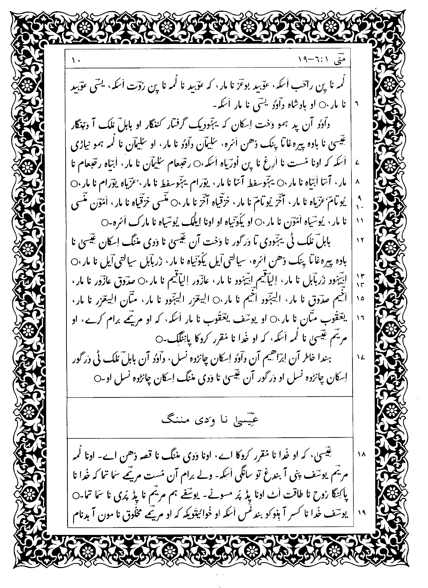

Although possibly not technically challenging for software developers, there are design differences in non-Roman scripts of which the typesetter must be aware. Many design issues are related to readability. The author and graphic designer, of course, want to have their manuscripts read. Emphasis, cultural design issues, optimum line length for a particular typeface and point size, leading, kerning and word spacing are all important in contributing to readability and will be different for each writing system.

## Page Design

### Overall design

There are some simple differences in the setup of a page. For instance, most of the world outside of the United States uses A4 paper. Another is that many non-Roman books use a line under the running header to set it off from the text. With sacred writings, especially in RTL scripts, one often needs to add decorative borders around each page (see Figure 1).

**Figure 1. Decorative border around sacred text (Brahui)**

## Multilingual texts

When mixing scripts on a page it is very important to ensure that the body size and feel of the fonts are balanced. If one font is significantly heavier than the other, the page will look unbalanced.

## Illustrations

Placement of illustrations will need to be different. Studies show that in reading Roman, the eye naturally scans from the top left to bottom right, and graphic designers keep the normal eye flow in mind when they are designing pages. Further study is needed to know whether there are similar guidelines for placing illustrations with RTL and vertical scripts.

## Figures

1. 1998. *The New Testament in Brahui, First Edition*, p. 10. Lahore: Pakistan Bible Society.