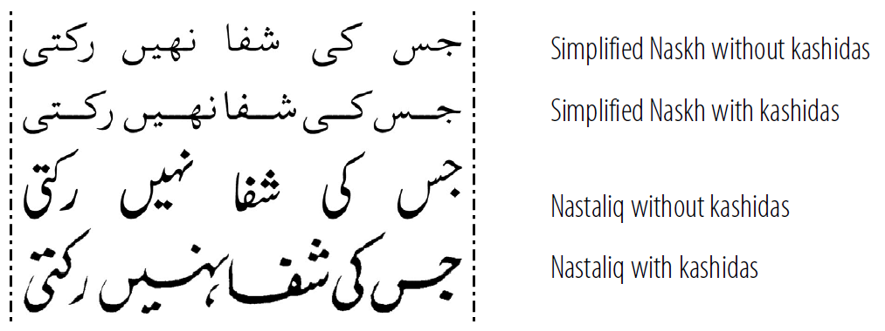

Hyphenation is often required because text is justified. The two are closely tied together.

Hyphenation is another tool used in Roman typesetting but is not always allowed in other writing systems. Since Arabic does not allow hyphenation, another method for justification is needed: *kashidas* are used to stretch the line. The *kashida* (or tatweel) is typeface-dependent and varies for each kind of Arabic script. Thus, the rules for inserting the *kashida* will be in the font, and the publishing application would need to have the capability of using the font (Milo 2001).x

**Figure 1. Use of kashida**

Another interesting case of different hyphenation methods is Ethiopic. Because Ethiopic was traditionally written using the *Hulet Neteb* there was no need for a hyphenation character. If a line broke at the end of a word you would see the *Hulet Neteb* or other punctuation but, if a line broke in the middle of the word, the reader just saw the word break with no hyphen. In Figure 2, line two is “hyphenated,” line one is not.

**Figure 2. “Hyphenation” in line two with use of Hulet
Neteb (Ethiopic)**

**Figure 3. “Hyphenation” in line two with use of white space
(Ethiopic)**

The difficulty now arises that word breaking still sometimes occurs this way but, with software limitations encouraging the use of white space between words (rather than the *Hulet Neteb*), it is difficult to know if there is a complete word at the end of a line or if it is a “broken” word (compare Figure 3 with Figure 2).

Interesting hyphenation behaviors also occur in some Roman script use, as in the German word “backen” which becomes “bak-ken” when hyphenated (although there are moves for this to be abandoned). Hyphenation rules in the publishing application need to be fully customizable for these types of behaviors.

## References

Milo, Thomas. 2001. *“Creating Solutions for Arabic: A Case Study,”* Eighteenth International Unicode Conference, Pre-Conference Tutorials. TC5:6.
