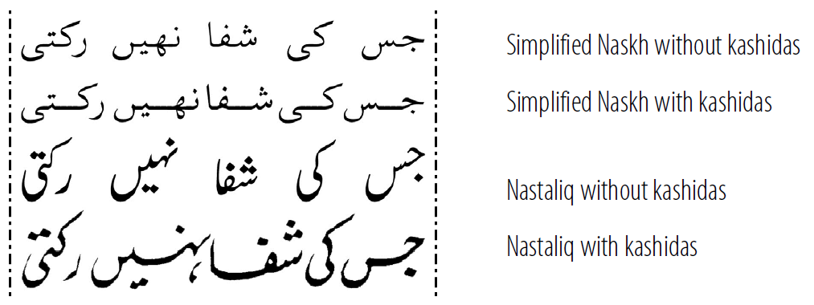

[Justification][justification] is the alignment of text along both the left and right margins so that all the lines are the same length. In Latin and other similar scripts, justification is usually handled by applying [hyphenation][hyphenation], or by adjusting the spacing between words and characters on each line. However, not all scripts can use hyphenation. Two examples are the Tibetan and Arabic scripts.

Tibetan does not have visible word breaks and so the only variable white space is after the _shad_ (&#x0F0D;). In Figure 1 one can see that lines four, five and six are “completed” (or justified) with a series of syllable markers (&#x0F0B;) while the other lines are justified via the variable space after each _shad_.

")

Another interesting example is Arabic. Since Arabic does not allow hyphenation, another method for justification is needed: *kashidas* are used to stretch the line. The *kashida* (or tatweel) is typeface-dependent and varies for each kind of Arabic script. Thus, the rules for inserting the *kashida* will be in the font, and the publishing application requires the capability of using the font.

## References

Minzu Tushuguan bian (Library of Nationalities). 1984. “Zangwen dianji mulu: wenjilei zimu” (Bibliography of Ancient Tibetan books and documents). Vol. 1, p. 1. Chengdu: Sichuan Minority Press.

 

_Portions of this content first appeared in [Implementing Writing Systems][iws], copyright © 2001 SIL International._

[iws]: https://scripts.sil.org/iws-toc.html

[hyphenation]: /reference/glossary#hyphen
[justification]: /reference/glossary#justify
