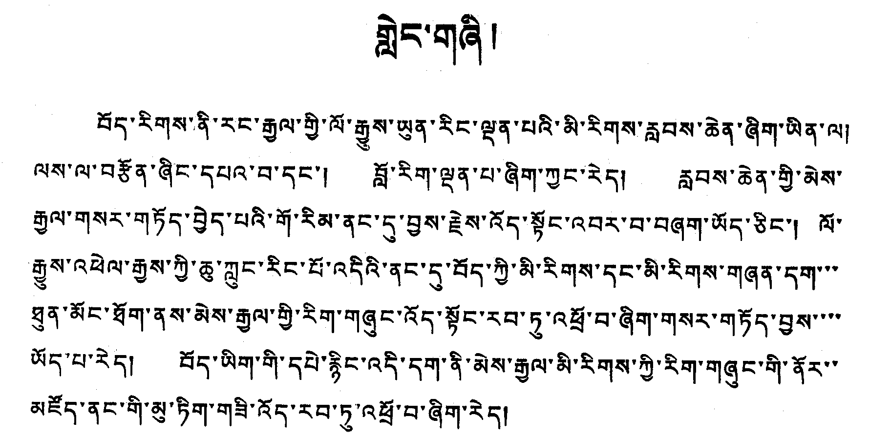

Tibetan does not have visible word breaks and so the only variable white space is after the _shad_ (&#x0F0D;). In Figure 1 one can see that lines four, five and six are “completed” (or justified) with a series of syllable markers (&#x0F0B;) while the other lines are justified via the variable space after each _shad_.

**Figure 1. Syllable markers help “justify” the line (Tibetan)**

## Figures

1. Minzu Tushuguan bian (Library of Nationalities). 1984. “Zangwen dianji mulu: wenjilei zimu” (Bibliography of Ancient Tibetan books and documents). Vol. 1, p. 1. Chengdu: Sichuan Minority Press.

