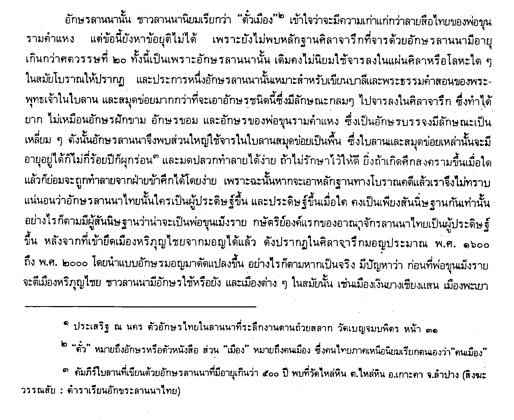
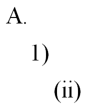
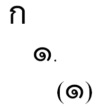

Most of the behaviors mentioned in this section will be based on the national standard for a particular script. This type of behavior won’t reside in the font though, and the typesetting application will need to be customized to follow national standards.

## Footnotes

Footnote numbering must be addressed. Most non-Roman scripts will only use numbers or symbols rather than alphabetic characters, as are often used in Roman typesetting. If symbols are used, decisions on order (dagger, double-dagger, asterisk…) need to be made and implemented. Figure 24 shows the use of Thai digits in footnotes. At small point sizes it becomes difficult to distinguish between digits.

**Figure 1. Use of Thai digits in footnotes**

## Outlines
In an ordered list, whether an outline, footnotes or a glossary with alphabetic headers, the sort order must be addressed. Punctuation around outline points must also follow national standards.

**Figure 2. Sample of outline in Roman text**

**Figure 2. Sample of outline in Thai text**

A look through various Thai publications reveals that, as in English, there are a variety of ways to number outlines. The Thai example above uses both “alphabetic” characters as well as digits. Once again, the ability to customize an application’s rendering of ordered lists is important.

## Figures

1. Pankhueankhat, Ruengdet. 2530 (Buddhist calendar). *Aksorn Thai*, p. 9. Salaya, Thailand: Mahidol University. Institute for the Study of Language and Culture for Rural Development.