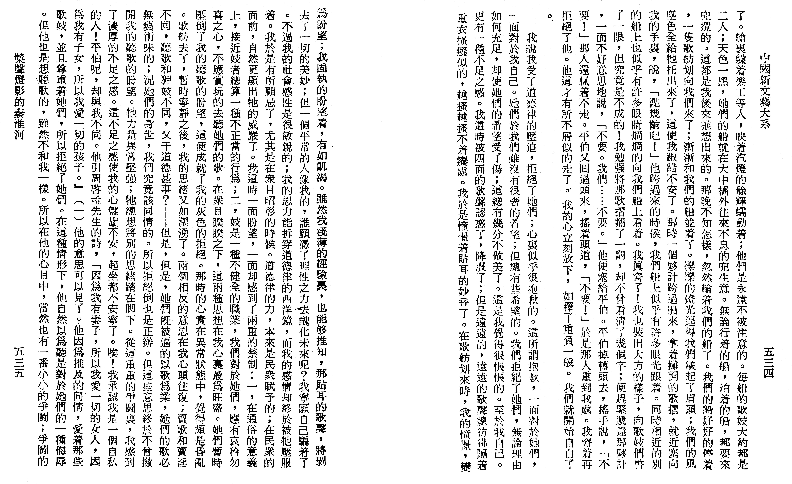
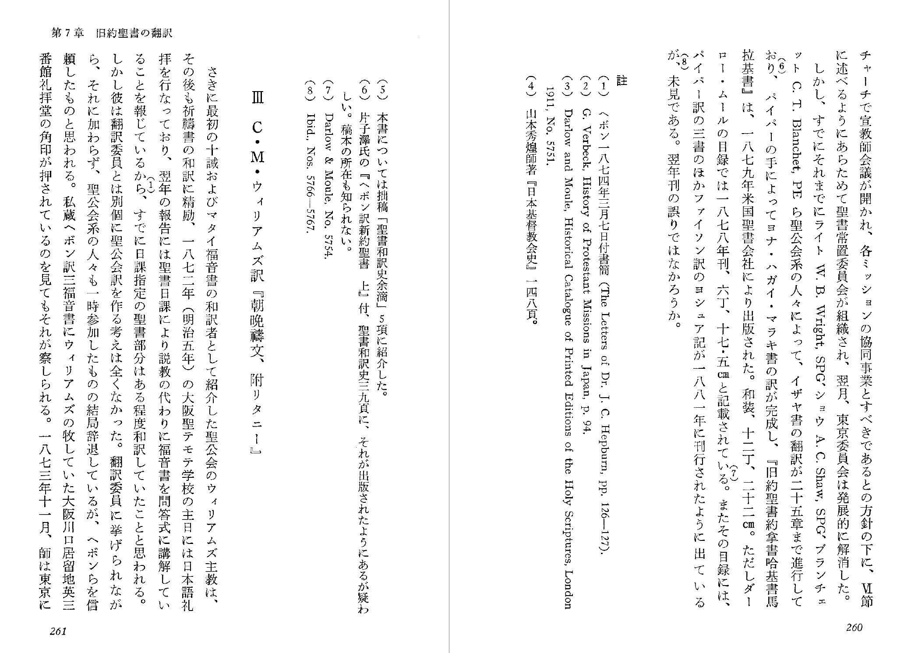
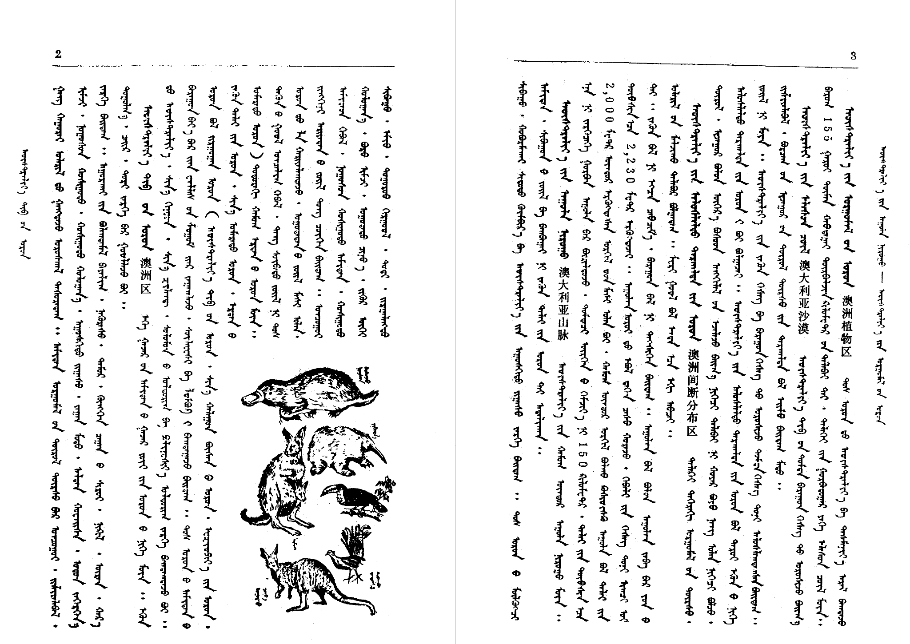
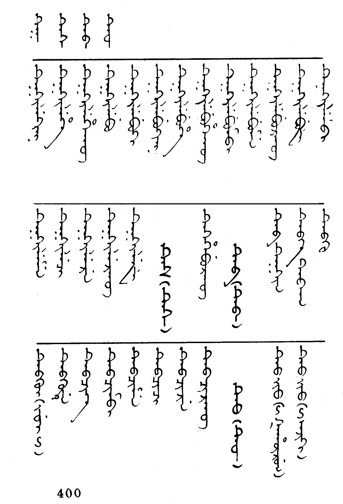
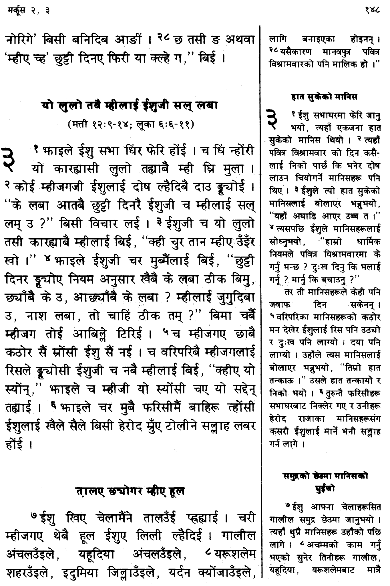
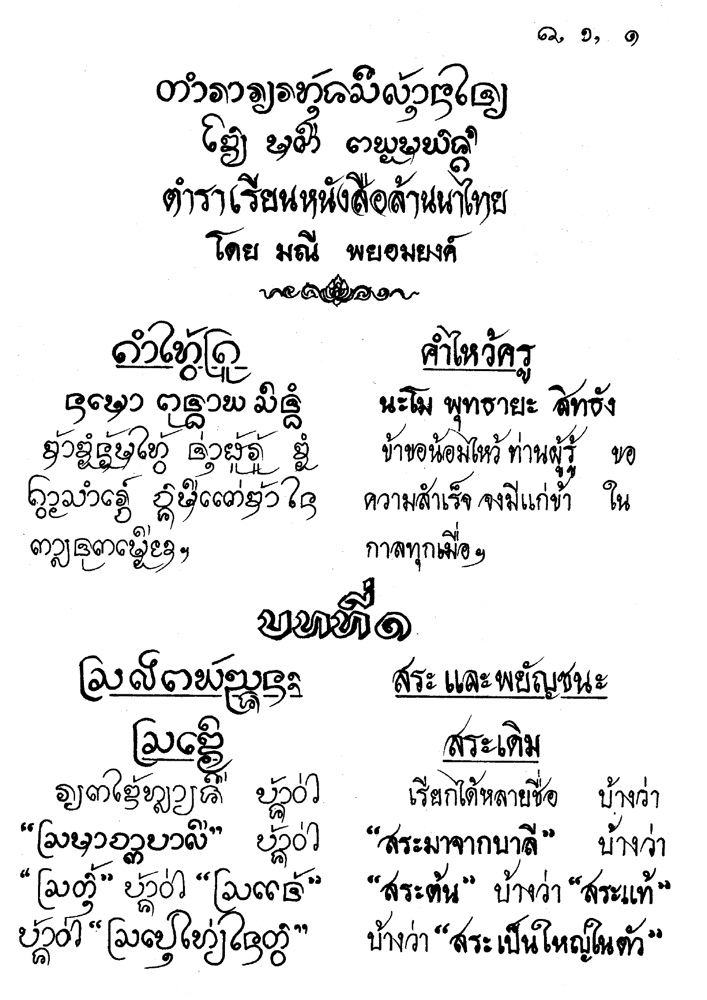

## Overall design

The setup of a page will especially be affected in RTL and top-to-bottom books. Even numbered page numbers will now be on the right side of the page and odd numbered page numbers on the left side of the page, as seen in Figure 1 (page numbers are on lower outside margin) and Figure 2. Thus, even/odd pages will have margins which are opposite from a LTR book.

**Figure 1. Vertical headers in a top-to-bottom-RTL script (Chinese)**

## Headers and Footers

Another issue that needs to be examined is what headers, footers and footnotes look like with vertical text. Do they run across the top and bottom of the page or do they run down the far left or far right of the page? The publishing application must be able to handle these unusual header and footer types.

**Figure 2. Horizontal headers in a top-to-bottom-RTL script (Japanese)**

A vertical text with vertical headers is seen in Figure 1 while the body of Figure 2 is vertical with vertical footnotes but has LTR horizontal headers and footers. Examples of Chinese and Korean with RTL horizontal headers have also been seen.

**Figure 3. Horizontal *and* vertical headers in a top-to-bottom-LTR script (Mongolian)**

Figure 3 has a vertical body text with both a horizontal header for the page number and a vertical header on the outside pages (which contain first and last dictionary entries). Figure 4 has a vertical body text with a header across the top of the page while the words in the header are still running vertically LTR. What a rich variety of possibilities!

**Figure 4. Columns in a top-to-bottom-LTR script (Xibo)**

## Columns

Columns, of course, must be handled differently when a vertical script is in use. Figure 4 shows a dictionary which is set in three columns. The text reads LTR, then flows to the next column and again begins at the left and flows right. Obviously, column behavior for RTL vertical scripts would be opposite to this.

## Diglots

The ability to typeset diglots is also very important. This could take the form of using the same script (Figure 5) or two differing scripts (Figure 6).

**Figure 5. Diglot using the same script (Devanagari) in two languages (Gurung/Nepali)**

**Figure 6. Diglot using differing scripts (Lanna/Thai)**

## Figures

1. Yü, Ta-fu. *Chung-kuo hsin wen i ta hsi*, Vol. 2, pp. 534-535. Taipei, Ta han chu pan she, Tsung ching hsiao yuan liu chu pan she, min kuo 65- [1976- ].

2. Ebisawa, Arimichi. 1981. *Nihon no Seisho (The Japanese Bible: A History)*, pp. 260-261. Tokyo: Nihon Kirisuto Kyodan Shuppankyoku.

3. Hasbaatar Saranbat. 1985. *Baigal gazar zuin toli (Nature dictionary)*, pp. 2-3. Inner Mongolia: Inner Mongolian People’s Publication Committee.

4. Tong, Qing-funei (Mr.). Chief editor. 1994. *fon koolingga sibe shu tacin gisun i buleku bithe (Modern Standardized Xibo Written Language Dictionary)*. Edited by “Xinjiang Uygur Autonomous Region Working Committee of National Languages and Writings”, p. 400. Urumqi, People’s Republic of China: Xinjiang People’s Publishing House.

5. 1982. *Gurung-Nepali (common language version) New Testament*, p. 148. New Delhi, India: World Home Bible League. Printed at Ambassador Press.

6. Phayomyong, Manee. 2533 (Buddhist calendar). *Learning to Read Lanna Thai* (translation), p. 1. Chiang Mai, Thailand: Chiang Mai University. Printed by Sap Karn Pim.