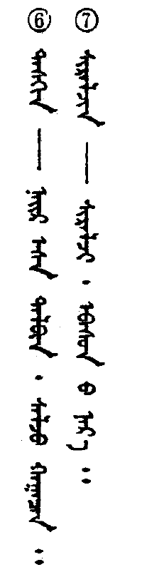

## Bullets and Indents

RTL behavior needs to be properly implemented with regards to bullets (see Figure 7) and paragraph indents (see Figure 9). Vertical scripts also need proper bullets (see Figure 8) and paragraph indenting. As with any formatting decisions, the typesetter needs to examine a great variety of examples to see what is considered normal and beautiful. The typesetter who comes from a Roman perspective to typeset Arabic would probably choose to use smaller bullets than those used in Figure 7, but the larger bullets might be considered beautiful to readers of Arabic.

**Figure 7. Right aligned bullets in RTL text (Arabic)**

**Figure 8. Top aligned bullets in vertical text (Mongolian)**

**Figure 9. Right indented paragraph in RTL text (Arabic)**

## Verse numbers

In Christian biblical typesetting, there is the question of how to display verse numbers. There are three main approaches. Inline verse numbers insert the verse number, usually as a superscript number, before the text in the verse. Marginal verse numbers move the verse numbers out into the margin. Hanging verse numbers hang them off the following text. We describe these last two approaches.

## “Marginal” verse numbers

It is fairly unusual to see [“marginal” verse numbers](https://silnrsi.github.io/wstr-sample-site/reference/glossary#marginal) in Roman scriptures today, they are commonly used in non-Roman scriptures. Although their use remains popular in Myanmar. Marginal verse numbers are never easy to implement, whether in Roman or in non-Roman typesetting. The Lao New Testament in Figure 10 uses hanging chapter and verse numbers (which appear down the far left of the page). Another instance of hanging verse numbers is seen in Figure 11 (the small digits at the top of the page).

**Figure 10. Marginal verse numbers in LTR text (Lao)**

**Figure 11. Marginal verse numbers in top-to-bottom RTL text (Chinese)**

## “Hanging” verse numbers

Hanging verse numbers are often used in poetry contexts where the position of the start of the text is fixed and the verse numbers hangs off to the left (in LTR text) and may be of variable width. In the two examples below compare the position of the start of each line of text and the start of the verse number.

**Figure 12. Non hanging verse numbers in LTR text (English)**

**Figure 13. Hanging verse numbers in LTR text (English)**

## Mixed direction

Mixed direction text can be especially interesting. LTR behavior of numbers in Arabic text is seen in Figure 12. Figure 13 shows justification problems the application had when RTL text was at the beginning of a LTR line (but at the end of the RTL text – note the undesirable extra white space at the left edge of lines 4 and 6 and at the right edge of lines 3 and 5). Figure 14 illustrates how Roman text is set vertically with Mongolian. It appears to be standard in Chinese, Japanese and Mongolian to rotate the Roman text 90 degrees rather than stack letters vertically. There are texts which are stacked rather than rotated but these are generally only with very short runs of Roman text (3-4 glyphs).

**Figure 14. LTR numbers in RTL text (Arabic)**

**Figure 15. LTR text (Cyrillic) with RTL words (Arabic)**

**Figure 16. top-to-bottom-LTR script (Mongolian) containing text normally written horizontally (Roman)**

When set horizontally, Chinese is typically LTR as seen in Figure 15, but Figure 16 has Chinese set RTL as a result of the RTL behavior of Qazaq, written with Arabic script. A Chinese text which is set LTR with IPA and Mongolian “in line” is seen in Figure 17.

**Figure 17. LTR (Chinese/Roman) and RTL (Arabic)**

**Figure 18. Text normally set LTR (Chinese) is set RTL because of RTL paragraph (Arabic)**

**Figure 19. Mongolian, Chinese, and IPA all written LTR**

## Paragraph breaks

Some scripts do not break paragraphs as in Roman scripts. For example, ancient Ethiopic uses a paragraph separater mark (&#x1368;) rather than beginning the next paragraph on a new line.

## Baseline

Baselines can also vary: whether a baseline is sloping (Urdu ), hanging (Devanagari , Tibetan ), or centered (Chinese ) will affect line spacing (otherwise known as leading) as well as the space above and below paragraphs. When the baseline is sloping, the height of a word grows as the length of the word increases. This is especially challenging in setting the linespacing.

## Underlining

The type of baseline will also affect underlining of text: if the baseline is hanging or sloping what is the best way to underline that text? One would need to study conventions used with each script.

In the Tibetan example in Figure 18, there appears to be a wavy underline almost as far down as the top of the next line. Without knowing the rules of the writing system one cannot know the purpose of it. The small circles under several of the glyphs actually represent something similar to underlining in Roman typography, thus the wavy underline most likely represents some other form of emphasis. It is important to check this out rather than making assumptions based on design guidelines one is most familiar with. Figure 19 shows another example of underlining. One can see in both the Lanna (left) and Thai (right) titles the underline does not cross the descenders. Although technically more difficult, this is more aesthetically appealing than if the underline crossed the descenders or was set below them.

**Figure 20. Wavy “underlining” with long descenders (Tibetan). Line spacing is increased for long descenders.**

**Figure 21. Underlining with long descenders (Lanna/Thai). Lanna line spacing is crowded with long ascenders and descenders.**

## Point size and Line spacing

There are differences in optimum point sizes between scripts. In general the point size needs to be larger for non-Roman scripts to successfully reproduce complex characters or because of longer ascenders and descenders. Clearly this would affect line spacing as well and, in many computer applications, one would not want to allow the default leading to prevail. Extra line spacing is allowed for long descenders in the Tibetan text of Figure 18, while enough leading was probably not allowed for in Figure 19 as ascenders and descenders run together in places. Undoubtedly this makes reading the book more difficult.

Figure 13 also shows how leading can be affected when one script is used within another: the line spacing in this case is increased when Turkic words are used but remains the same for the rest of the paragraph. If leading had been set to an exact amount, rather than letting the computer application decide, this odd behavior would not have occurred.

The result of having larger point sizes and greater amounts of leading means that the size of the finished document can increase dramatically. For example, an edition of the Thai Bible only has 24 lines of text per page, and weighs in at 2.2 kg!

## Display type

It is common for non-Roman scripts to use a large variety of fonts for titles. Stylistic variations, such as serifed fonts, all caps, bold and especially italic do not always lend themselves to non-Roman scripts.

Other methods of highlighting information, creating contrasts and emphasis are needed. The method used will vary greatly depending on the script. Figures 9 and 20 show examples with use of various title fonts.

One would also need to study whether certain typefaces are only used with specific types of literature (for example, used only when talking about certain events), or whether they can be used anywhere. It would be important to know whether certain fonts (such as more ornate fonts) would be used in sacred writings, in newspapers, novels, etc.

**Figure 22. Use of title fonts in a vertical text (Chinese)**

## Figures

7. 15 June, 1999. *Al Hayat Newspaper*. Issue No 13247 p. 2.

8. G. Buyanbat. 1985. *Mongoliin ertnii bilig surgal*, p. 91. Inner Mongolia: Inner Mongolian People’s Publication Committee.

9. 15 June, 1999. *Al Hayat Newspaper*. 13247:23.

10. 1981. *Lao New Testament*, p. 726. KBS.

11. 1982. *Bible in Chinese Union Version*, “Shangti” Edition 2546, p. 619. Hong Kong: The Bible Society in Hong Kong.

12. 15 June, 1999. *Al Hayat Newspaper. Issue No 13247 p. 2.*

13. Stebleva, I.V. 1971. *The Development of Turkic Poetic Forms in the Eleventh Century*, p. 37. Moscow: Nauka. Academy of Sciences of the USSR. Institute of Oriental Studies.

14. 1999. *Mongol zuv bichgiin toli (dictionary)*, p. 1595. Inner Mongolian Newspaper Publication Agency, Inner Mongolian People’s Publication Committee, Inner Mongolian national Printing house.

15. Qawuz, Qadir. 1990. *Hanzučä, Ingliz čä Uyghur čä turaqluq ibarilar lughati*. (Chinese-English-Uighur
Dictionary of Idioms), p. 504. Urumqi: Xinjiang Minzu Chubanshe.

16. Nurbek. Chief editor. 1989. *Ha-Han Cidian: Qazaq Xansushu Sözdik (Chinese-Qazak Dictionary)*, p. 4. Beijing: Minzu Chubanshe.

17. Surizhu. 1985. *Mengguyu wenji (Anthology of Mongolian languages)*, p. 124. Xining: Qinghai People’s Publishing House.

18. China Tibetan Language Department Higher Buddhist Studies Institute (ed.) 1987. *Work said to be the key to open the door of snowland wisdom*. Book 1, p. 24. Beijing: Nationalities Publishing House.

19. Phayomyong, Manee. 2533 (Buddhist calendar). *Learning to Read Lanna Thai (translation)*, p. 1. Chiang Mai, Thailand: Chiang Mai University. Printed by Sap Karn Pim.

20. 7 May 1993. *Dallas Chinese Times*. D:8.
