A script is a collection of symbols with accompanying rules of behavior. For some scripts the behavior is simple—the symbols (letters) are written in a line, one right after another. For most scripts, however, some special behavior is expected and required. 

## Diacritic placement

Diacritics often require smart positioning. In the example below, the red grave accent must be positioned higher when there is an intervening diacritic such as a tilde, in contrast to when it appears directly over the base character. Similarly, the tilde must be positioned differently over the narrow "i" than the wider "e", and must be adjusted vertically when it is placed above an uppercase letter.

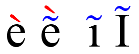

Many other scripts, such as Thai, also have stacking diacritics.

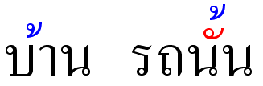

The varying sizes of base letters in the Arabic script require smart placement of diacritics.

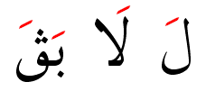

## Contextual shaping

In many writing systems the exact shape of the letter depends on the neighboring characters or its position within the word. In Greek, the sigma takes an alternate form at the end of the word. (Note: in Unicode and most other encodings, the Greek word-final sigma is encoded as a distinct character, so a smart font is not required to show this behavior.)

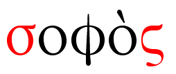

Arabic script, which is read from right to left, uses extensive contextual shaping to produce its cursive form. The figure below shows four forms of the letters "beh" and "meem". Typically there is a word-initial (red), word-medial (green), word-final (blue), and isolate (black) form of each character.

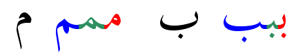

In the Myanmar script some shapes are dependent on the preceding consonant around which it must wrap.

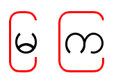

In some cases the base letter changes shape to accommodate an added character, as in this example of both contextual shaping and positioning in the Myanmar script. When the red character is added, the tail of the base character must be removed. To add the blue character, the preceding (red) letter must be moved to the left to make room for it.

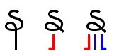

## Ligatures

It is common in many scripts for multiple characters to combine into a single shape, as in this example of the "lam-alef" ligature in the Arabic script. Note that the figure is read from right to left!

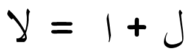

In the Tamil script short and long "u" vowels form ligatures with the preceding consonant.

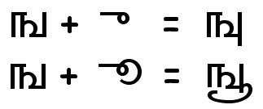

Here is another ligature typical of Indic scripts, involving a viramacized consonant followed by a second consonant. In the figure, the Tamil virama is written as a dot above the first consonant—but notice that the virama is not shown in the ligated form. In Indic scripts, the term "conjuncts" is often used to refer to these letter combinations.

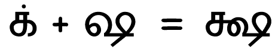

In the International Phonetic Alphabet (IPA) sequences of tone letters combine to form single tone contour symbols.

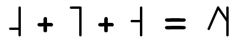

## Reordering and splitting

It is common in Indic scripts for consonants and the vowels that follow them to form clusters, with the vowels being written in specific positions relative to the consonant. In these Bengali examples the red items indicate vowels. In the first example, the vowel is displayed to the right of the preceding consonant (as expected), and in the second, the vowel is displayed to the left. In the third item, the vowel is split into two forms, one of which is written to the left and the other to the right.

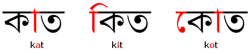

The following example shows a combination of reordering and conjunct creation in the Devanagari script. The orange virama (or "halant") in Devanagari indicates the absence of a vowel. The red "ra" character is unique in that the virama causes it to be rendered as a "reph", above and to the right of the consonant cluster. The virama also causes the two neighboring blue consonants to form a conjunct, and in both cases the virama disappears. The following vowel (in green) is rendered to the left of the entire conjunct.

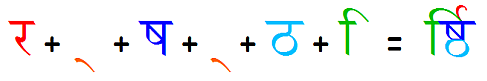

## Bidirectionality

Semitic scripts such as Arabic and Hebrew are written from right to left. Numerals, however, are written from left to right.

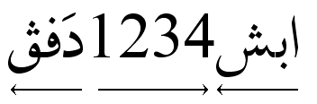
